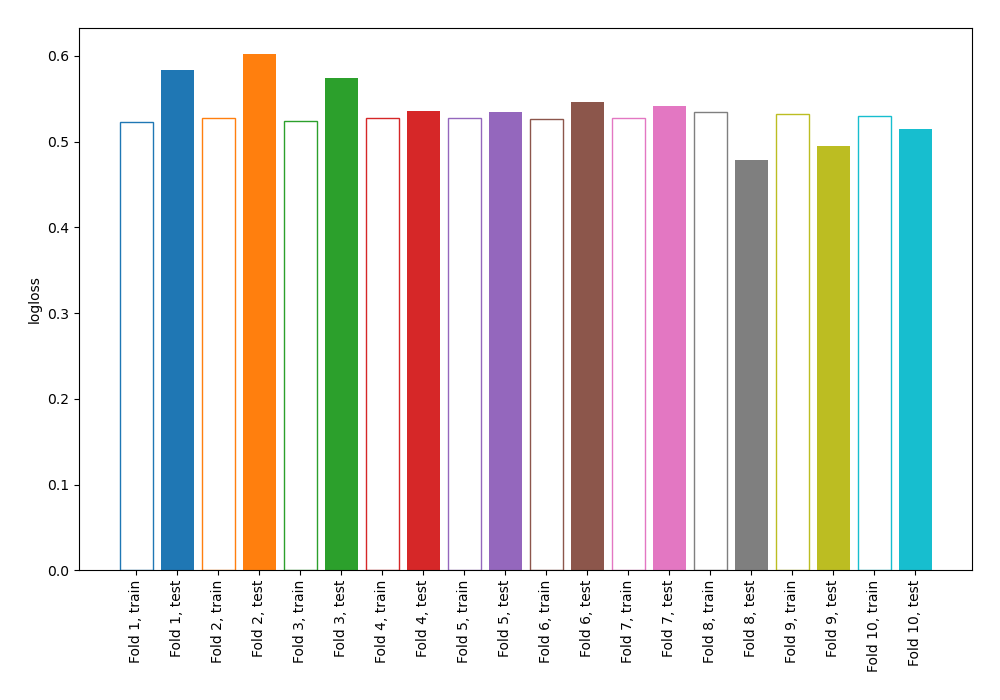
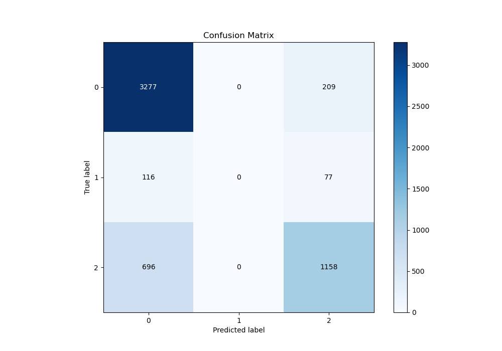
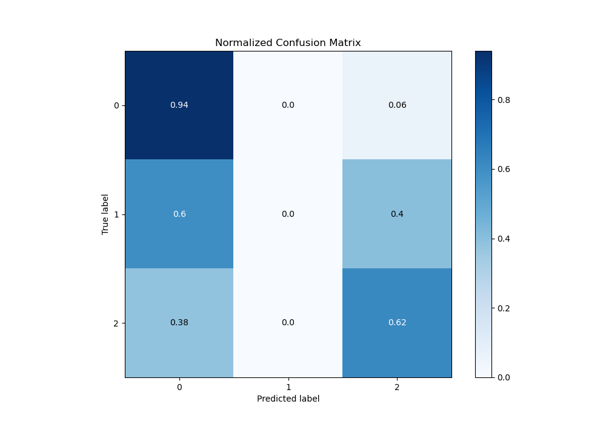
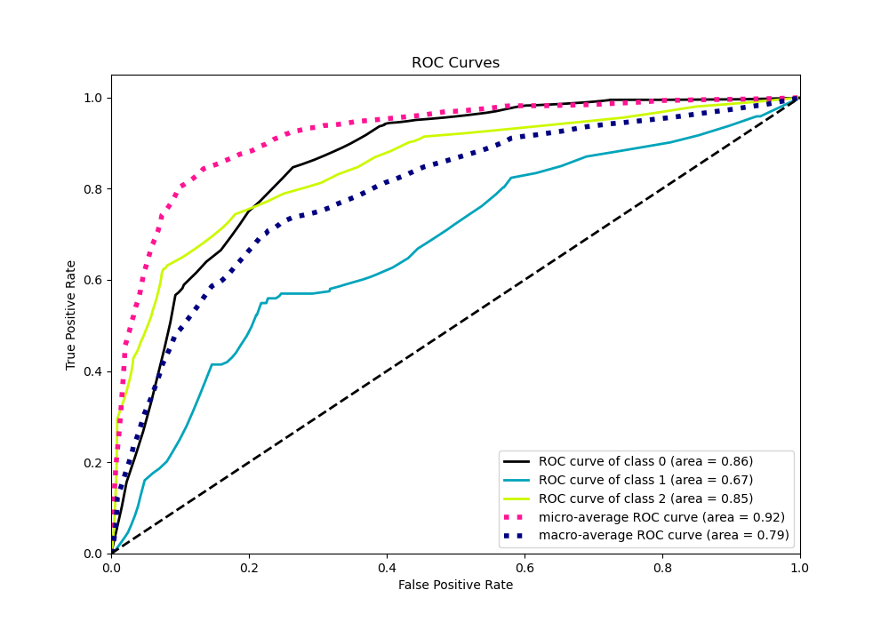
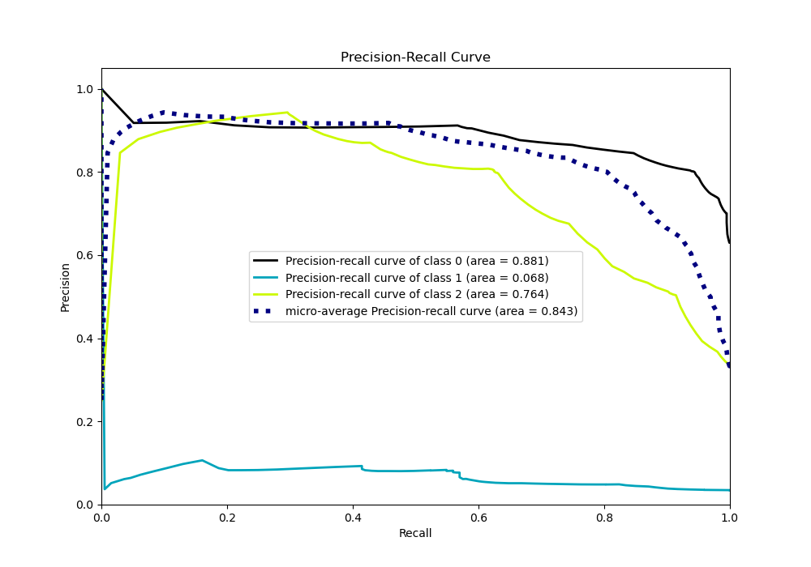

# Summary of 102_DecisionTree

[<< Go back](../README.md)

## Decision Tree
- **n_jobs**: -1
- **criterion**: entropy
- **max_depth**: 3
- **num_class**: 3
- **explain_level**: 0

## Validation
 - **validation_type**: kfold
 - **shuffle**: True
 - **stratify**: True
 - **k_folds**: 10

## Optimized metric
logloss

## Training time

6.9 seconds

### Metric details
|           |           0 |   1 |           2 |   accuracy |   macro avg |   weighted avg |   logloss |
|:----------|------------:|----:|------------:|-----------:|------------:|---------------:|----------:|
| precision |    0.801418 |   0 |    0.801939 |   0.801554 |    0.534452 |       0.773638 |  0.540788 |
| recall    |    0.940046 |   0 |    0.624595 |   0.801554 |    0.521547 |       0.801554 |  0.540788 |
| f1-score  |    0.865215 |   0 |    0.702244 |   0.801554 |    0.522486 |       0.780426 |  0.540788 |
| support   | 3486        | 193 | 1854        |   0.801554 | 5533        |    5533        |  0.540788 |

## Confusion matrix
|              |   Predicted as 0 |   Predicted as 1 |   Predicted as 2 |
|:-------------|-----------------:|-----------------:|-----------------:|
| Labeled as 0 |             3277 |                0 |              209 |
| Labeled as 1 |              116 |                0 |               77 |
| Labeled as 2 |              696 |                0 |             1158 |

## Learning curves

## Confusion Matrix

## Normalized Confusion Matrix

## ROC Curve

## Precision Recall Curve

[<< Go back](../README.md)
