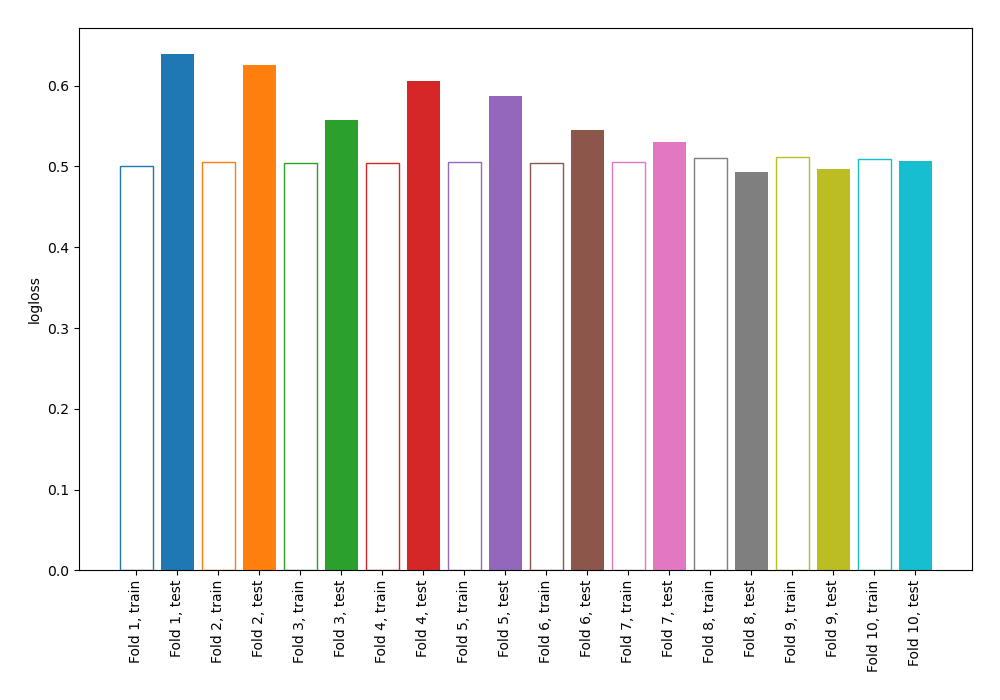
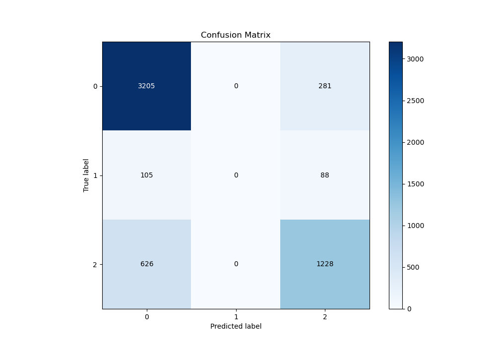
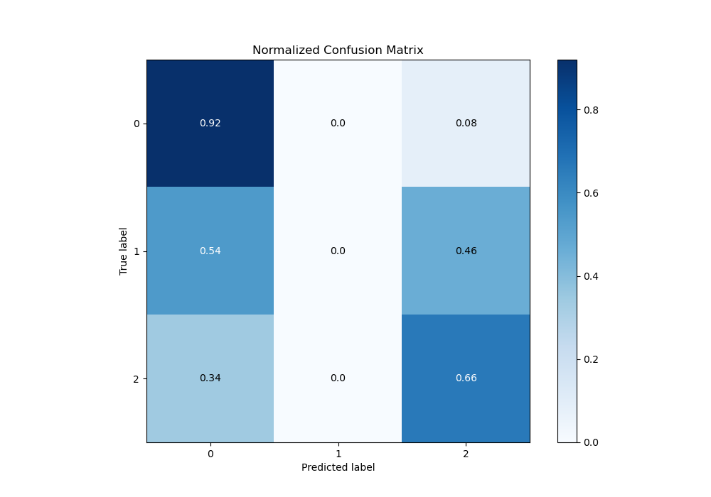
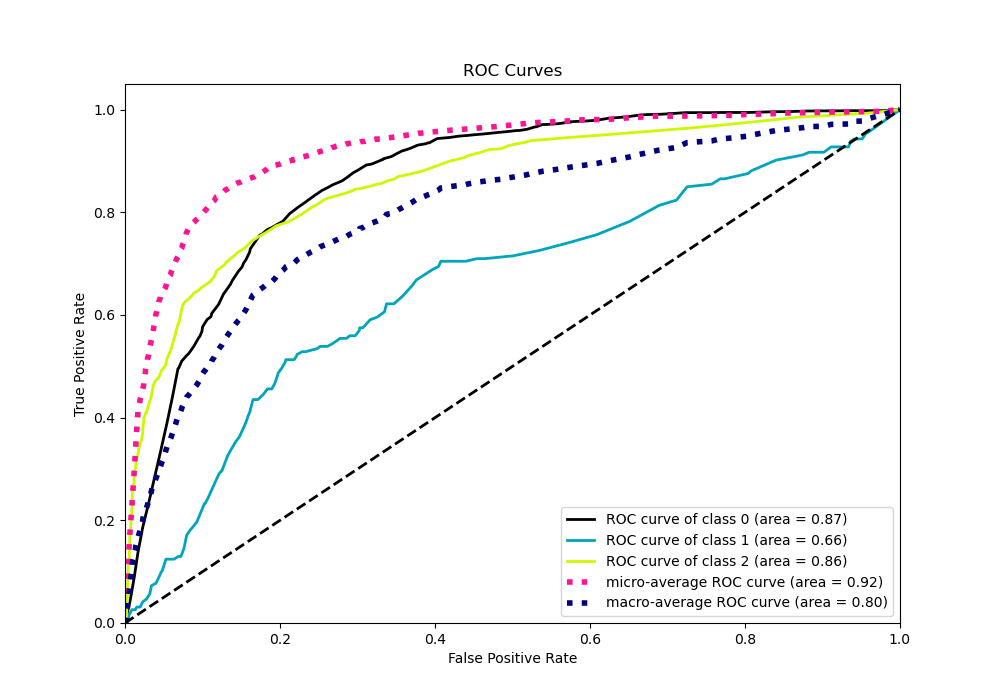
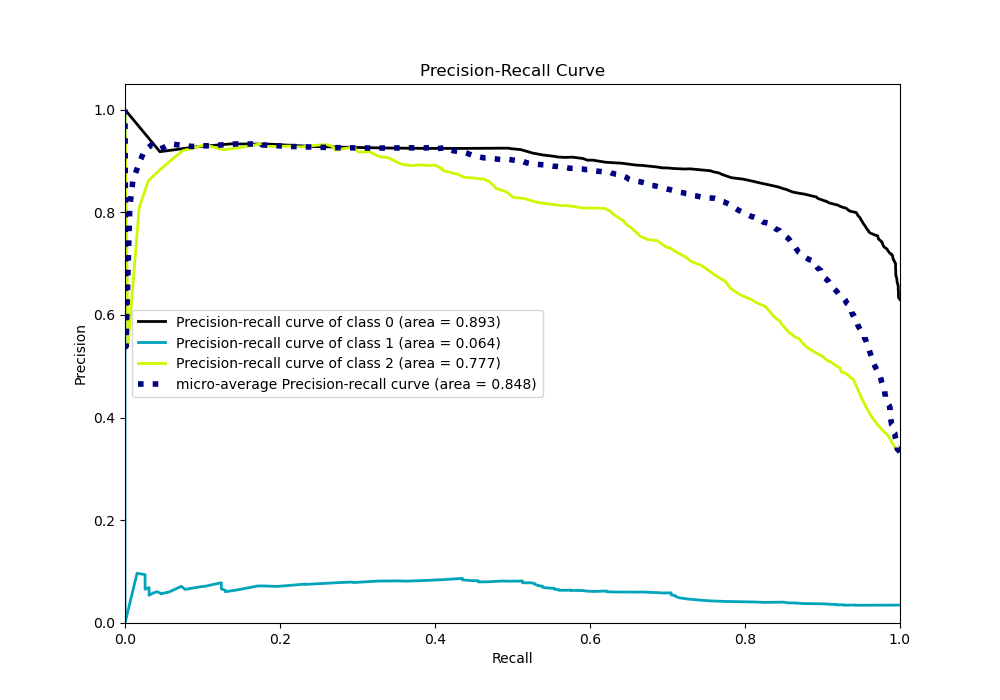

# Summary of 104_DecisionTree

[<< Go back](../README.md)

## Decision Tree
- **n_jobs**: -1
- **criterion**: entropy
- **max_depth**: 4
- **num_class**: 3
- **explain_level**: 0

## Validation
 - **validation_type**: kfold
 - **shuffle**: True
 - **stratify**: True
 - **k_folds**: 10

## Optimized metric
logloss

## Training time

7.0 seconds

### Metric details
|           |           0 |   1 |           2 |   accuracy |   macro avg |   weighted avg |   logloss |
|:----------|------------:|----:|------------:|-----------:|------------:|---------------:|----------:|
| precision |    0.814278 |   0 |    0.768942 |   0.801193 |    0.52774  |       0.770684 |  0.558732 |
| recall    |    0.919392 |   0 |    0.662352 |   0.801193 |    0.527248 |       0.801193 |  0.558732 |
| f1-score  |    0.863649 |   0 |    0.711678 |   0.801193 |    0.525109 |       0.782601 |  0.558732 |
| support   | 3486        | 193 | 1854        |   0.801193 | 5533        |    5533        |  0.558732 |

## Confusion matrix
|              |   Predicted as 0 |   Predicted as 1 |   Predicted as 2 |
|:-------------|-----------------:|-----------------:|-----------------:|
| Labeled as 0 |             3205 |                0 |              281 |
| Labeled as 1 |              105 |                0 |               88 |
| Labeled as 2 |              626 |                0 |             1228 |

## Learning curves

## Confusion Matrix

## Normalized Confusion Matrix

## ROC Curve

## Precision Recall Curve

[<< Go back](../README.md)
