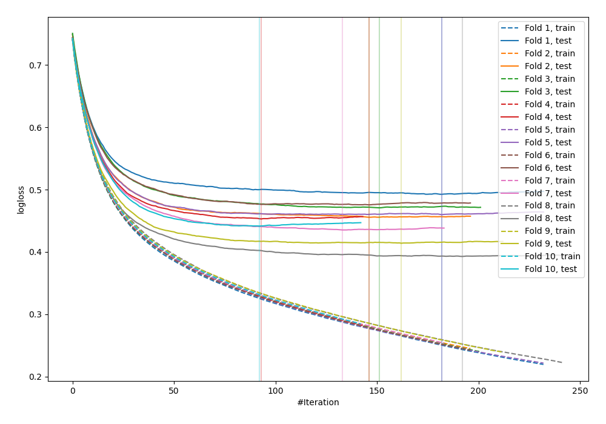
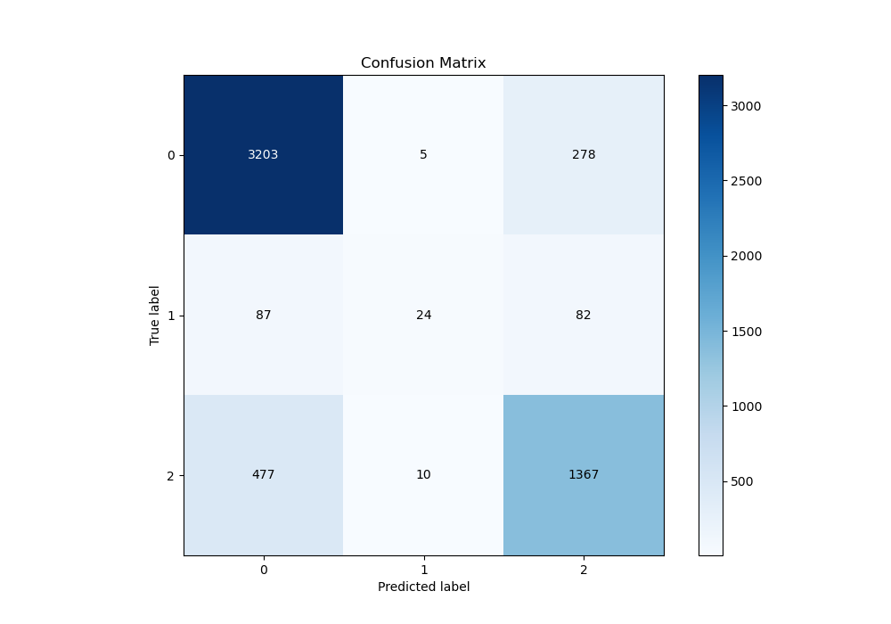
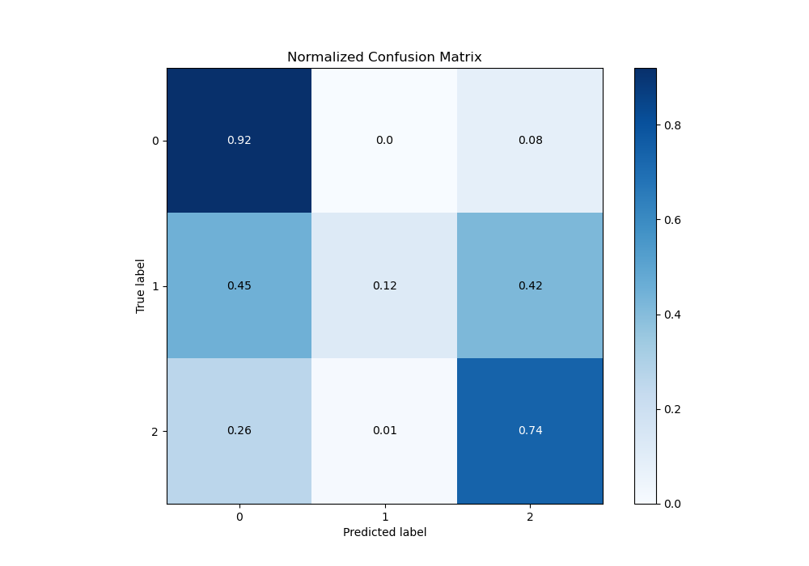
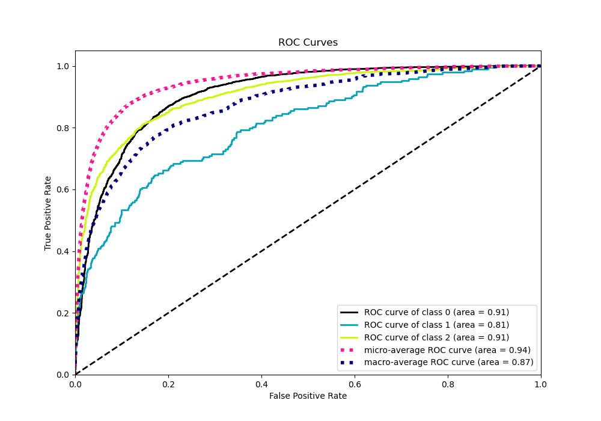
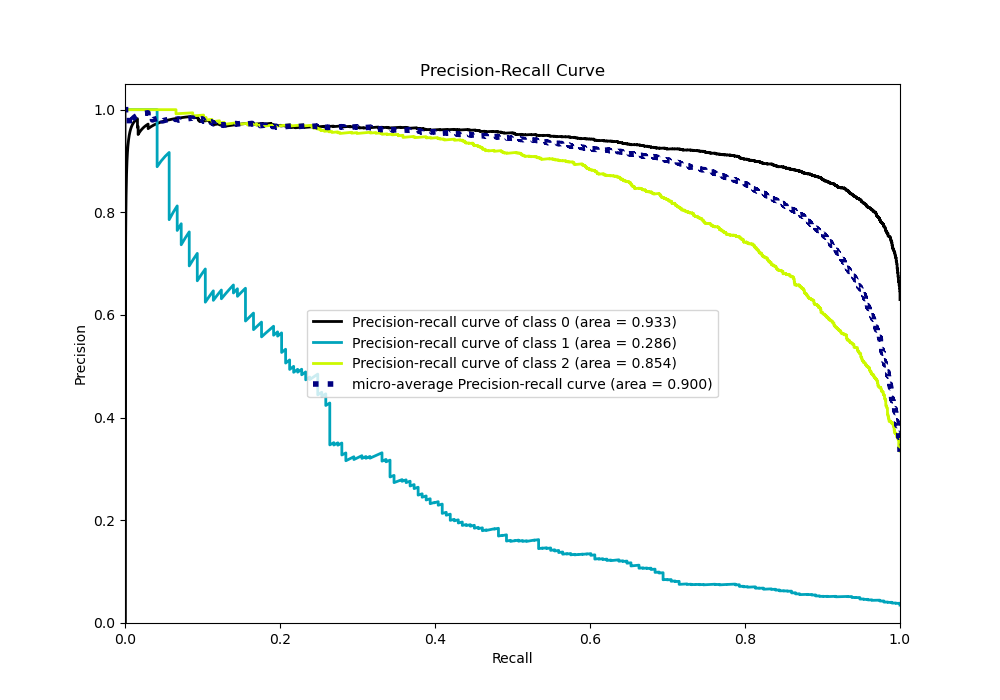

# Summary of 109_LightGBM

[<< Go back](../README.md)

## LightGBM
- **n_jobs**: -1
- **objective**: multiclass
- **num_leaves**: 15
- **learning_rate**: 0.05
- **feature_fraction**: 0.8
- **bagging_fraction**: 0.5
- **min_data_in_leaf**: 20
- **metric**: multi_logloss
- **custom_eval_metric_name**: None
- **num_class**: 3
- **explain_level**: 0

## Validation
 - **validation_type**: kfold
 - **shuffle**: True
 - **stratify**: True
 - **k_folds**: 10

## Optimized metric
logloss

## Training time

13.5 seconds

### Metric details
|           |           0 |          1 |           2 |   accuracy |   macro avg |   weighted avg |   logloss |
|:----------|------------:|-----------:|------------:|-----------:|------------:|---------------:|----------:|
| precision |    0.850279 |   0.615385 |    0.791546 |   0.830291 |    0.752403 |       0.822405 |  0.449086 |
| recall    |    0.918818 |   0.124352 |    0.737325 |   0.830291 |    0.593498 |       0.830291 |  0.449086 |
| f1-score  |    0.883221 |   0.206897 |    0.763474 |   0.830291 |    0.617864 |       0.819505 |  0.449086 |
| support   | 3486        | 193        | 1854        |   0.830291 | 5533        |    5533        |  0.449086 |

## Confusion matrix
|              |   Predicted as 0 |   Predicted as 1 |   Predicted as 2 |
|:-------------|-----------------:|-----------------:|-----------------:|
| Labeled as 0 |             3203 |                5 |              278 |
| Labeled as 1 |               87 |               24 |               82 |
| Labeled as 2 |              477 |               10 |             1367 |

## Learning curves

## Confusion Matrix

## Normalized Confusion Matrix

## ROC Curve

## Precision Recall Curve

[<< Go back](../README.md)
