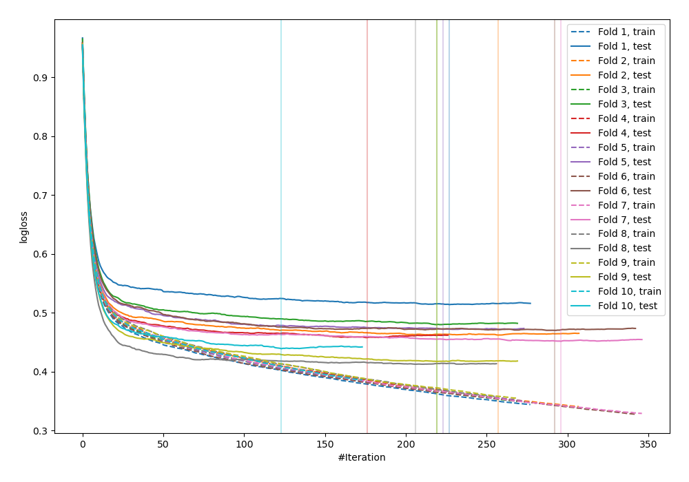
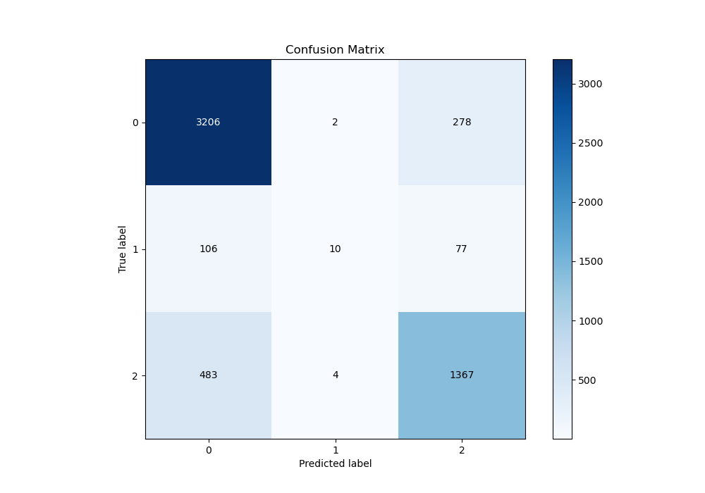
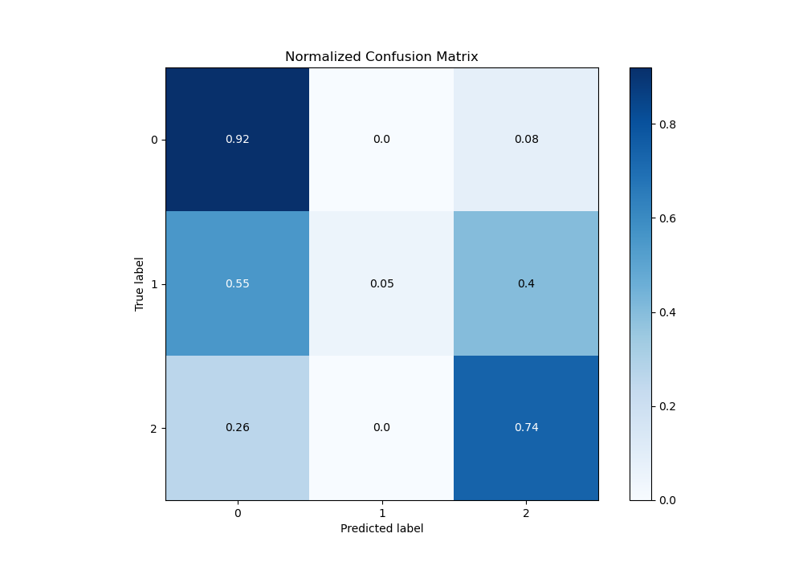
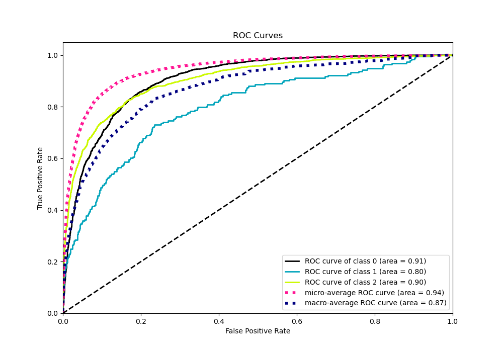
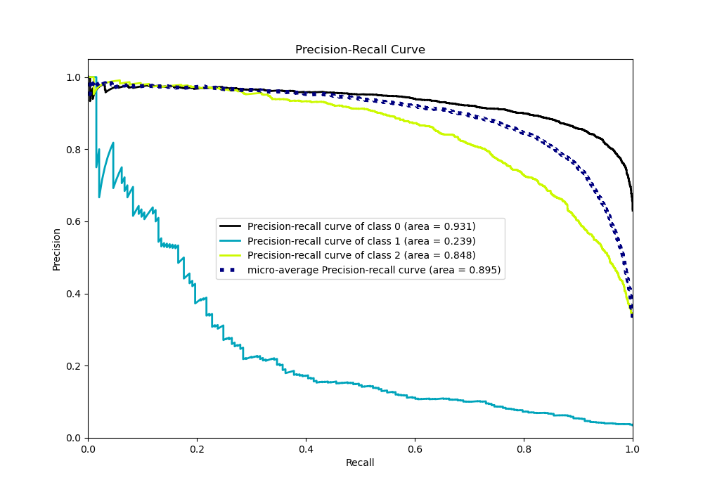

# Summary of 111_CatBoost

[<< Go back](../README.md)

## CatBoost
- **n_jobs**: -1
- **learning_rate**: 0.15
- **depth**: 4
- **rsm**: 0.7
- **loss_function**: MultiClass
- **eval_metric**: MultiClass
- **num_class**: 3
- **explain_level**: 0

## Validation
 - **validation_type**: kfold
 - **shuffle**: True
 - **stratify**: True
 - **k_folds**: 10

## Optimized metric
logloss

## Training time

14.8 seconds

### Metric details
|           |           0 |           1 |           2 |   accuracy |   macro avg |   weighted avg |   logloss |
|:----------|------------:|------------:|------------:|-----------:|------------:|---------------:|----------:|
| precision |    0.844796 |   0.625     |    0.793844 |   0.828303 |    0.754547 |       0.820056 |  0.457829 |
| recall    |    0.919679 |   0.0518135 |    0.737325 |   0.828303 |    0.569606 |       0.828303 |  0.457829 |
| f1-score  |    0.880648 |   0.0956938 |    0.764541 |   0.828303 |    0.580294 |       0.814363 |  0.457829 |
| support   | 3486        | 193         | 1854        |   0.828303 | 5533        |    5533        |  0.457829 |

## Confusion matrix
|              |   Predicted as 0 |   Predicted as 1 |   Predicted as 2 |
|:-------------|-----------------:|-----------------:|-----------------:|
| Labeled as 0 |             3206 |                2 |              278 |
| Labeled as 1 |              106 |               10 |               77 |
| Labeled as 2 |              483 |                4 |             1367 |

## Learning curves

## Confusion Matrix

## Normalized Confusion Matrix

## ROC Curve

## Precision Recall Curve

[<< Go back](../README.md)
