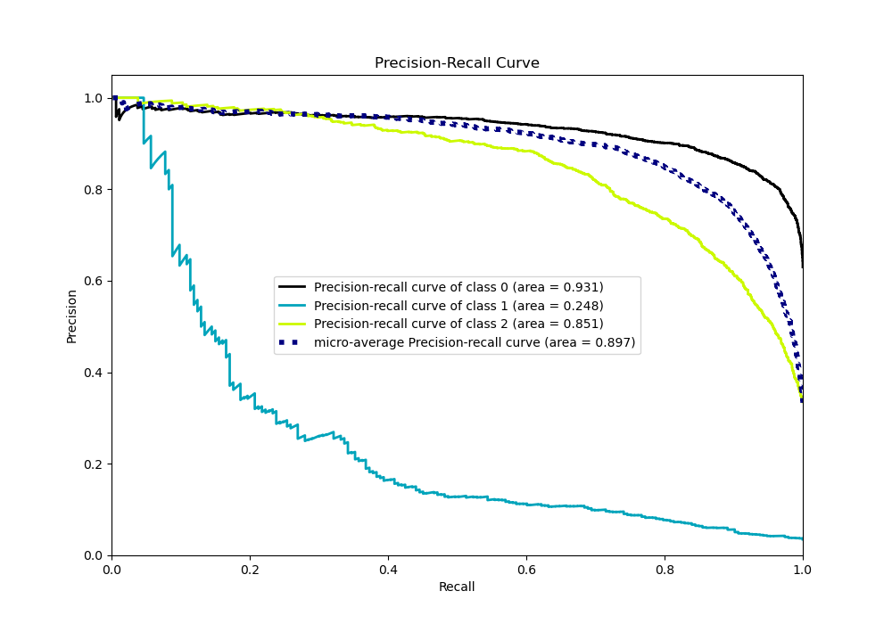

# Summary of 112_CatBoost

[<< Go back](../README.md)

## CatBoost
- **n_jobs**: -1
- **learning_rate**: 0.15
- **depth**: 4
- **rsm**: 0.7
- **loss_function**: MultiClass
- **eval_metric**: MultiClass
- **num_class**: 3
- **explain_level**: 0

## Validation
 - **validation_type**: kfold
 - **shuffle**: True
 - **stratify**: True
 - **k_folds**: 10

## Optimized metric
logloss

## Training time

15.7 seconds

### Metric details
|           |           0 |           1 |           2 |   accuracy |   macro avg |   weighted avg |   logloss |
|:----------|------------:|------------:|------------:|-----------:|------------:|---------------:|----------:|
| precision |    0.844063 |   0.75      |    0.785839 |   0.825592 |    0.793301 |       0.821272 |  0.455391 |
| recall    |    0.917671 |   0.0777202 |    0.730313 |   0.825592 |    0.575235 |       0.825592 |  0.455391 |
| f1-score  |    0.879329 |   0.140845  |    0.757059 |   0.825592 |    0.592411 |       0.812599 |  0.455391 |
| support   | 3486        | 193         | 1854        |   0.825592 | 5533        |    5533        |  0.455391 |

## Confusion matrix
|              |   Predicted as 0 |   Predicted as 1 |   Predicted as 2 |
|:-------------|-----------------:|-----------------:|-----------------:|
| Labeled as 0 |             3199 |                3 |              284 |
| Labeled as 1 |               93 |               15 |               85 |
| Labeled as 2 |              498 |                2 |             1354 |

## Learning curves

## Confusion Matrix

## Normalized Confusion Matrix

## ROC Curve

## Precision Recall Curve

[<< Go back](../README.md)
