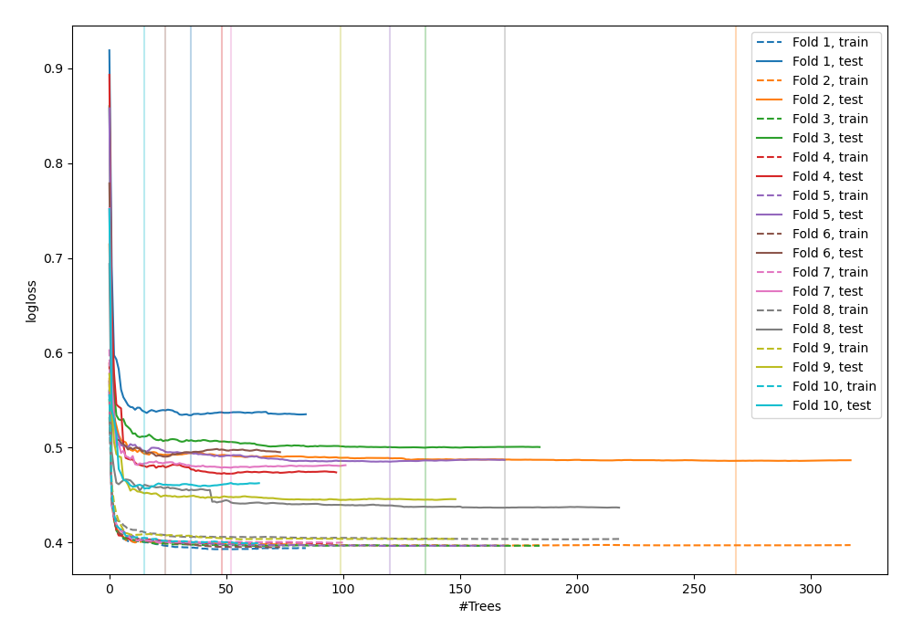

# Summary of 113_RandomForest_SelectedFeatures

[<< Go back](../README.md)

## Random Forest
- **n_jobs**: -1
- **criterion**: entropy
- **max_features**: 0.6
- **min_samples_split**: 30
- **max_depth**: 7
- **eval_metric_name**: logloss
- **num_class**: 3
- **explain_level**: 0

## Validation
 - **validation_type**: kfold
 - **shuffle**: True
 - **stratify**: True
 - **k_folds**: 10

## Optimized metric
logloss

## Training time

23.2 seconds

### Metric details
|           |           0 |   1 |           2 |   accuracy |   macro avg |   weighted avg |   logloss |
|:----------|------------:|----:|------------:|-----------:|------------:|---------------:|----------:|
| precision |    0.829469 |   0 |    0.785584 |   0.816374 |    0.538351 |       0.785831 |   0.47849 |
| recall    |    0.923695 |   0 |    0.699569 |   0.816374 |    0.541088 |       0.816374 |   0.47849 |
| f1-score  |    0.87405  |   0 |    0.740086 |   0.816374 |    0.538045 |       0.798673 |   0.47849 |
| support   | 3486        | 193 | 1854        |   0.816374 | 5533        |    5533        |   0.47849 |

## Confusion matrix
|              |   Predicted as 0 |   Predicted as 1 |   Predicted as 2 |
|:-------------|-----------------:|-----------------:|-----------------:|
| Labeled as 0 |             3220 |                0 |              266 |
| Labeled as 1 |              105 |                0 |               88 |
| Labeled as 2 |              557 |                0 |             1297 |

## Learning curves

## Confusion Matrix

## Normalized Confusion Matrix

## ROC Curve

## Precision Recall Curve

[<< Go back](../README.md)
