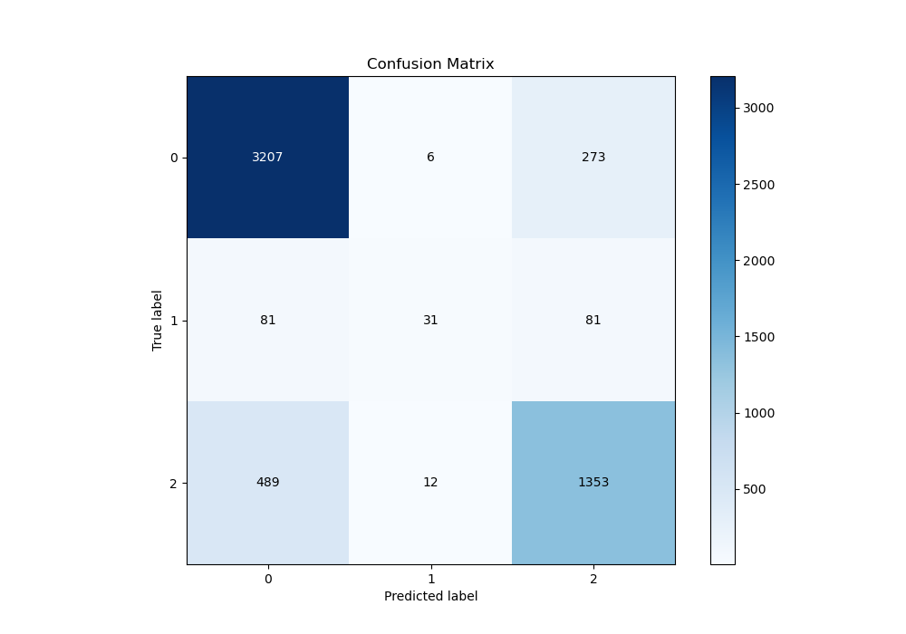
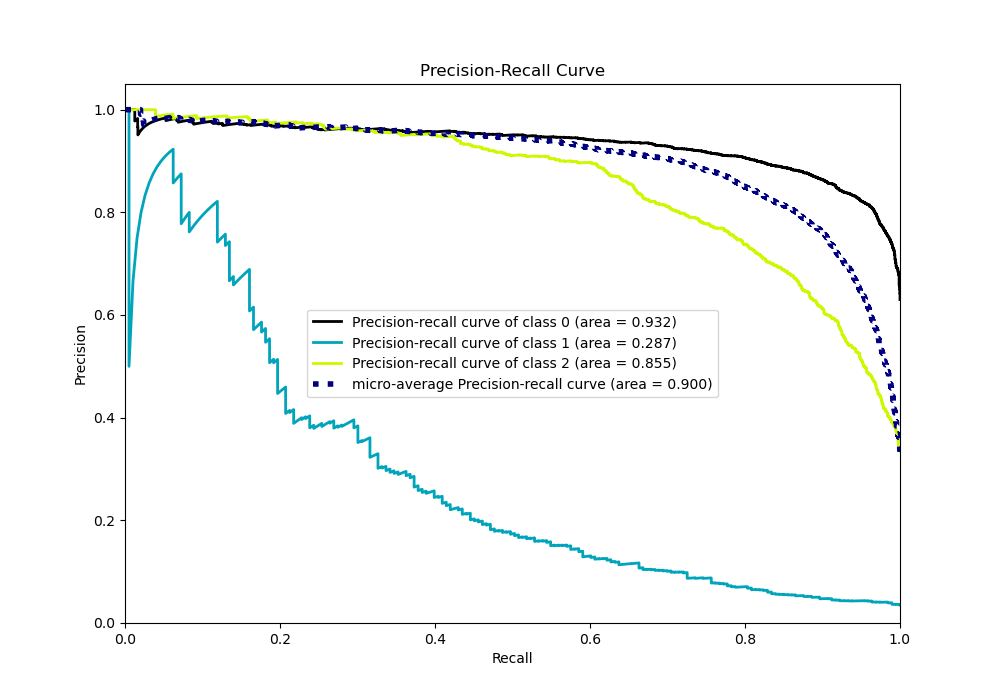

# Summary of 114_RandomForest_Stacked

[<< Go back](../README.md)

## Random Forest
- **n_jobs**: -1
- **criterion**: entropy
- **max_features**: 0.7
- **min_samples_split**: 30
- **max_depth**: 7
- **eval_metric_name**: logloss
- **num_class**: 3
- **explain_level**: 0

## Validation
 - **validation_type**: kfold
 - **shuffle**: True
 - **stratify**: True
 - **k_folds**: 10

## Optimized metric
logloss

## Training time

243.8 seconds

### Metric details
|           |           0 |          1 |           2 |   accuracy |   macro avg |   weighted avg |   logloss |
|:----------|------------:|-----------:|------------:|-----------:|------------:|---------------:|----------:|
| precision |    0.849087 |   0.632653 |    0.792619 |   0.829749 |    0.758119 |       0.822616 |  0.450977 |
| recall    |    0.919966 |   0.160622 |    0.729773 |   0.829749 |    0.603454 |       0.829749 |  0.450977 |
| f1-score  |    0.883106 |   0.256198 |    0.759899 |   0.829749 |    0.633068 |       0.819954 |  0.450977 |
| support   | 3486        | 193        | 1854        |   0.829749 | 5533        |    5533        |  0.450977 |

## Confusion matrix
|              |   Predicted as 0 |   Predicted as 1 |   Predicted as 2 |
|:-------------|-----------------:|-----------------:|-----------------:|
| Labeled as 0 |             3207 |                6 |              273 |
| Labeled as 1 |               81 |               31 |               81 |
| Labeled as 2 |              489 |               12 |             1353 |

## Learning curves

## Confusion Matrix

## Normalized Confusion Matrix

## ROC Curve

## Precision Recall Curve

[<< Go back](../README.md)
