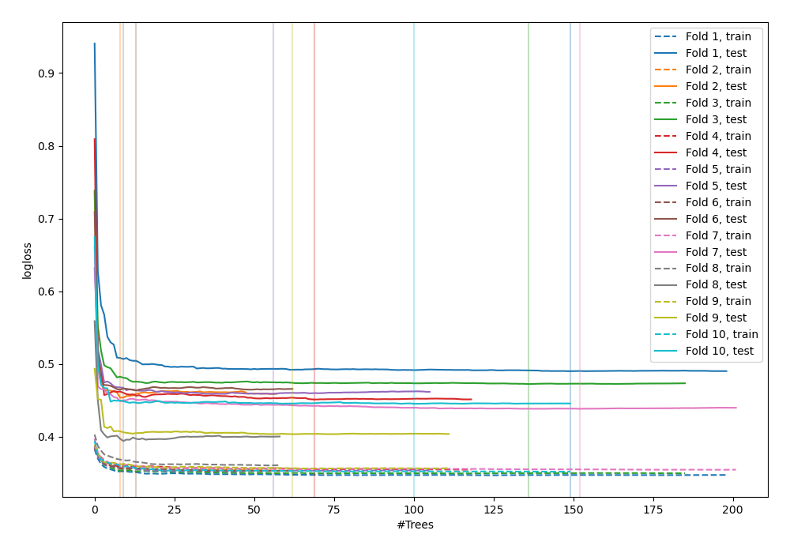
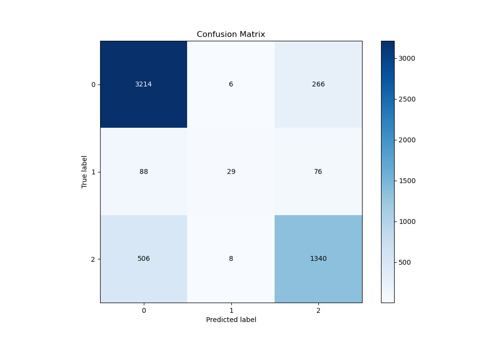
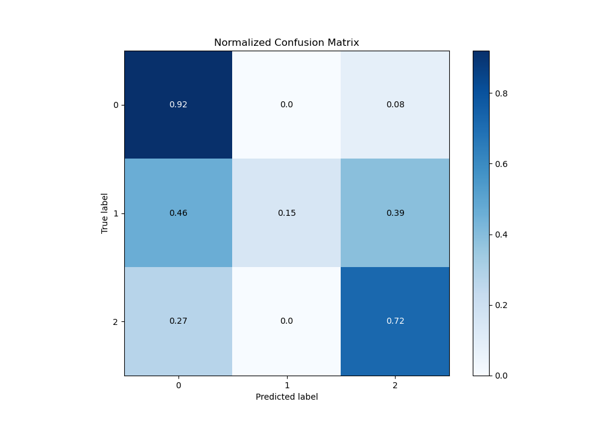
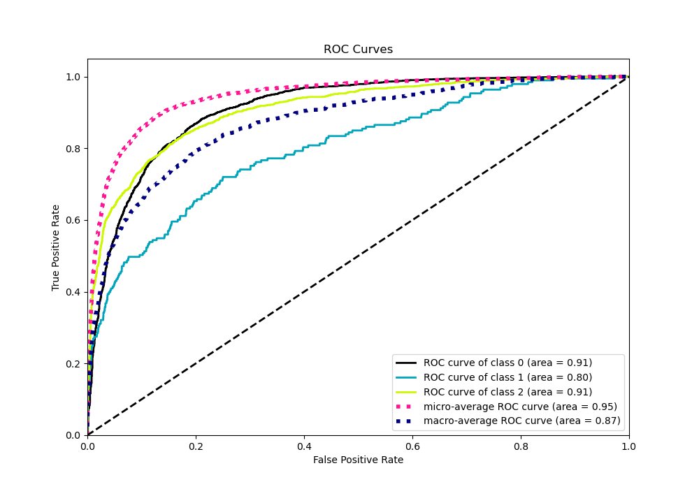
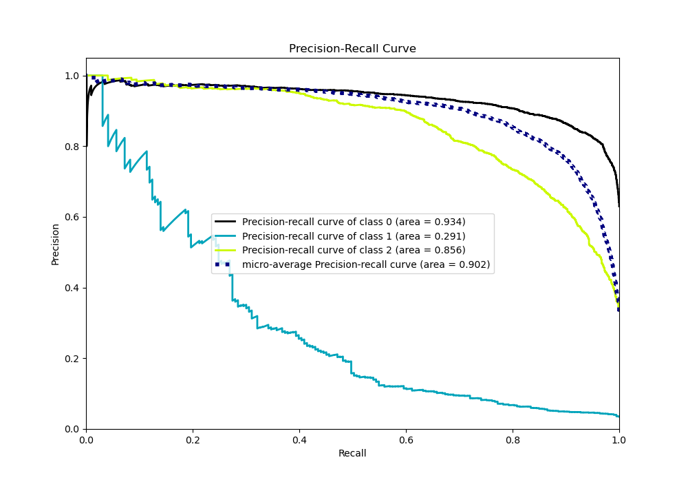

# Summary of 116_ExtraTrees_SelectedFeatures_Stacked

[<< Go back](../README.md)

## Extra Trees Classifier (Extra Trees)
- **n_jobs**: -1
- **criterion**: entropy
- **max_features**: 1.0
- **min_samples_split**: 40
- **max_depth**: 7
- **eval_metric_name**: logloss
- **num_class**: 3
- **explain_level**: 0

## Validation
 - **validation_type**: kfold
 - **shuffle**: True
 - **stratify**: True
 - **k_folds**: 10

## Optimized metric
logloss

## Training time

74.2 seconds

### Metric details
|           |           0 |          1 |           2 |   accuracy |   macro avg |   weighted avg |   logloss |
|:----------|------------:|-----------:|------------:|-----------:|------------:|---------------:|----------:|
| precision |    0.844013 |   0.674419 |    0.796671 |   0.828303 |    0.771701 |       0.822234 |  0.447005 |
| recall    |    0.921974 |   0.150259 |    0.722762 |   0.828303 |    0.598331 |       0.828303 |  0.447005 |
| f1-score  |    0.881272 |   0.245763 |    0.757919 |   0.828303 |    0.628318 |       0.817771 |  0.447005 |
| support   | 3486        | 193        | 1854        |   0.828303 | 5533        |    5533        |  0.447005 |

## Confusion matrix
|              |   Predicted as 0 |   Predicted as 1 |   Predicted as 2 |
|:-------------|-----------------:|-----------------:|-----------------:|
| Labeled as 0 |             3214 |                6 |              266 |
| Labeled as 1 |               88 |               29 |               76 |
| Labeled as 2 |              506 |                8 |             1340 |

## Learning curves

## Confusion Matrix

## Normalized Confusion Matrix

## ROC Curve

## Precision Recall Curve

[<< Go back](../README.md)
