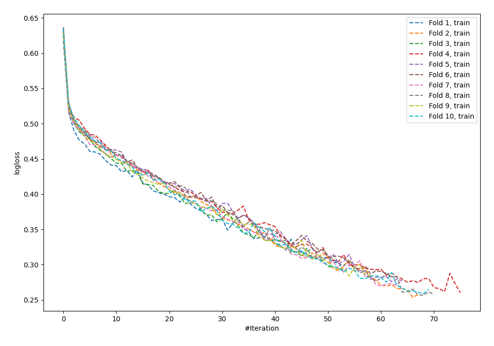
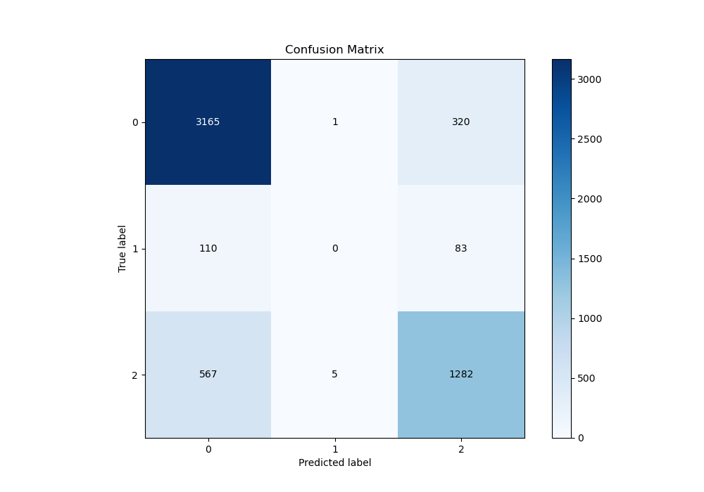
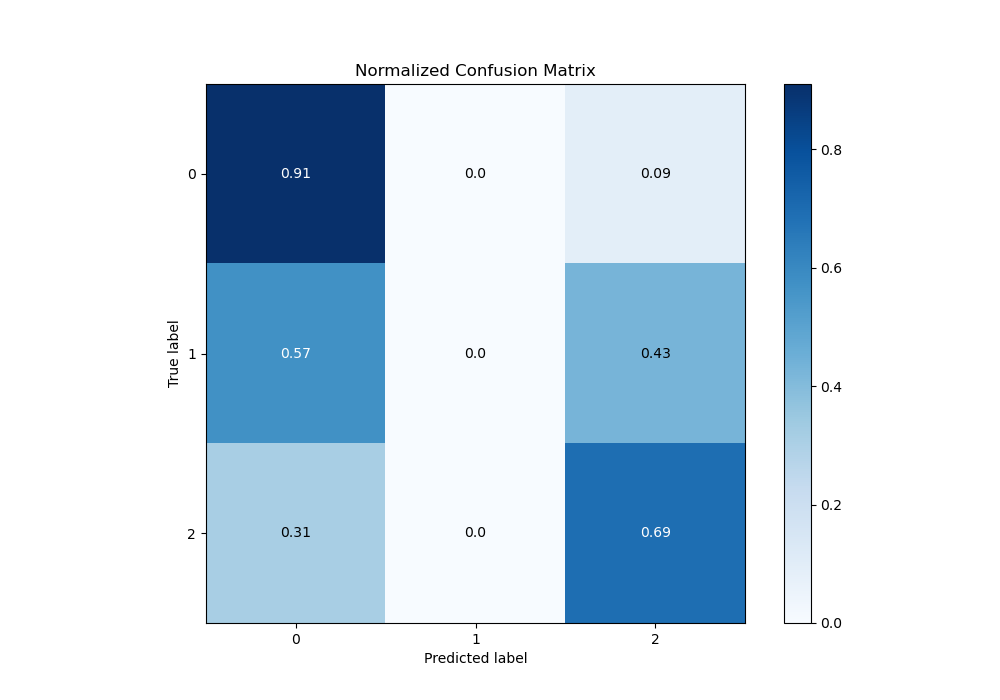
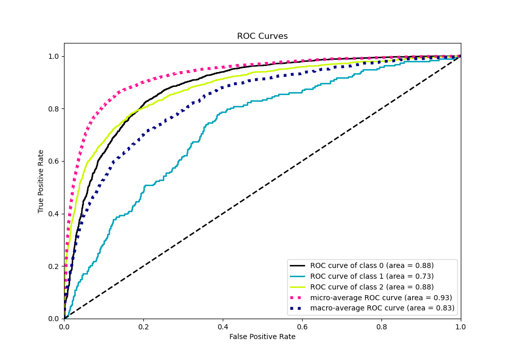
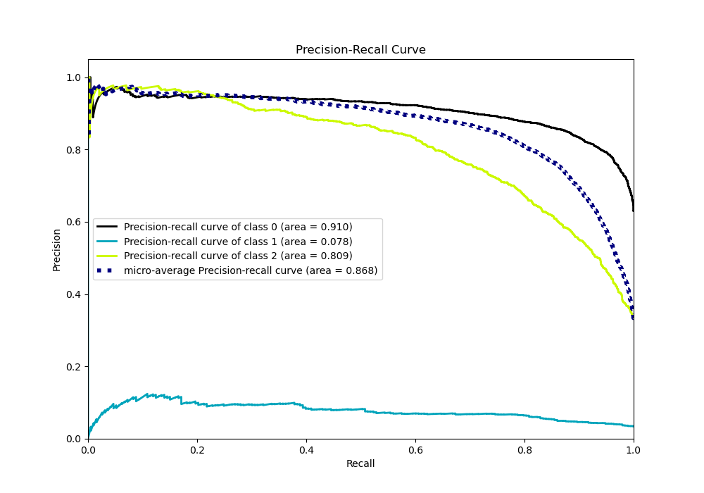

# Summary of 119_NeuralNetwork_SelectedFeatures

[<< Go back](../README.md)

## Neural Network
- **n_jobs**: -1
- **dense_1_size**: 64
- **dense_2_size**: 16
- **learning_rate**: 0.01
- **num_class**: 3
- **explain_level**: 0

## Validation
 - **validation_type**: kfold
 - **shuffle**: True
 - **stratify**: True
 - **k_folds**: 10

## Optimized metric
logloss

## Training time

20.1 seconds

### Metric details
|           |           0 |   1 |           2 |   accuracy |   macro avg |   weighted avg |   logloss |
|:----------|------------:|----:|------------:|-----------:|------------:|---------------:|----------:|
| precision |    0.82379  |   0 |    0.760831 |   0.803723 |    0.528207 |       0.773958 |  0.527662 |
| recall    |    0.907917 |   0 |    0.691478 |   0.803723 |    0.533132 |       0.803723 |  0.527662 |
| f1-score  |    0.86381  |   0 |    0.724498 |   0.803723 |    0.529436 |       0.786998 |  0.527662 |
| support   | 3486        | 193 | 1854        |   0.803723 | 5533        |    5533        |  0.527662 |

## Confusion matrix
|              |   Predicted as 0 |   Predicted as 1 |   Predicted as 2 |
|:-------------|-----------------:|-----------------:|-----------------:|
| Labeled as 0 |             3165 |                1 |              320 |
| Labeled as 1 |              110 |                0 |               83 |
| Labeled as 2 |              567 |                5 |             1282 |

## Learning curves

## Confusion Matrix

## Normalized Confusion Matrix

## ROC Curve

## Precision Recall Curve

[<< Go back](../README.md)
