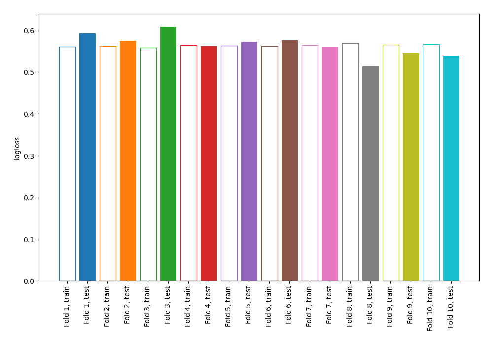
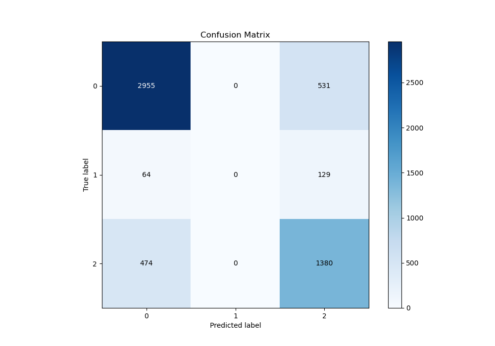
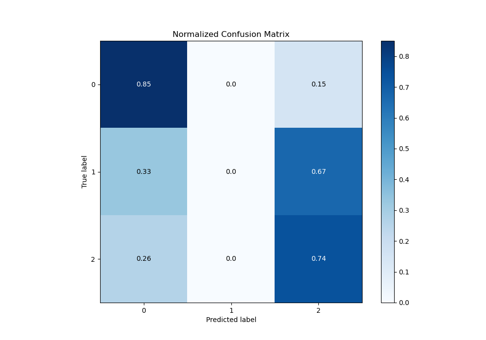
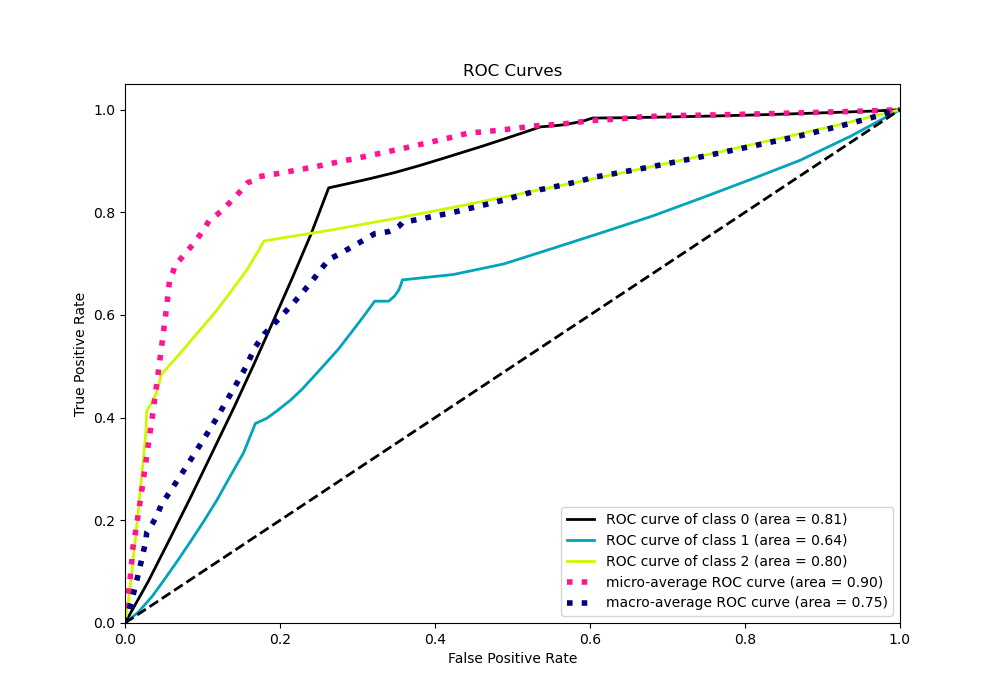
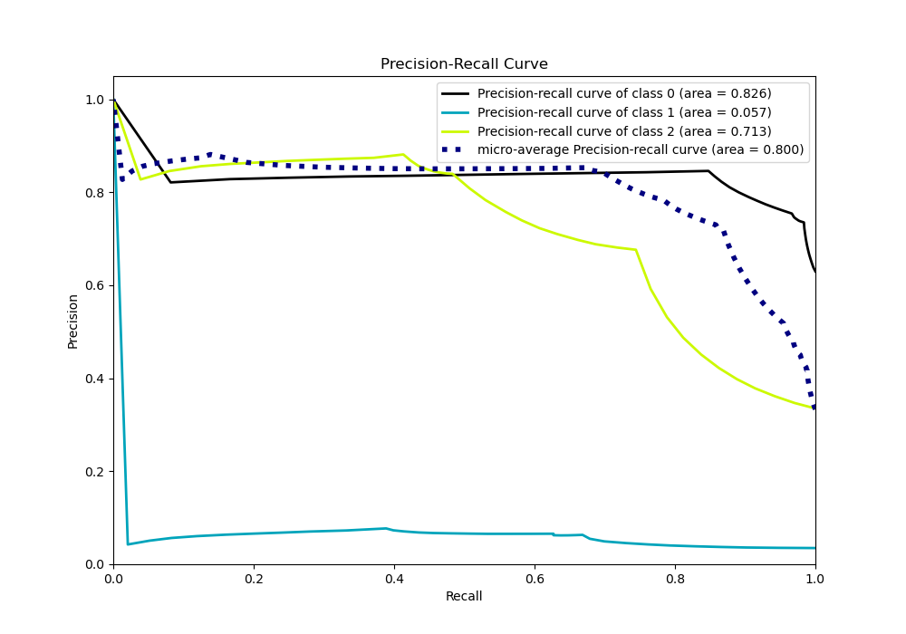

# Summary of 120_DecisionTree

[<< Go back](../README.md)

## Decision Tree
- **n_jobs**: -1
- **criterion**: gini
- **max_depth**: 2
- **num_class**: 3
- **explain_level**: 0

## Validation
 - **validation_type**: kfold
 - **shuffle**: True
 - **stratify**: True
 - **k_folds**: 10

## Optimized metric
logloss

## Training time

7.8 seconds

### Metric details
|           |           0 |   1 |           2 |   accuracy |   macro avg |   weighted avg |   logloss |
|:----------|------------:|----:|------------:|-----------:|------------:|---------------:|----------:|
| precision |    0.845978 |   0 |    0.676471 |   0.783481 |    0.507483 |       0.75967  |  0.565019 |
| recall    |    0.847676 |   0 |    0.744337 |   0.783481 |    0.530671 |       0.783481 |  0.565019 |
| f1-score  |    0.846826 |   0 |    0.708783 |   0.783481 |    0.518536 |       0.771032 |  0.565019 |
| support   | 3486        | 193 | 1854        |   0.783481 | 5533        |    5533        |  0.565019 |

## Confusion matrix
|              |   Predicted as 0 |   Predicted as 1 |   Predicted as 2 |
|:-------------|-----------------:|-----------------:|-----------------:|
| Labeled as 0 |             2955 |                0 |              531 |
| Labeled as 1 |               64 |                0 |              129 |
| Labeled as 2 |              474 |                0 |             1380 |

## Learning curves

## Confusion Matrix

## Normalized Confusion Matrix

## ROC Curve

## Precision Recall Curve

[<< Go back](../README.md)
