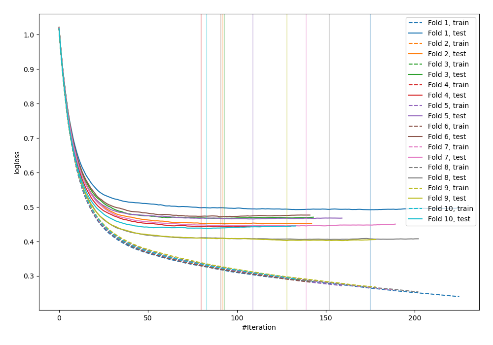
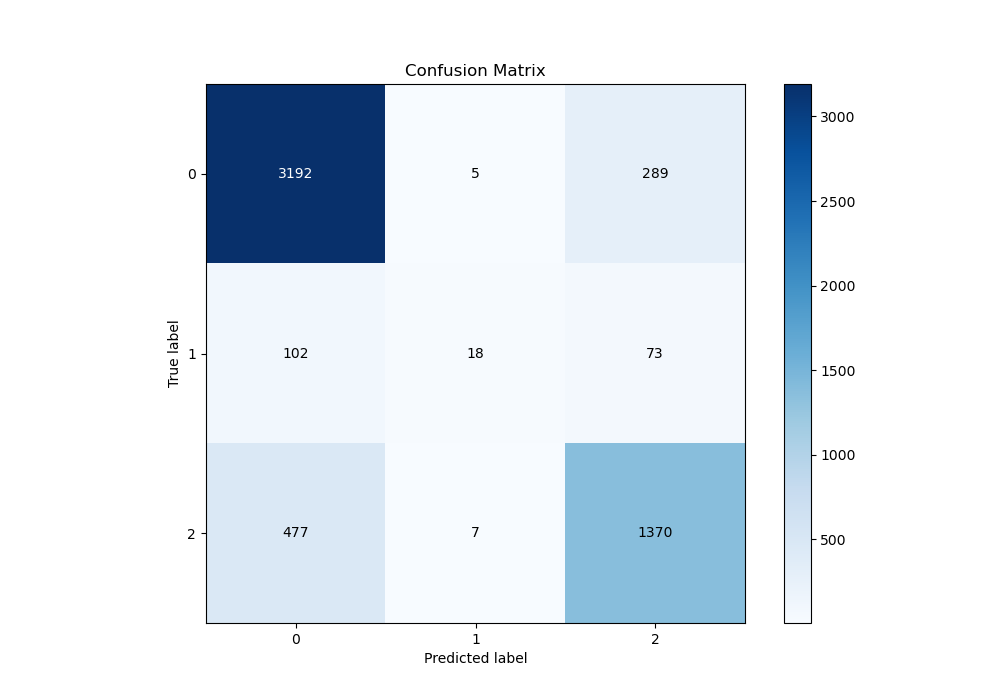
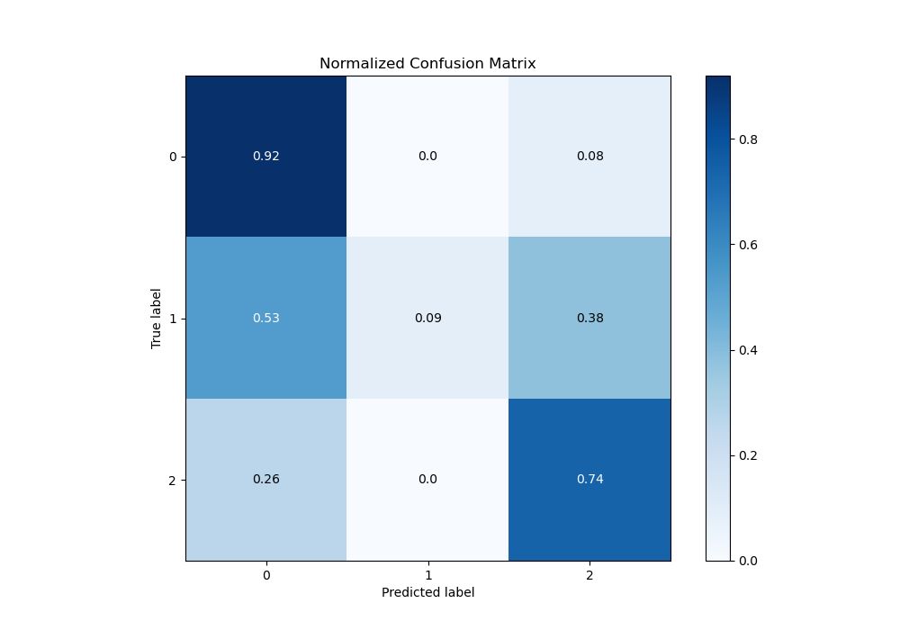
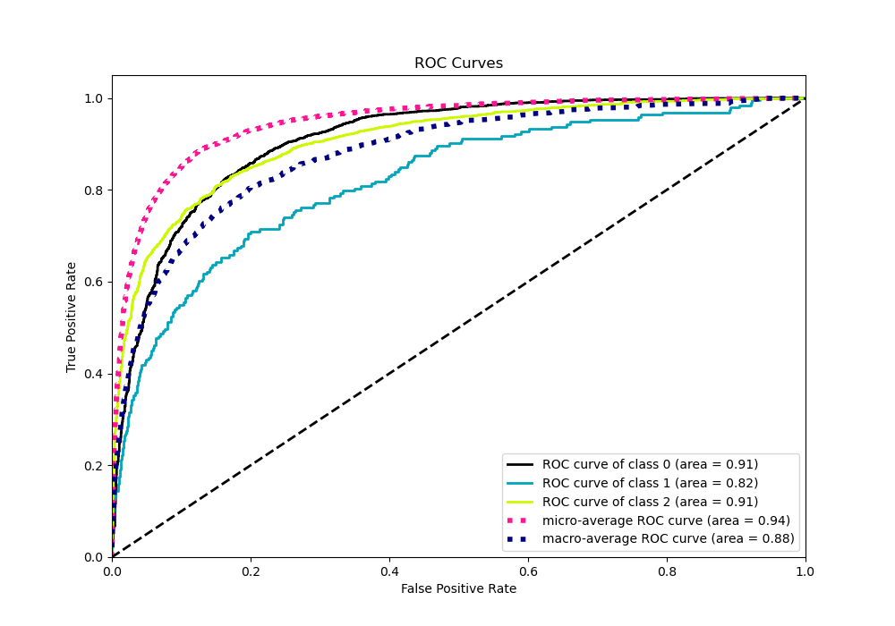
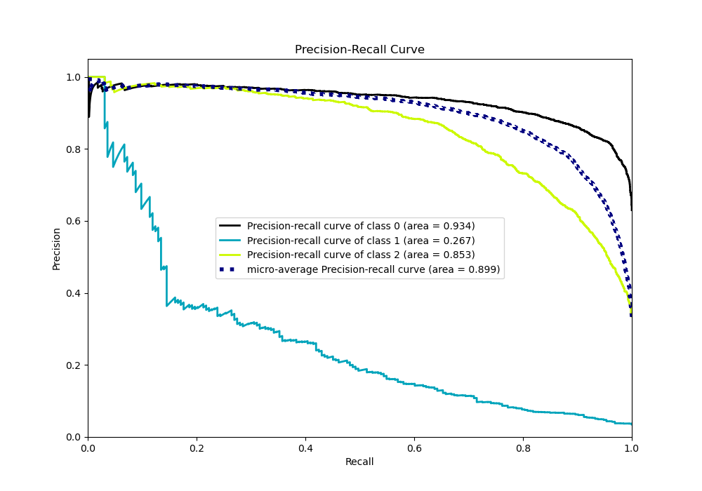

# Summary of 14_Xgboost_SelectedFeatures

[<< Go back](../README.md)

## Extreme Gradient Boosting (Xgboost)
- **n_jobs**: -1
- **objective**: multi:softprob
- **eta**: 0.1
- **max_depth**: 7
- **min_child_weight**: 25
- **subsample**: 0.9
- **colsample_bytree**: 0.6
- **eval_metric**: mlogloss
- **num_class**: 3
- **explain_level**: 0

## Validation
 - **validation_type**: kfold
 - **shuffle**: True
 - **stratify**: True
 - **k_folds**: 10

## Optimized metric
logloss

## Training time

12.2 seconds

### Metric details
|           |           0 |           1 |           2 |   accuracy |   macro avg |   weighted avg |   logloss |
|:----------|------------:|------------:|------------:|-----------:|------------:|---------------:|----------:|
| precision |    0.84646  |   0.6       |    0.790993 |   0.827761 |    0.745818 |       0.819277 |  0.448361 |
| recall    |    0.915663 |   0.0932642 |    0.738943 |   0.827761 |    0.582623 |       0.827761 |  0.448361 |
| f1-score  |    0.879702 |   0.161435  |    0.764083 |   0.827761 |    0.60174  |       0.815906 |  0.448361 |
| support   | 3486        | 193         | 1854        |   0.827761 | 5533        |    5533        |  0.448361 |

## Confusion matrix
|              |   Predicted as 0 |   Predicted as 1 |   Predicted as 2 |
|:-------------|-----------------:|-----------------:|-----------------:|
| Labeled as 0 |             3192 |                5 |              289 |
| Labeled as 1 |              102 |               18 |               73 |
| Labeled as 2 |              477 |                7 |             1370 |

## Learning curves

## Confusion Matrix

## Normalized Confusion Matrix

## ROC Curve

## Precision Recall Curve

[<< Go back](../README.md)
