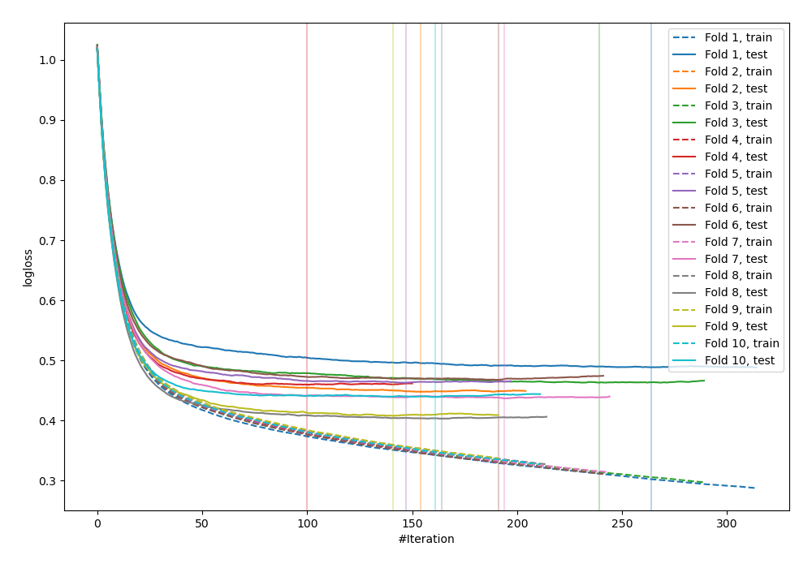

# Summary of 17_Xgboost

[<< Go back](../README.md)

## Extreme Gradient Boosting (Xgboost)
- **n_jobs**: -1
- **objective**: multi:softprob
- **eta**: 0.1
- **max_depth**: 4
- **min_child_weight**: 25
- **subsample**: 0.7
- **colsample_bytree**: 0.7
- **eval_metric**: mlogloss
- **num_class**: 3
- **explain_level**: 0

## Validation
 - **validation_type**: kfold
 - **shuffle**: True
 - **stratify**: True
 - **k_folds**: 10

## Optimized metric
logloss

## Training time

9.4 seconds

### Metric details
|           |           0 |           1 |           2 |   accuracy |   macro avg |   weighted avg |   logloss |
|:----------|------------:|------------:|------------:|-----------:|------------:|---------------:|----------:|
| precision |    0.84445  |   0.545455  |    0.795548 |    0.82758 |    0.728484 |       0.817635 |  0.447722 |
| recall    |    0.918818 |   0.0932642 |    0.73247  |    0.82758 |    0.581518 |       0.82758  |  0.447722 |
| f1-score  |    0.880066 |   0.159292  |    0.762707 |    0.82758 |    0.600688 |       0.8156   |  0.447722 |
| support   | 3486        | 193         | 1854        |    0.82758 | 5533        |    5533        |  0.447722 |

## Confusion matrix
|              |   Predicted as 0 |   Predicted as 1 |   Predicted as 2 |
|:-------------|-----------------:|-----------------:|-----------------:|
| Labeled as 0 |             3203 |                9 |              274 |
| Labeled as 1 |              100 |               18 |               75 |
| Labeled as 2 |              490 |                6 |             1358 |

## Learning curves

## Confusion Matrix

## Normalized Confusion Matrix

## ROC Curve

## Precision Recall Curve

[<< Go back](../README.md)
