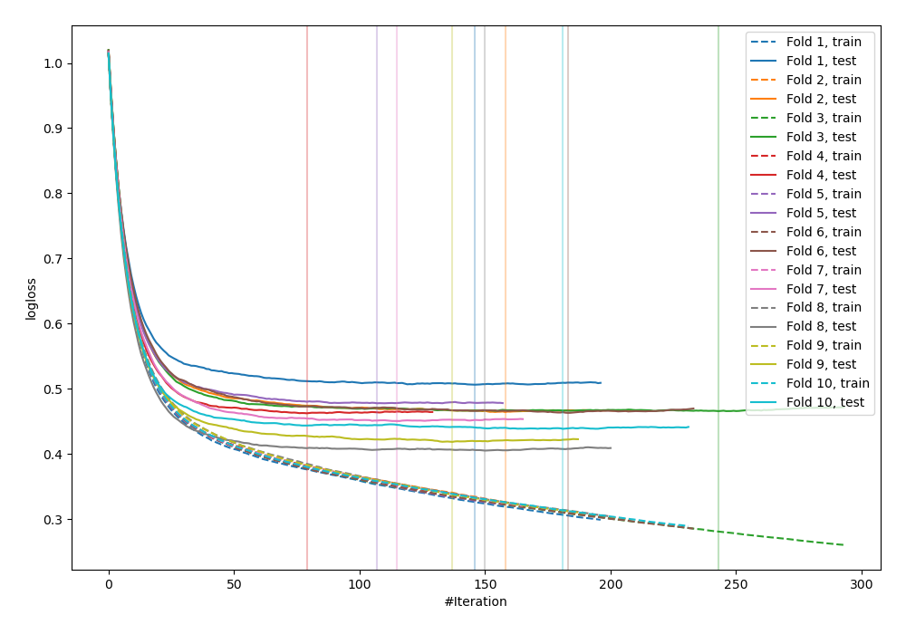
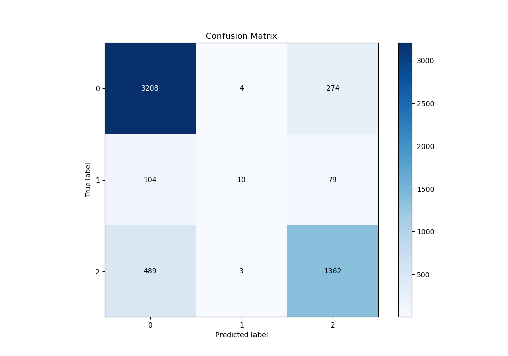
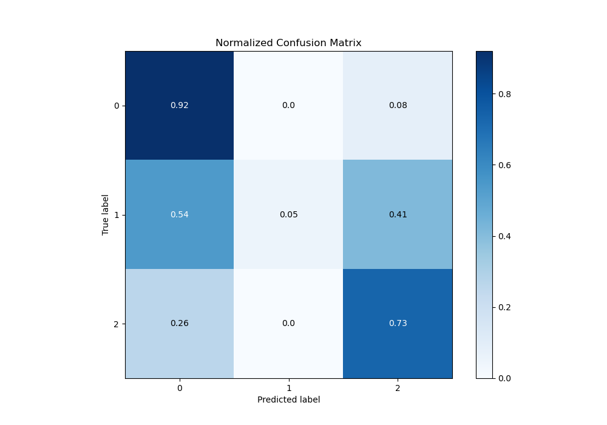
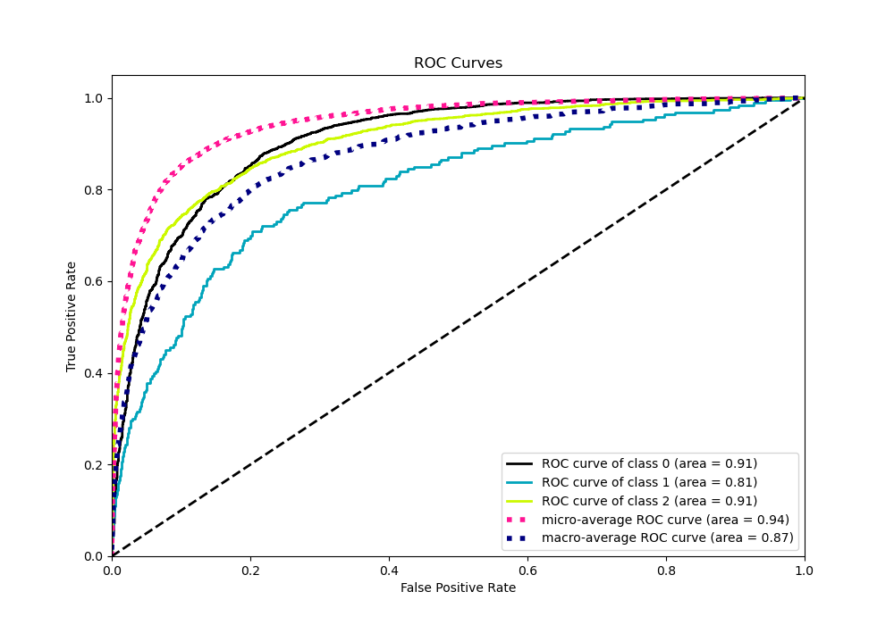
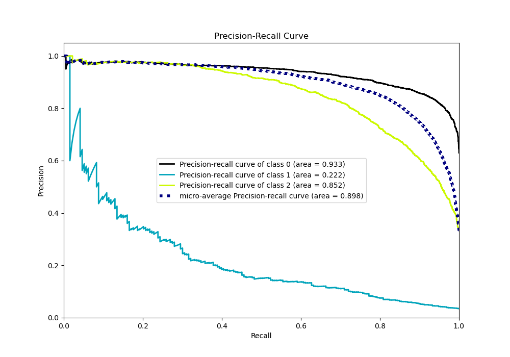

# Summary of 17_Xgboost_KMeansFeatures

[<< Go back](../README.md)

## Extreme Gradient Boosting (Xgboost)
- **n_jobs**: -1
- **objective**: multi:softprob
- **eta**: 0.1
- **max_depth**: 4
- **min_child_weight**: 25
- **subsample**: 0.7
- **colsample_bytree**: 0.7
- **eval_metric**: mlogloss
- **num_class**: 3
- **explain_level**: 0

## Validation
 - **validation_type**: kfold
 - **shuffle**: True
 - **stratify**: True
 - **k_folds**: 10

## Optimized metric
logloss

## Training time

16.6 seconds

### Metric details
|           |           0 |           1 |           2 |   accuracy |   macro avg |   weighted avg |   logloss |
|:----------|------------:|------------:|------------:|-----------:|------------:|---------------:|----------:|
| precision |    0.843988 |   0.588235  |    0.794169 |   0.827761 |    0.742131 |       0.818374 |  0.455123 |
| recall    |    0.920252 |   0.0518135 |    0.734628 |   0.827761 |    0.568898 |       0.827761 |  0.455123 |
| f1-score  |    0.880472 |   0.0952381 |    0.763239 |   0.827761 |    0.57965  |       0.813799 |  0.455123 |
| support   | 3486        | 193         | 1854        |   0.827761 | 5533        |    5533        |  0.455123 |

## Confusion matrix
|              |   Predicted as 0 |   Predicted as 1 |   Predicted as 2 |
|:-------------|-----------------:|-----------------:|-----------------:|
| Labeled as 0 |             3208 |                4 |              274 |
| Labeled as 1 |              104 |               10 |               79 |
| Labeled as 2 |              489 |                3 |             1362 |

## Learning curves

## Confusion Matrix

## Normalized Confusion Matrix

## ROC Curve

## Precision Recall Curve

[<< Go back](../README.md)
