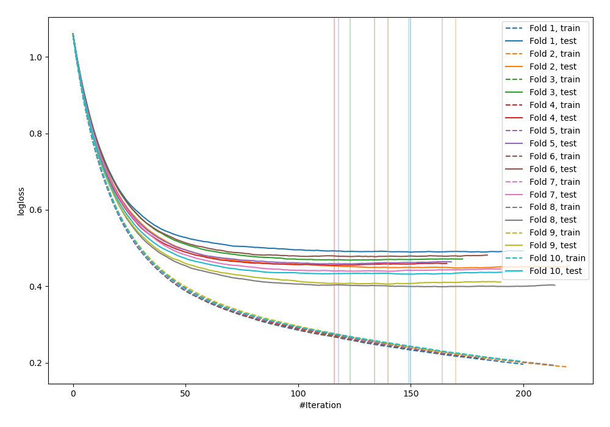
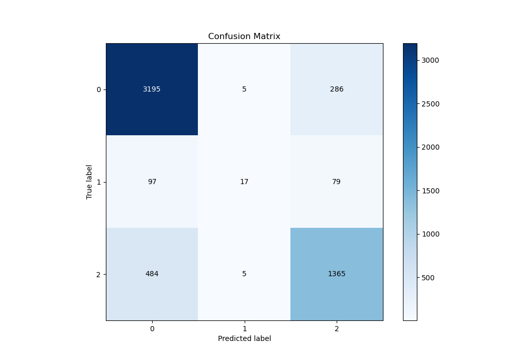
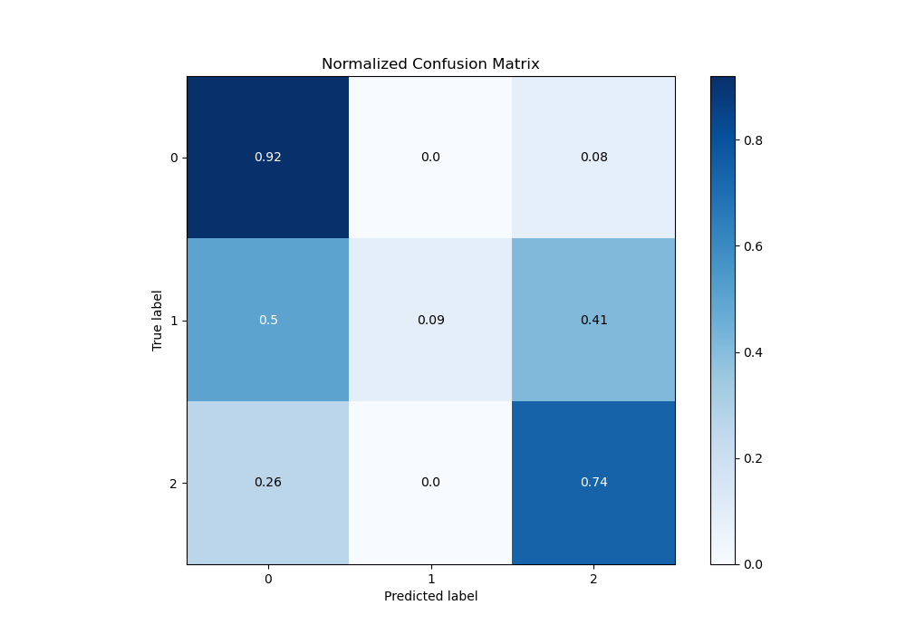
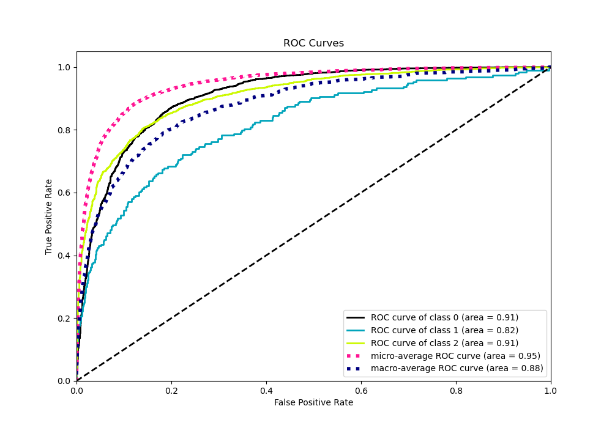
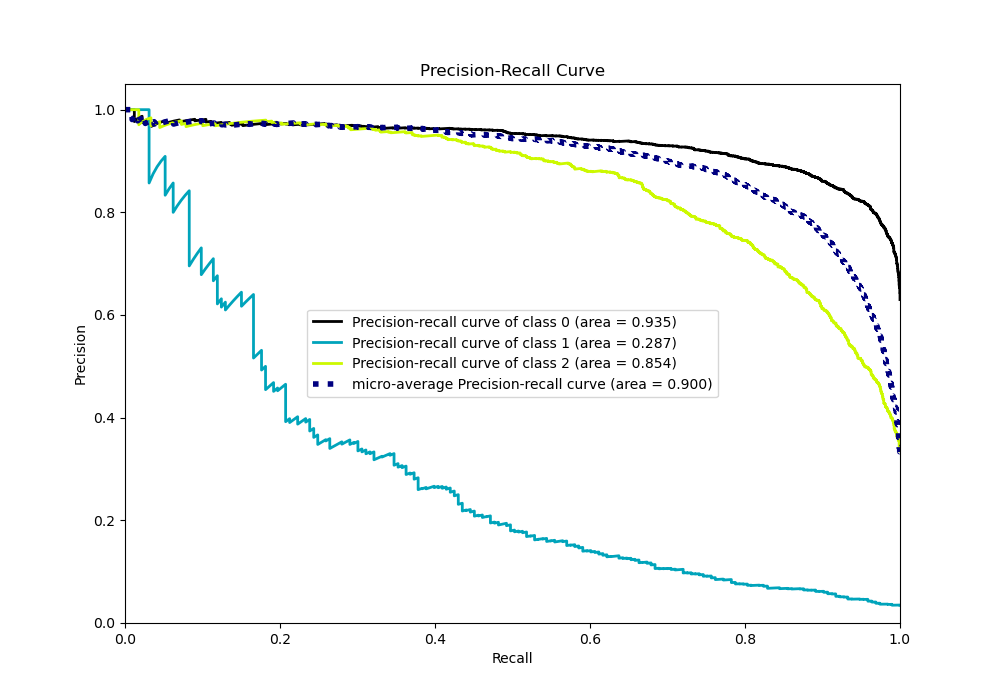

# Summary of 18_Xgboost

[<< Go back](../README.md)

## Extreme Gradient Boosting (Xgboost)
- **n_jobs**: -1
- **objective**: multi:softprob
- **eta**: 0.05
- **max_depth**: 8
- **min_child_weight**: 5
- **subsample**: 0.5
- **colsample_bytree**: 0.8
- **eval_metric**: mlogloss
- **num_class**: 3
- **explain_level**: 0

## Validation
 - **validation_type**: kfold
 - **shuffle**: True
 - **stratify**: True
 - **k_folds**: 10

## Optimized metric
logloss

## Training time

13.8 seconds

### Metric details
|           |           0 |           1 |           2 |   accuracy |   macro avg |   weighted avg |   logloss |
|:----------|------------:|------------:|------------:|-----------:|------------:|---------------:|----------:|
| precision |    0.846133 |   0.62963   |    0.789017 |   0.827219 |    0.754927 |       0.819443 |  0.447275 |
| recall    |    0.916523 |   0.0880829 |    0.736246 |   0.827219 |    0.580284 |       0.827219 |  0.447275 |
| f1-score  |    0.879923 |   0.154545  |    0.761719 |   0.827219 |    0.598729 |       0.815013 |  0.447275 |
| support   | 3486        | 193         | 1854        |   0.827219 | 5533        |    5533        |  0.447275 |

## Confusion matrix
|              |   Predicted as 0 |   Predicted as 1 |   Predicted as 2 |
|:-------------|-----------------:|-----------------:|-----------------:|
| Labeled as 0 |             3195 |                5 |              286 |
| Labeled as 1 |               97 |               17 |               79 |
| Labeled as 2 |              484 |                5 |             1365 |

## Learning curves

## Confusion Matrix

## Normalized Confusion Matrix

## ROC Curve

## Precision Recall Curve

[<< Go back](../README.md)
