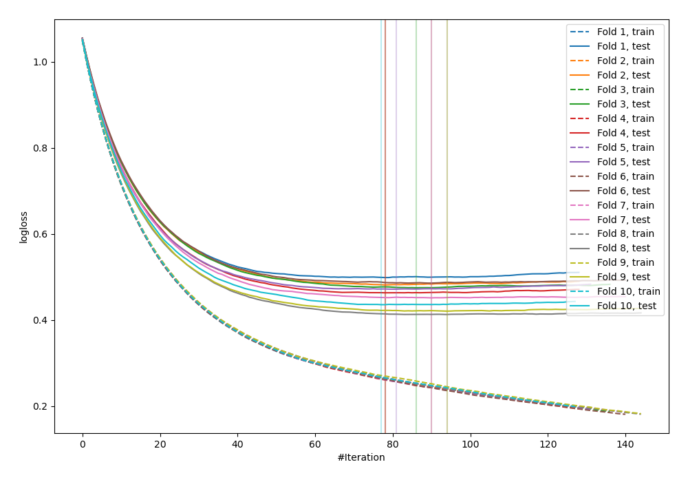
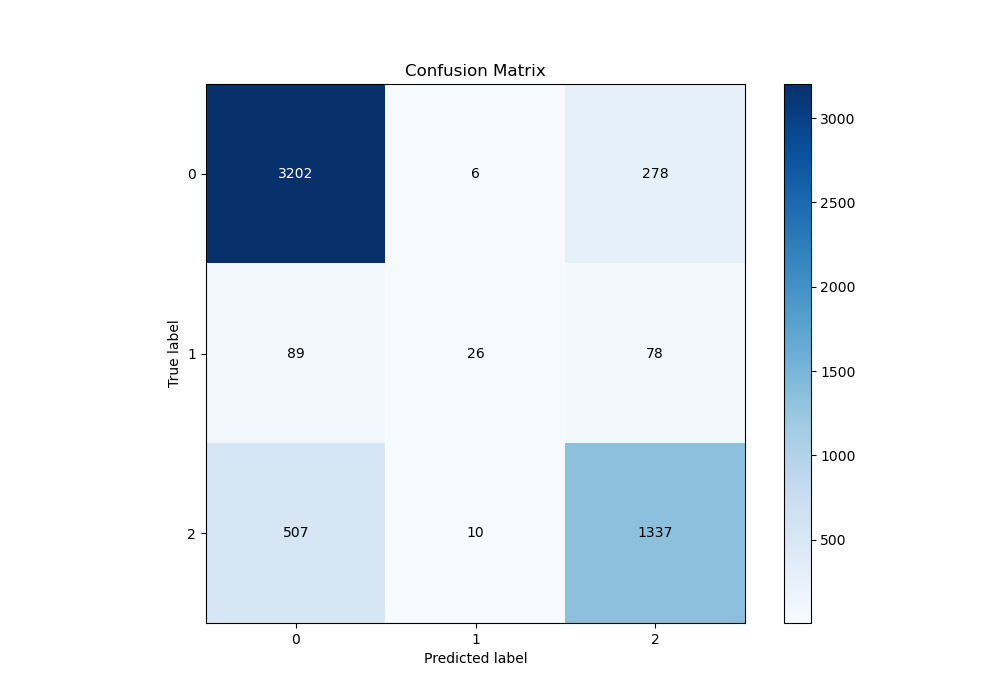
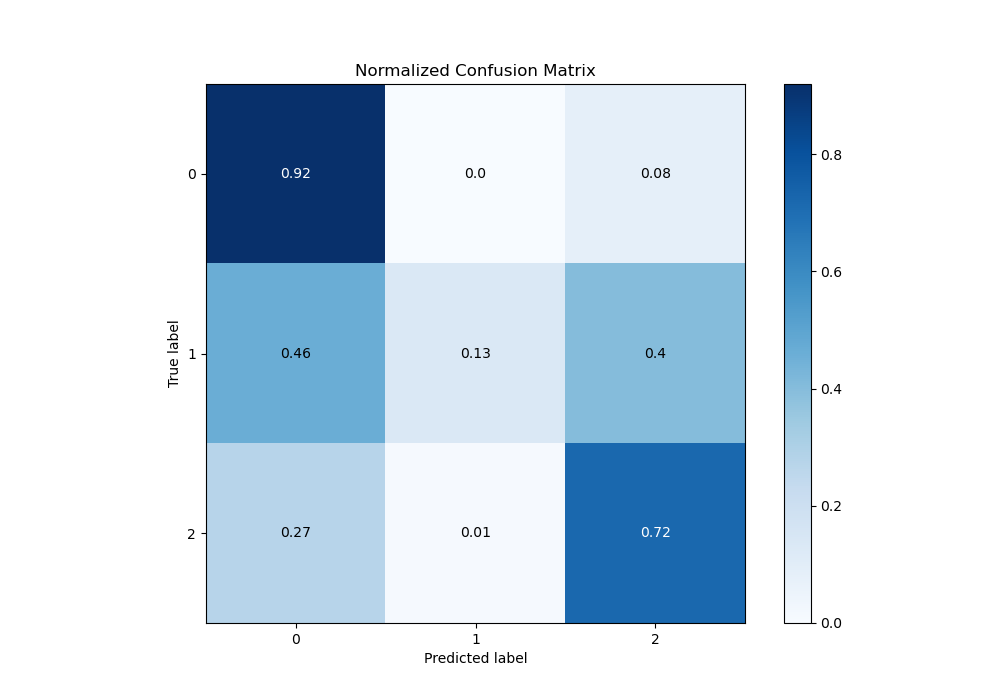
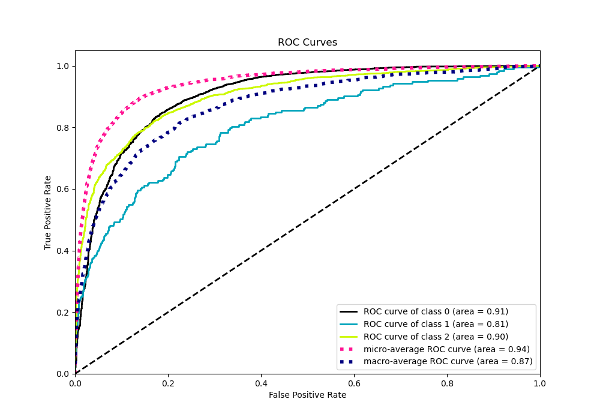
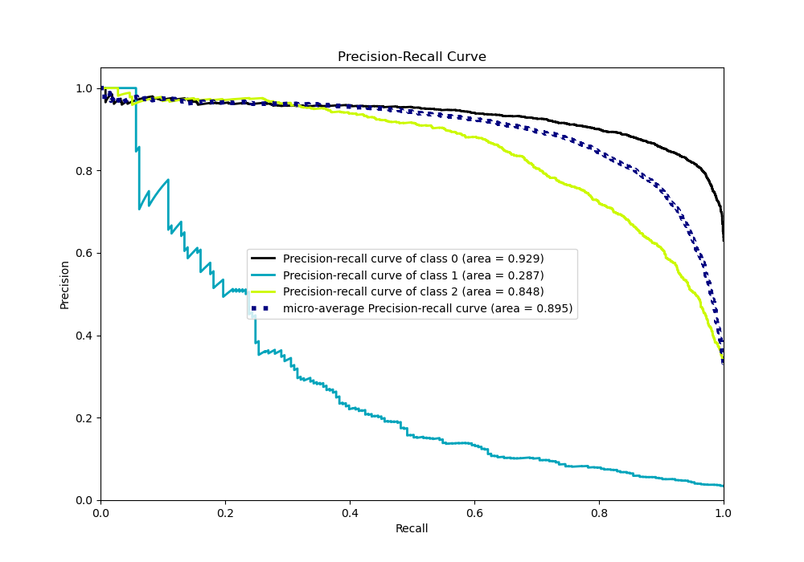

# Summary of 18_Xgboost_Stacked

[<< Go back](../README.md)

## Extreme Gradient Boosting (Xgboost)
- **n_jobs**: -1
- **objective**: multi:softprob
- **eta**: 0.05
- **max_depth**: 8
- **min_child_weight**: 5
- **subsample**: 0.5
- **colsample_bytree**: 0.8
- **eval_metric**: mlogloss
- **num_class**: 3
- **explain_level**: 0

## Validation
 - **validation_type**: kfold
 - **shuffle**: True
 - **stratify**: True
 - **k_folds**: 10

## Optimized metric
logloss

## Training time

80.0 seconds

### Metric details
|           |           0 |          1 |           2 |   accuracy |   macro avg |   weighted avg |   logloss |
|:----------|------------:|-----------:|------------:|-----------:|------------:|---------------:|----------:|
| precision |    0.843075 |   0.619048 |    0.789722 |    0.82505 |    0.750615 |       0.817383 |  0.459781 |
| recall    |    0.918531 |   0.134715 |    0.721143 |    0.82505 |    0.591463 |       0.82505  |  0.459781 |
| f1-score  |    0.879187 |   0.221277 |    0.753877 |    0.82505 |    0.618113 |       0.814249 |  0.459781 |
| support   | 3486        | 193        | 1854        |    0.82505 | 5533        |    5533        |  0.459781 |

## Confusion matrix
|              |   Predicted as 0 |   Predicted as 1 |   Predicted as 2 |
|:-------------|-----------------:|-----------------:|-----------------:|
| Labeled as 0 |             3202 |                6 |              278 |
| Labeled as 1 |               89 |               26 |               78 |
| Labeled as 2 |              507 |               10 |             1337 |

## Learning curves

## Confusion Matrix

## Normalized Confusion Matrix

## ROC Curve

## Precision Recall Curve

[<< Go back](../README.md)
