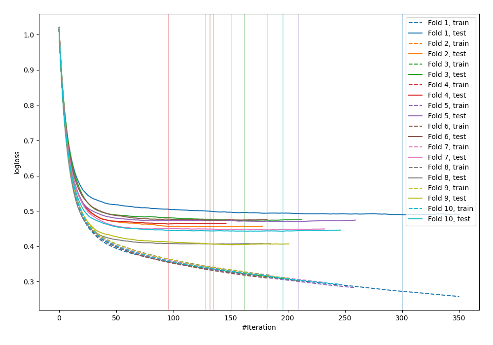
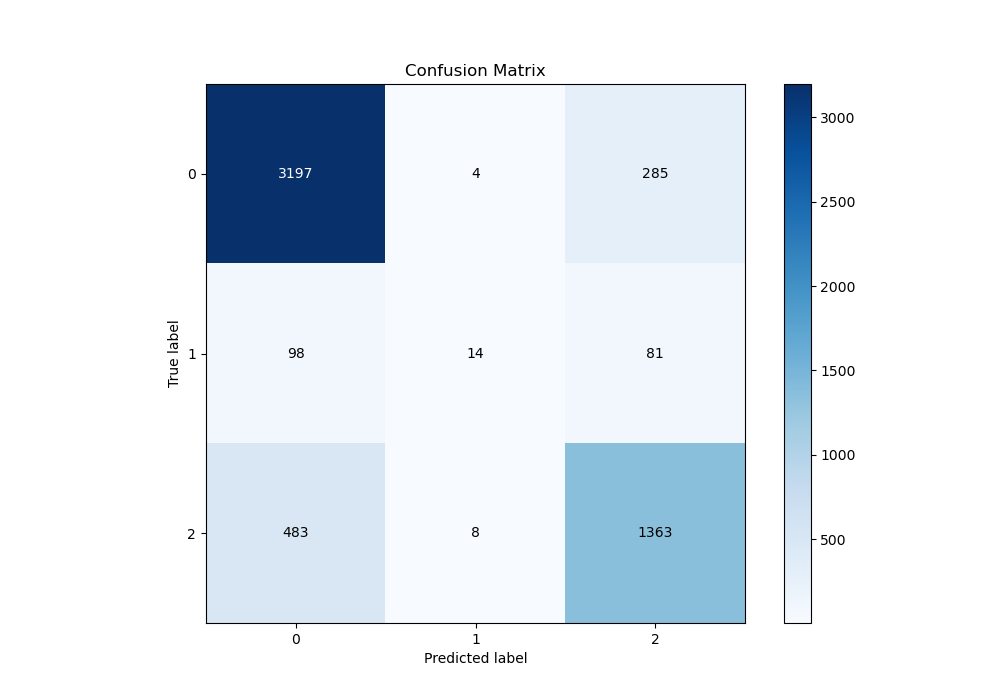
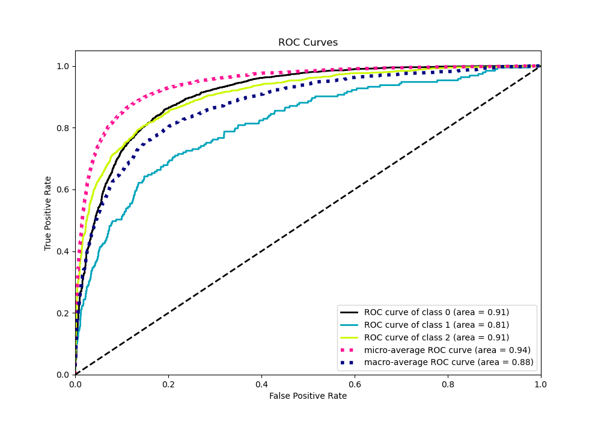
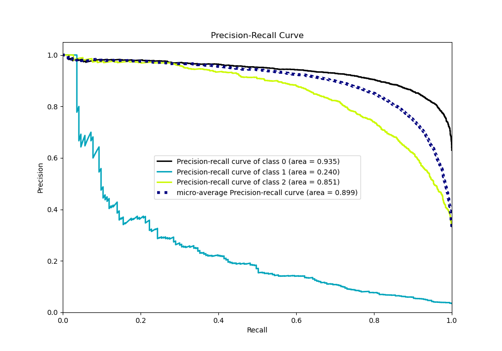

# Summary of 19_Xgboost

[<< Go back](../README.md)

## Extreme Gradient Boosting (Xgboost)
- **n_jobs**: -1
- **objective**: multi:softprob
- **eta**: 0.1
- **max_depth**: 7
- **min_child_weight**: 50
- **subsample**: 1.0
- **colsample_bytree**: 1.0
- **eval_metric**: mlogloss
- **num_class**: 3
- **explain_level**: 0

## Validation
 - **validation_type**: kfold
 - **shuffle**: True
 - **stratify**: True
 - **k_folds**: 10

## Optimized metric
logloss

## Training time

11.6 seconds

### Metric details
|           |           0 |           1 |           2 |   accuracy |   macro avg |   weighted avg |   logloss |
|:----------|------------:|------------:|------------:|-----------:|------------:|---------------:|----------:|
| precision |    0.846215 |   0.538462  |    0.788317 |   0.826676 |    0.724331 |       0.81608  |  0.452536 |
| recall    |    0.917097 |   0.0725389 |    0.735167 |   0.826676 |    0.574934 |       0.826676 |  0.452536 |
| f1-score  |    0.880231 |   0.127854  |    0.760815 |   0.826676 |    0.589633 |       0.813973 |  0.452536 |
| support   | 3486        | 193         | 1854        |   0.826676 | 5533        |    5533        |  0.452536 |

## Confusion matrix
|              |   Predicted as 0 |   Predicted as 1 |   Predicted as 2 |
|:-------------|-----------------:|-----------------:|-----------------:|
| Labeled as 0 |             3197 |                4 |              285 |
| Labeled as 1 |               98 |               14 |               81 |
| Labeled as 2 |              483 |                8 |             1363 |

## Learning curves

## Confusion Matrix

## Normalized Confusion Matrix

## ROC Curve

## Precision Recall Curve

[<< Go back](../README.md)
