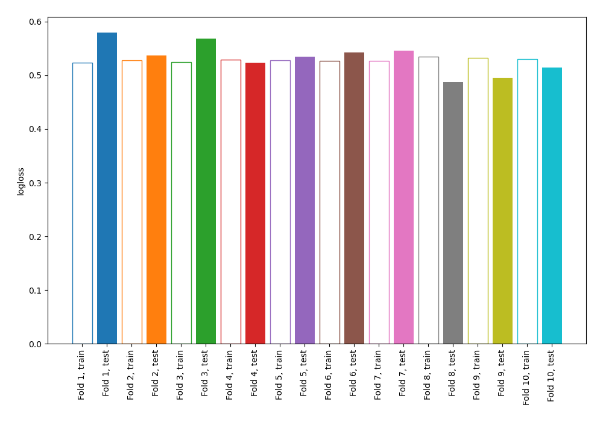
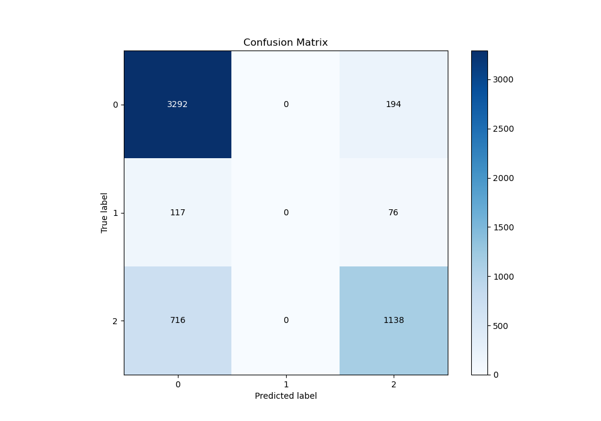
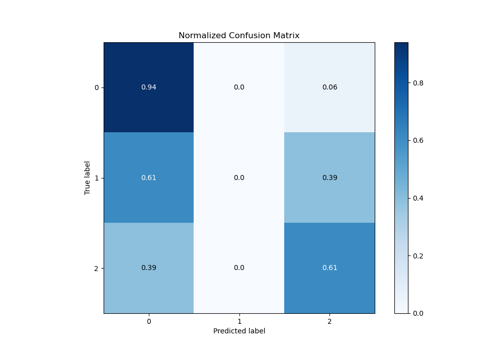
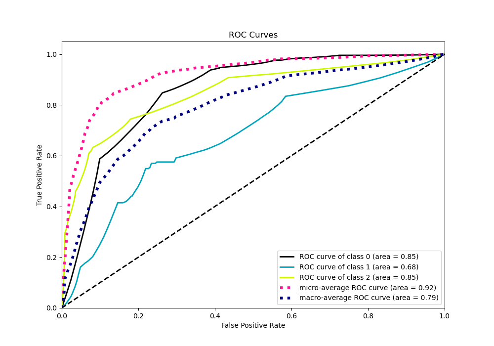
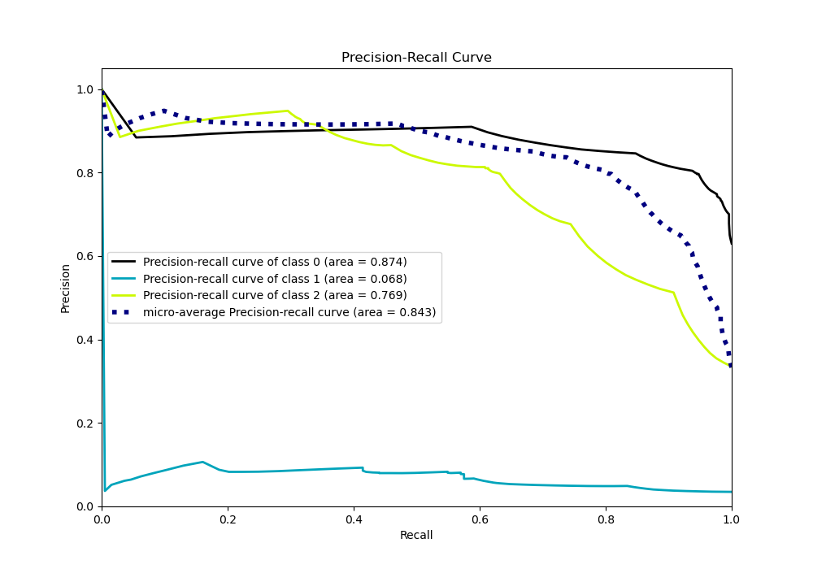

# Summary of 1_DecisionTree

[<< Go back](../README.md)

## Decision Tree
- **n_jobs**: -1
- **criterion**: gini
- **max_depth**: 3
- **num_class**: 3
- **explain_level**: 0

## Validation
 - **validation_type**: kfold
 - **shuffle**: True
 - **stratify**: True
 - **k_folds**: 10

## Optimized metric
logloss

## Training time

1.6 seconds

### Metric details
|           |           0 |   1 |           2 |   accuracy |   macro avg |   weighted avg |   logloss |
|:----------|------------:|----:|------------:|-----------:|------------:|---------------:|----------:|
| precision |    0.798061 |   0 |    0.808239 |   0.800651 |    0.535433 |       0.773633 |  0.532945 |
| recall    |    0.944349 |   0 |    0.613808 |   0.800651 |    0.519386 |       0.800651 |  0.532945 |
| f1-score  |    0.865064 |   0 |    0.697731 |   0.800651 |    0.520932 |       0.778819 |  0.532945 |
| support   | 3486        | 193 | 1854        |   0.800651 | 5533        |    5533        |  0.532945 |

## Confusion matrix
|              |   Predicted as 0 |   Predicted as 1 |   Predicted as 2 |
|:-------------|-----------------:|-----------------:|-----------------:|
| Labeled as 0 |             3292 |                0 |              194 |
| Labeled as 1 |              117 |                0 |               76 |
| Labeled as 2 |              716 |                0 |             1138 |

## Learning curves

## Confusion Matrix

## Normalized Confusion Matrix

## ROC Curve

## Precision Recall Curve

[<< Go back](../README.md)
