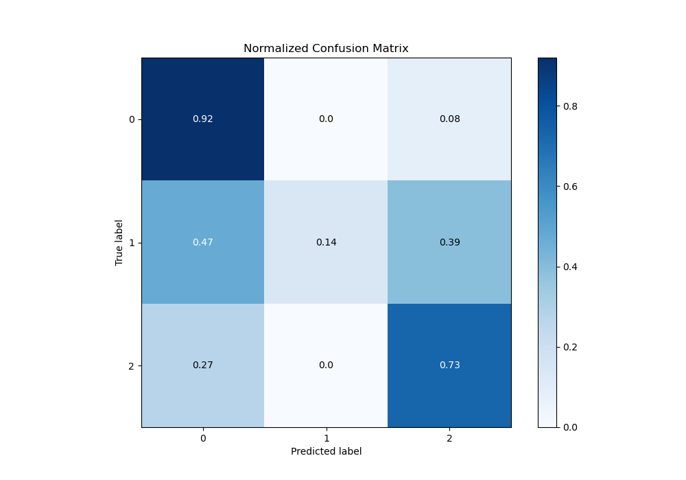

# Summary of 21_LightGBM_Stacked

[<< Go back](../README.md)

## LightGBM
- **n_jobs**: -1
- **objective**: multiclass
- **num_leaves**: 15
- **learning_rate**: 0.05
- **feature_fraction**: 0.8
- **bagging_fraction**: 0.5
- **min_data_in_leaf**: 50
- **metric**: multi_logloss
- **custom_eval_metric_name**: None
- **num_class**: 3
- **explain_level**: 0

## Validation
 - **validation_type**: kfold
 - **shuffle**: True
 - **stratify**: True
 - **k_folds**: 10

## Optimized metric
logloss

## Training time

20.7 seconds

### Metric details
|           |           0 |          1 |           2 |   accuracy |   macro avg |   weighted avg |   logloss |
|:----------|------------:|-----------:|------------:|-----------:|------------:|---------------:|----------:|
| precision |    0.844292 |   0.642857 |    0.796329 |   0.828122 |    0.76116  |       0.821195 |  0.453117 |
| recall    |    0.920826 |   0.139896 |    0.725458 |   0.828122 |    0.595394 |       0.828122 |  0.453117 |
| f1-score  |    0.8809   |   0.229787 |    0.759244 |   0.828122 |    0.62331  |       0.817424 |  0.453117 |
| support   | 3486        | 193        | 1854        |   0.828122 | 5533        |    5533        |  0.453117 |

## Confusion matrix
|              |   Predicted as 0 |   Predicted as 1 |   Predicted as 2 |
|:-------------|-----------------:|-----------------:|-----------------:|
| Labeled as 0 |             3210 |                8 |              268 |
| Labeled as 1 |               90 |               27 |               76 |
| Labeled as 2 |              502 |                7 |             1345 |

## Learning curves

## Confusion Matrix

## Normalized Confusion Matrix

## ROC Curve

## Precision Recall Curve

[<< Go back](../README.md)
