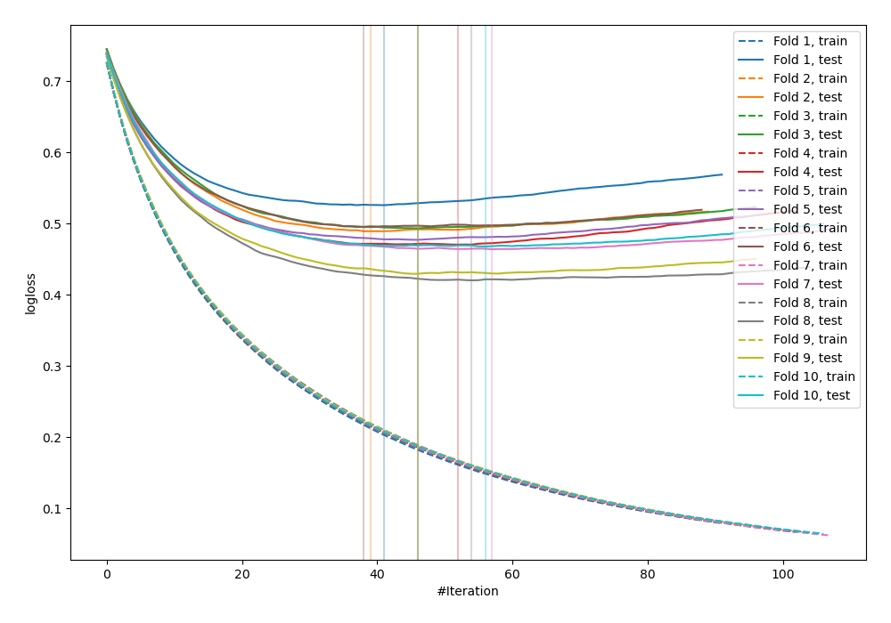
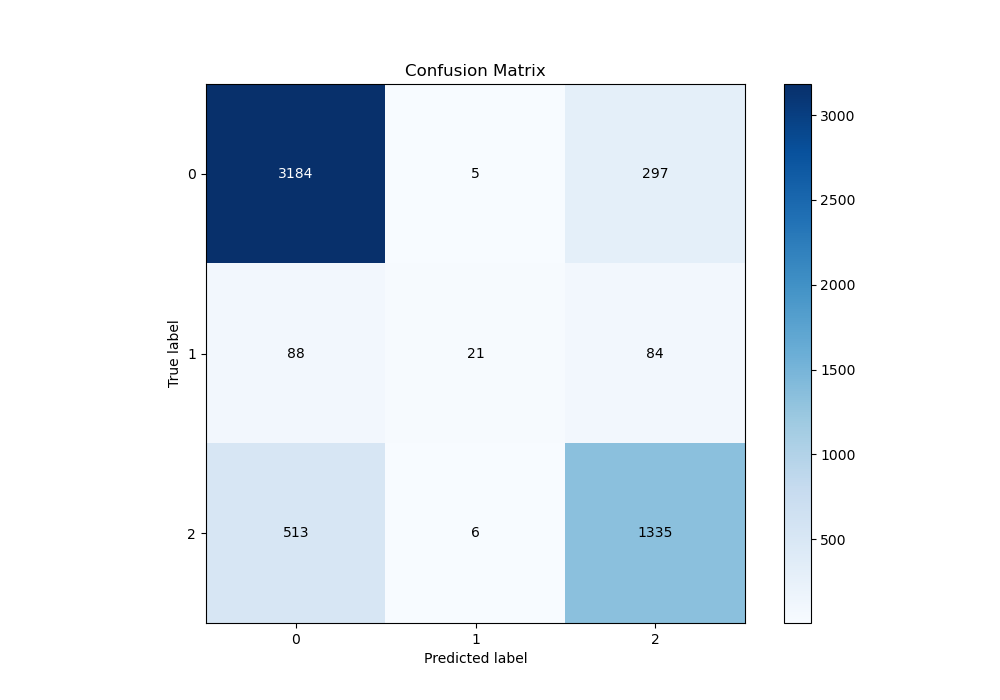
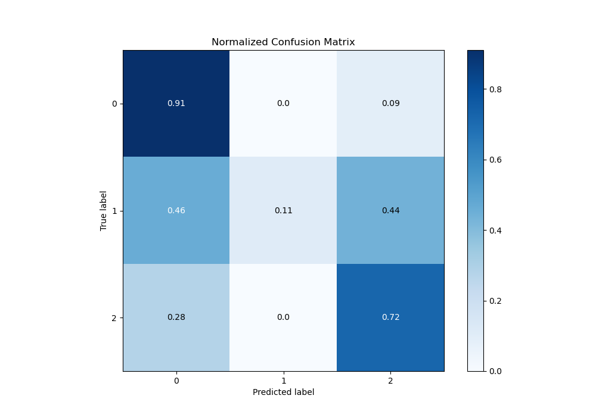
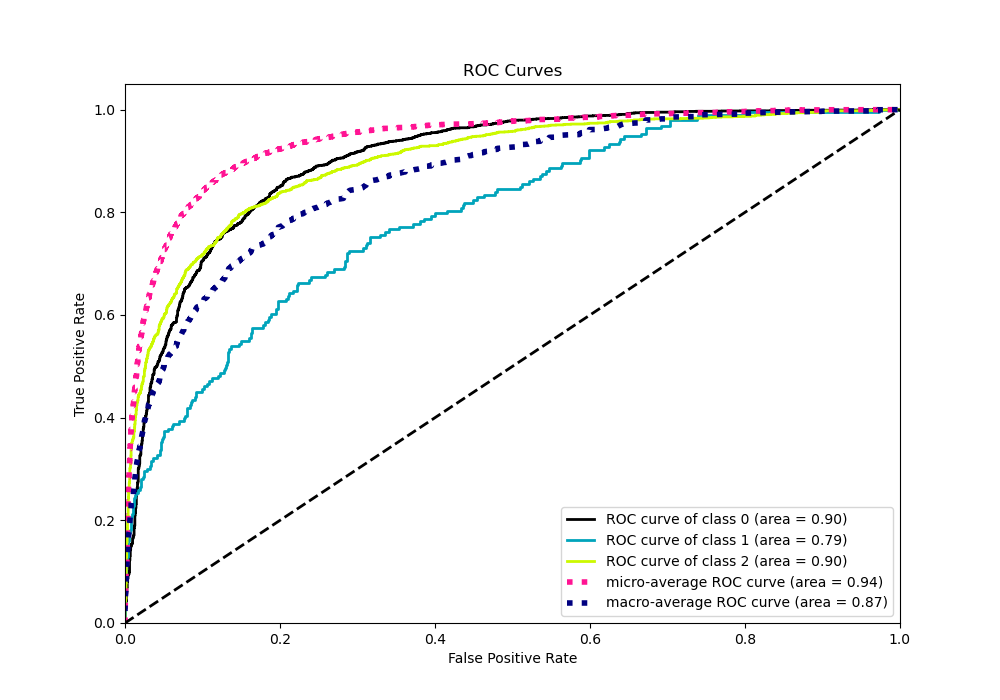
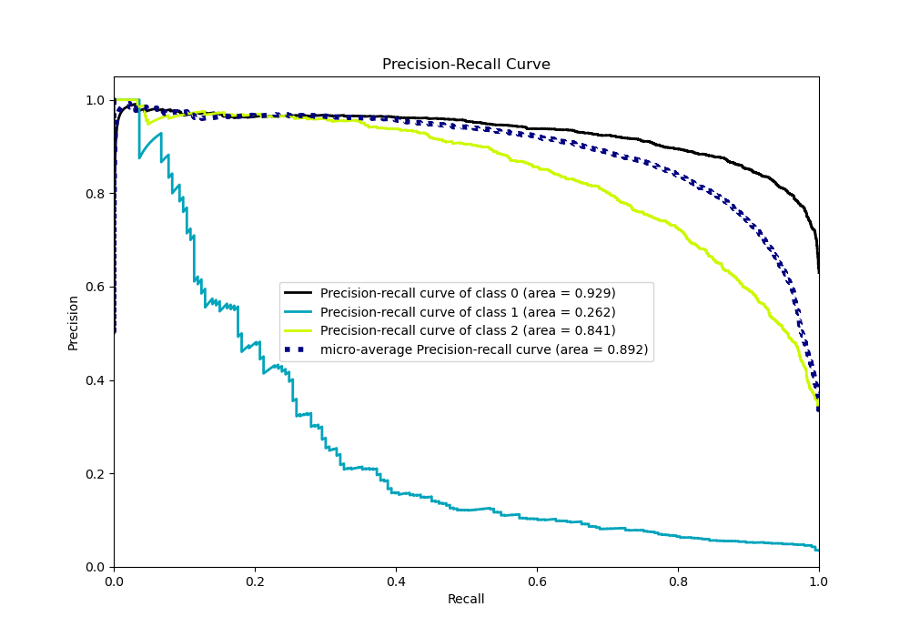

# Summary of 24_LightGBM

[<< Go back](../README.md)

## LightGBM
- **n_jobs**: -1
- **objective**: multiclass
- **num_leaves**: 95
- **learning_rate**: 0.05
- **feature_fraction**: 1.0
- **bagging_fraction**: 1.0
- **min_data_in_leaf**: 10
- **metric**: multi_logloss
- **custom_eval_metric_name**: None
- **num_class**: 3
- **explain_level**: 0

## Validation
 - **validation_type**: kfold
 - **shuffle**: True
 - **stratify**: True
 - **k_folds**: 10

## Optimized metric
logloss

## Training time

12.5 seconds

### Metric details
|           |           0 |          1 |           2 |   accuracy |   macro avg |   weighted avg |   logloss |
|:----------|------------:|-----------:|------------:|-----------:|------------:|---------------:|----------:|
| precision |    0.841215 |   0.65625  |    0.777972 |   0.820531 |    0.758479 |       0.813572 |  0.473534 |
| recall    |    0.913368 |   0.108808 |    0.720065 |   0.820531 |    0.580747 |       0.820531 |  0.473534 |
| f1-score  |    0.875808 |   0.186667 |    0.747899 |   0.820531 |    0.603458 |       0.80891  |  0.473534 |
| support   | 3486        | 193        | 1854        |   0.820531 | 5533        |    5533        |  0.473534 |

## Confusion matrix
|              |   Predicted as 0 |   Predicted as 1 |   Predicted as 2 |
|:-------------|-----------------:|-----------------:|-----------------:|
| Labeled as 0 |             3184 |                5 |              297 |
| Labeled as 1 |               88 |               21 |               84 |
| Labeled as 2 |              513 |                6 |             1335 |

## Learning curves

## Confusion Matrix

## Normalized Confusion Matrix

## ROC Curve

## Precision Recall Curve

[<< Go back](../README.md)
