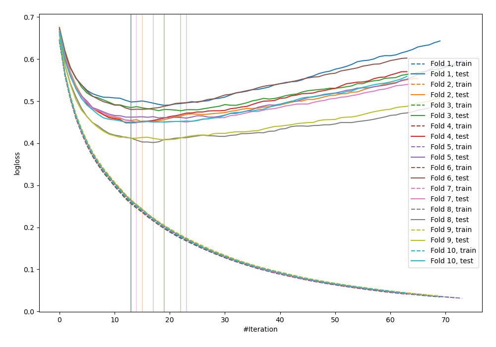
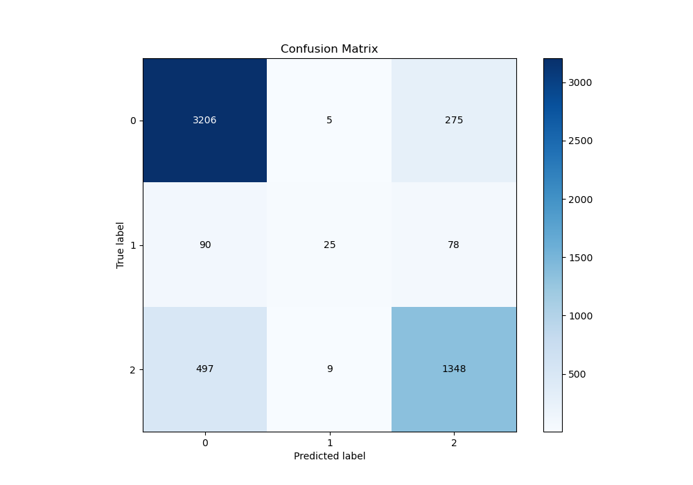
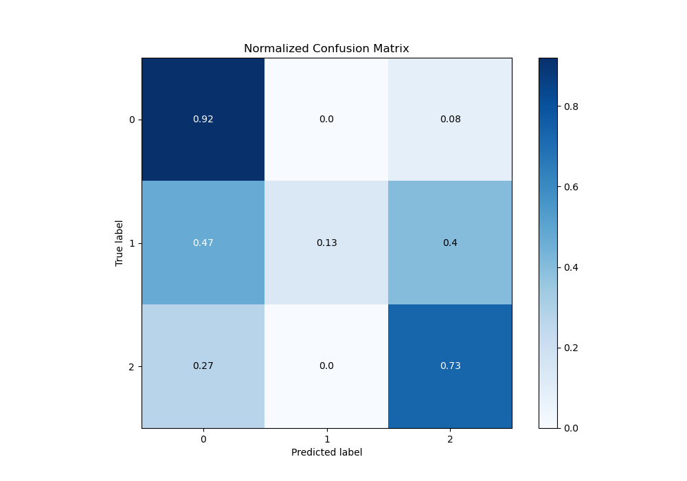
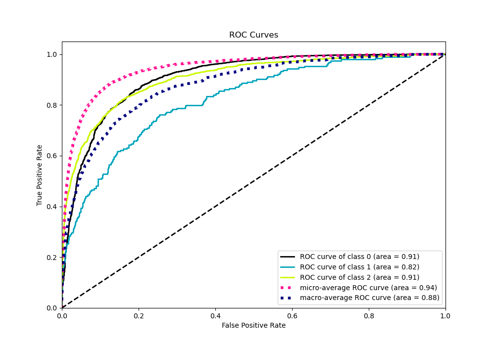
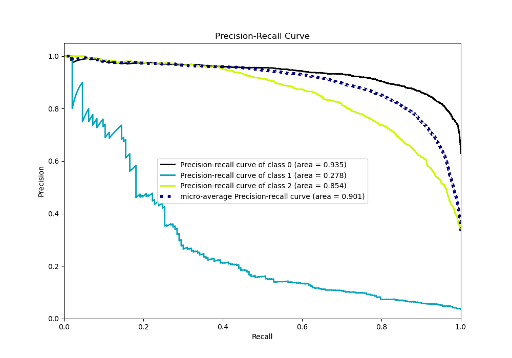

# Summary of 25_LightGBM

[<< Go back](../README.md)

## LightGBM
- **n_jobs**: -1
- **objective**: multiclass
- **num_leaves**: 63
- **learning_rate**: 0.2
- **feature_fraction**: 0.5
- **bagging_fraction**: 1.0
- **min_data_in_leaf**: 30
- **metric**: multi_logloss
- **custom_eval_metric_name**: None
- **num_class**: 3
- **explain_level**: 0

## Validation
 - **validation_type**: kfold
 - **shuffle**: True
 - **stratify**: True
 - **k_folds**: 10

## Optimized metric
logloss

## Training time

7.9 seconds

### Metric details
|           |           0 |          1 |           2 |   accuracy |   macro avg |   weighted avg |   logloss |
|:----------|------------:|-----------:|------------:|-----------:|------------:|---------------:|----------:|
| precision |    0.845241 |   0.641026 |    0.792475 |    0.82758 |    0.759581 |       0.820437 |  0.451488 |
| recall    |    0.919679 |   0.129534 |    0.727077 |    0.82758 |    0.592096 |       0.82758  |  0.451488 |
| f1-score  |    0.88089  |   0.215517 |    0.758368 |    0.82758 |    0.618259 |       0.816626 |  0.451488 |
| support   | 3486        | 193        | 1854        |    0.82758 | 5533        |    5533        |  0.451488 |

## Confusion matrix
|              |   Predicted as 0 |   Predicted as 1 |   Predicted as 2 |
|:-------------|-----------------:|-----------------:|-----------------:|
| Labeled as 0 |             3206 |                5 |              275 |
| Labeled as 1 |               90 |               25 |               78 |
| Labeled as 2 |              497 |                9 |             1348 |

## Learning curves

## Confusion Matrix

## Normalized Confusion Matrix

## ROC Curve

## Precision Recall Curve

[<< Go back](../README.md)
