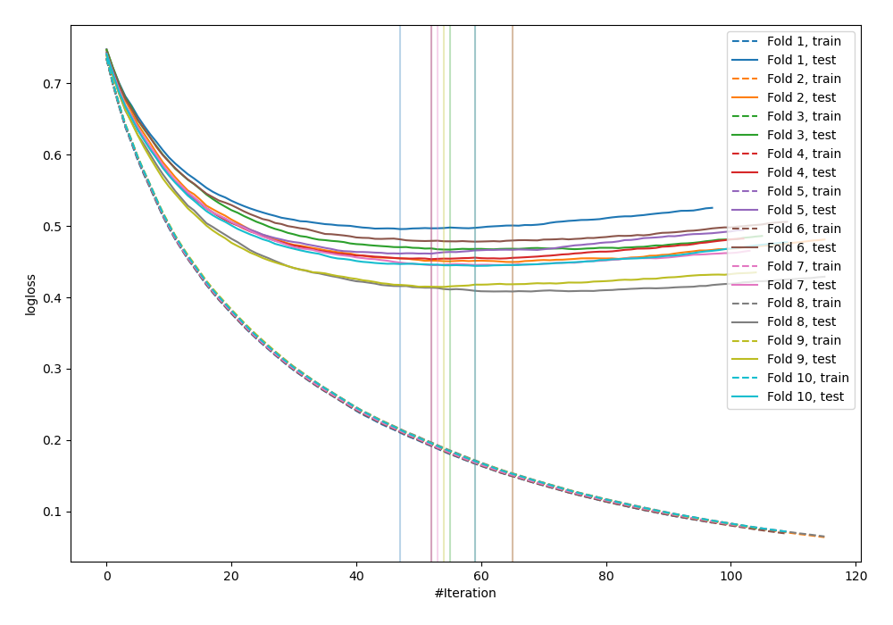
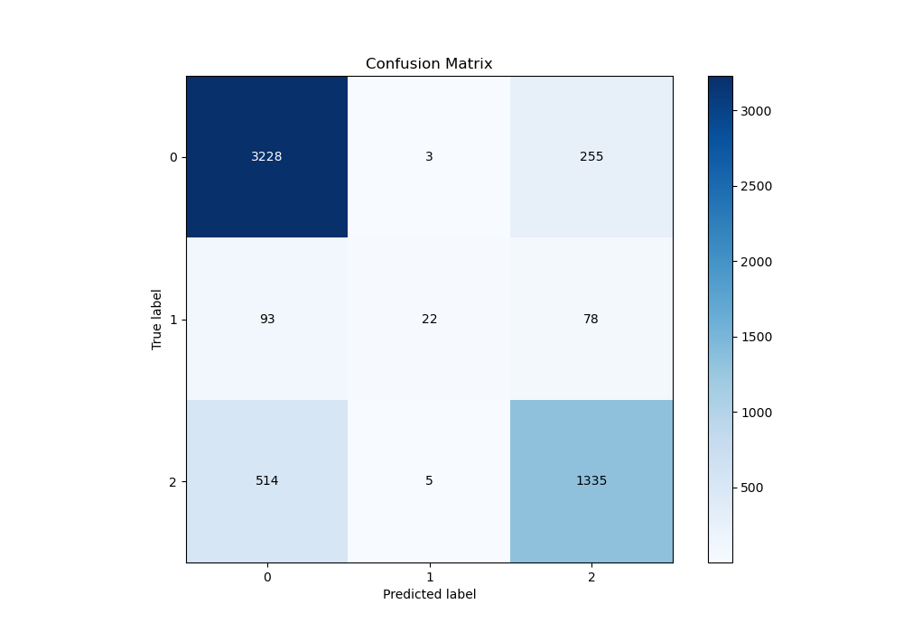
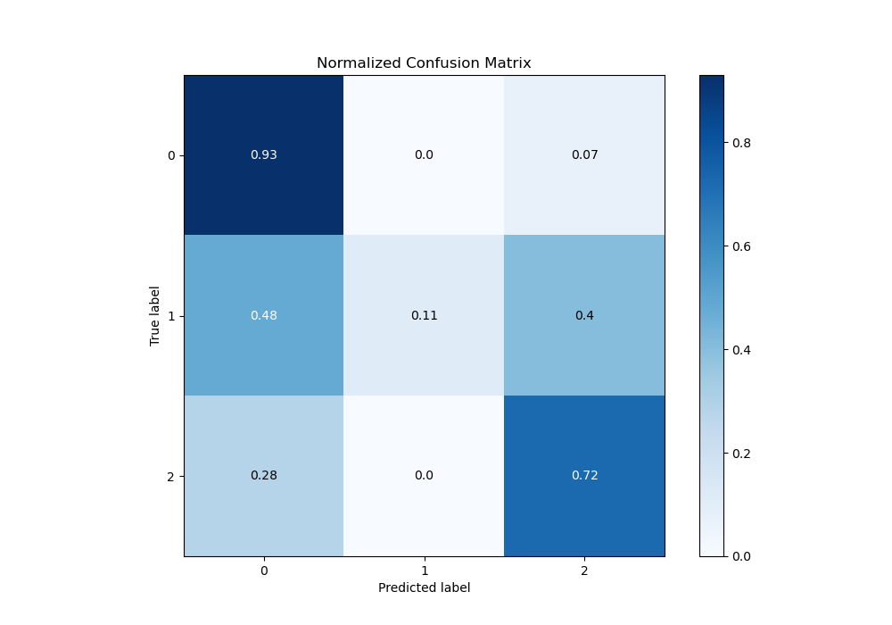
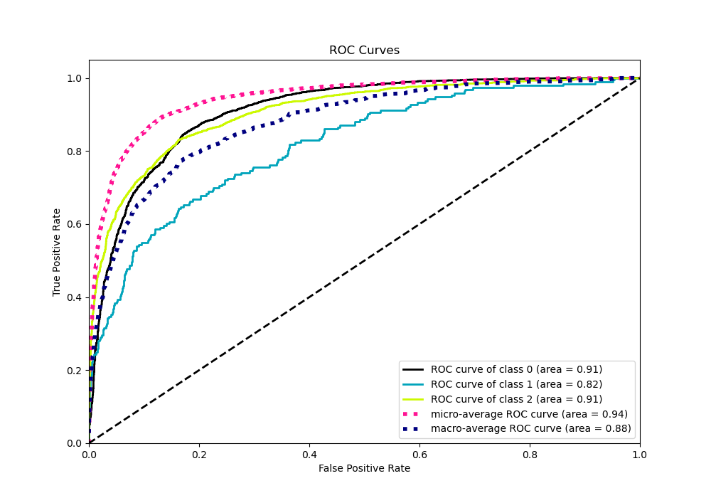
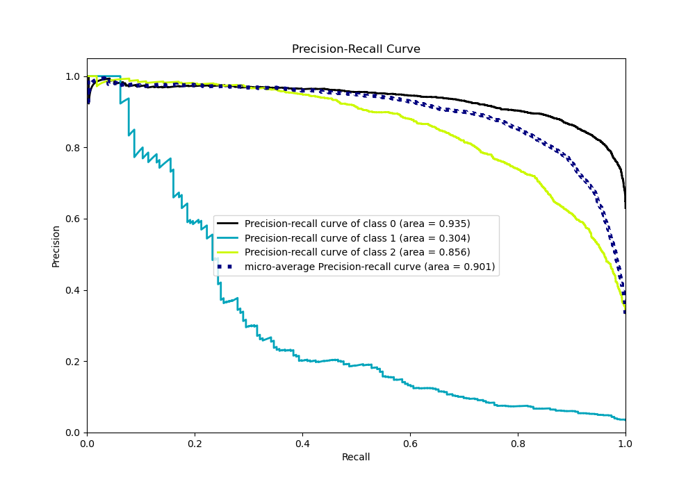

# Summary of 26_LightGBM

[<< Go back](../README.md)

## LightGBM
- **n_jobs**: -1
- **objective**: multiclass
- **num_leaves**: 127
- **learning_rate**: 0.05
- **feature_fraction**: 0.5
- **bagging_fraction**: 0.5
- **min_data_in_leaf**: 20
- **metric**: multi_logloss
- **custom_eval_metric_name**: None
- **num_class**: 3
- **explain_level**: 0

## Validation
 - **validation_type**: kfold
 - **shuffle**: True
 - **stratify**: True
 - **k_folds**: 10

## Optimized metric
logloss

## Training time

15.0 seconds

### Metric details
|           |           0 |          1 |           2 |   accuracy |   macro avg |   weighted avg |   logloss |
|:----------|------------:|-----------:|------------:|-----------:|------------:|---------------:|----------:|
| precision |    0.841721 |   0.733333 |    0.80036  |   0.828664 |    0.791805 |       0.824081 |  0.451788 |
| recall    |    0.92599  |   0.11399  |    0.720065 |   0.828664 |    0.586681 |       0.828664 |  0.451788 |
| f1-score  |    0.881847 |   0.197309 |    0.758092 |   0.828664 |    0.612416 |       0.816501 |  0.451788 |
| support   | 3486        | 193        | 1854        |   0.828664 | 5533        |    5533        |  0.451788 |

## Confusion matrix
|              |   Predicted as 0 |   Predicted as 1 |   Predicted as 2 |
|:-------------|-----------------:|-----------------:|-----------------:|
| Labeled as 0 |             3228 |                3 |              255 |
| Labeled as 1 |               93 |               22 |               78 |
| Labeled as 2 |              514 |                5 |             1335 |

## Learning curves

## Confusion Matrix

## Normalized Confusion Matrix

## ROC Curve

## Precision Recall Curve

[<< Go back](../README.md)
