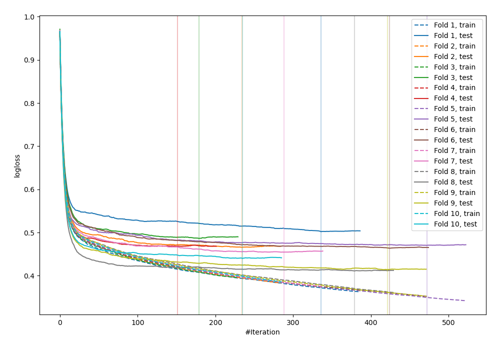
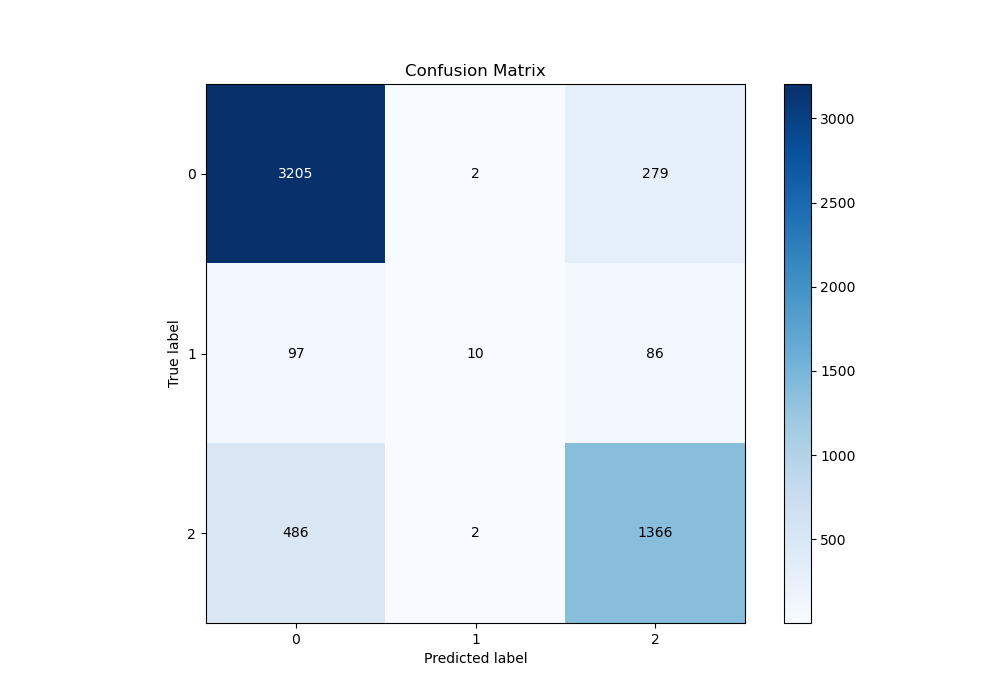
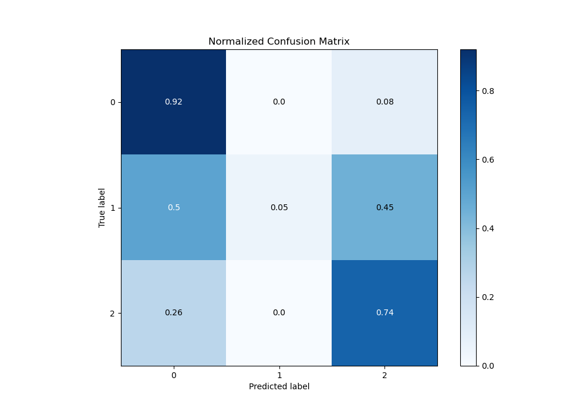
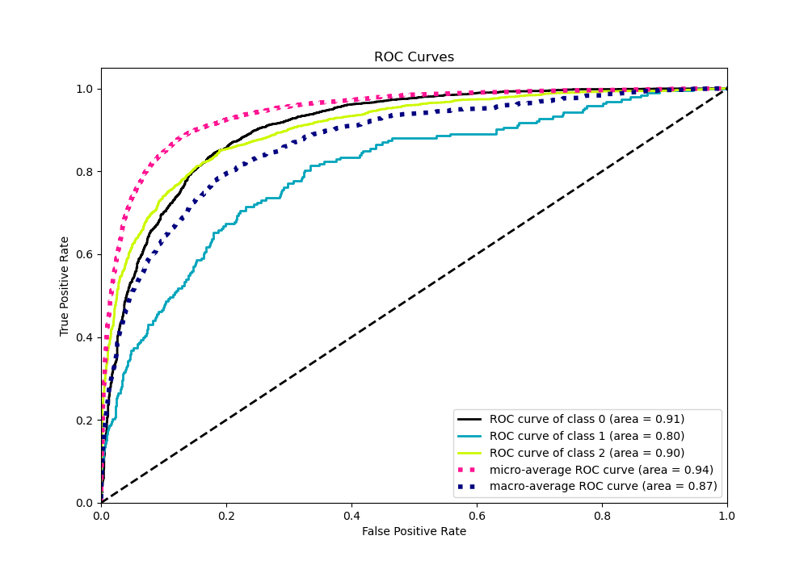
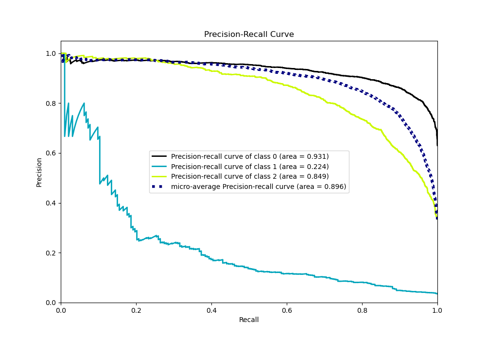

# Summary of 30_CatBoost

[<< Go back](../README.md)

## CatBoost
- **n_jobs**: -1
- **learning_rate**: 0.15
- **depth**: 3
- **rsm**: 0.8
- **loss_function**: MultiClass
- **eval_metric**: MultiClass
- **num_class**: 3
- **explain_level**: 0

## Validation
 - **validation_type**: kfold
 - **shuffle**: True
 - **stratify**: True
 - **k_folds**: 10

## Optimized metric
logloss

## Training time

8.8 seconds

### Metric details
|           |           0 |           1 |           2 |   accuracy |   macro avg |   weighted avg |   logloss |
|:----------|------------:|------------:|------------:|-----------:|------------:|---------------:|----------:|
| precision |    0.846093 |   0.714286  |    0.789139 |   0.827941 |    0.783173 |       0.822411 |  0.457547 |
| recall    |    0.919392 |   0.0518135 |    0.736785 |   0.827941 |    0.56933  |       0.827941 |  0.457547 |
| f1-score  |    0.881221 |   0.0966184 |    0.762064 |   0.827941 |    0.579968 |       0.813926 |  0.457547 |
| support   | 3486        | 193         | 1854        |   0.827941 | 5533        |    5533        |  0.457547 |

## Confusion matrix
|              |   Predicted as 0 |   Predicted as 1 |   Predicted as 2 |
|:-------------|-----------------:|-----------------:|-----------------:|
| Labeled as 0 |             3205 |                2 |              279 |
| Labeled as 1 |               97 |               10 |               86 |
| Labeled as 2 |              486 |                2 |             1366 |

## Learning curves

## Confusion Matrix

## Normalized Confusion Matrix

## ROC Curve

## Precision Recall Curve

[<< Go back](../README.md)
