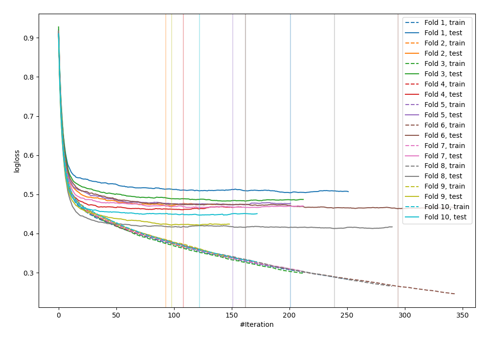
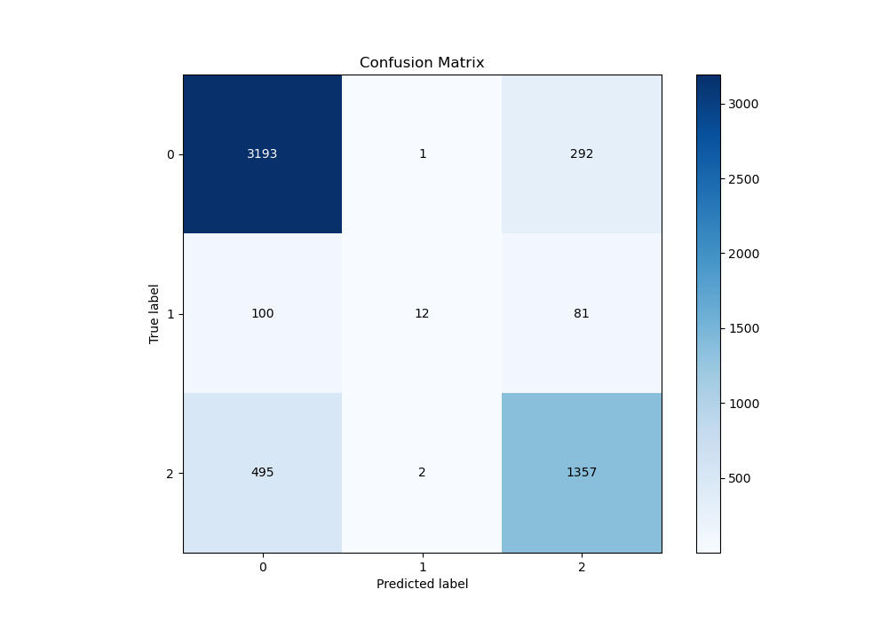
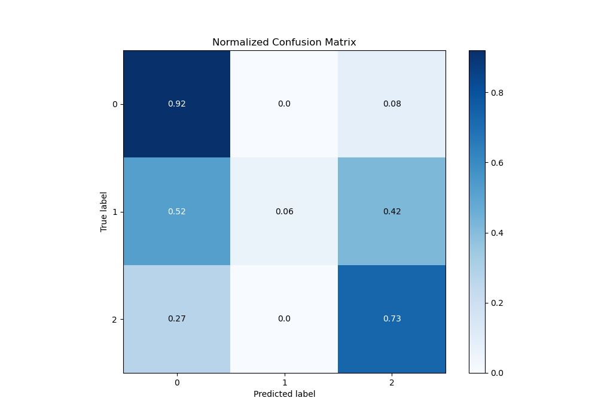
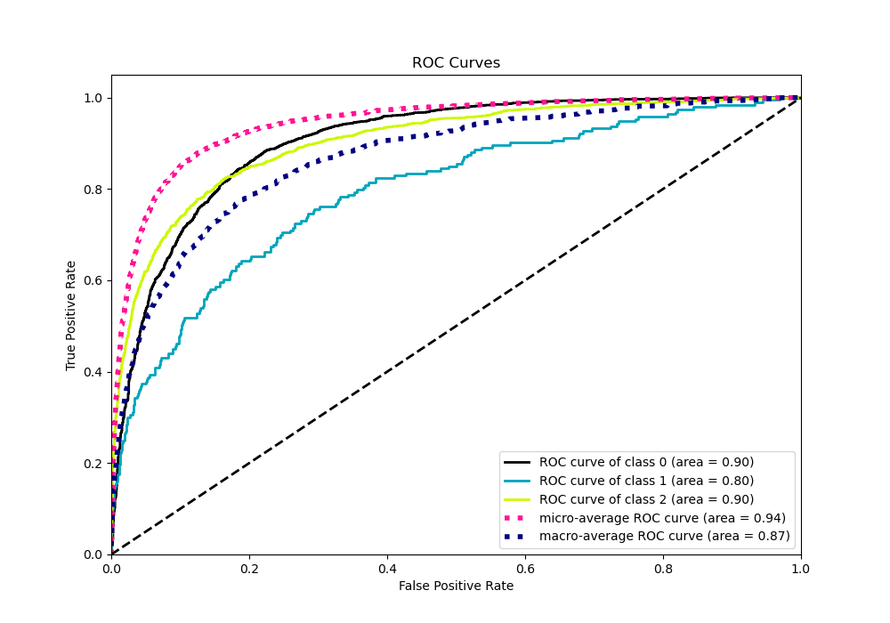
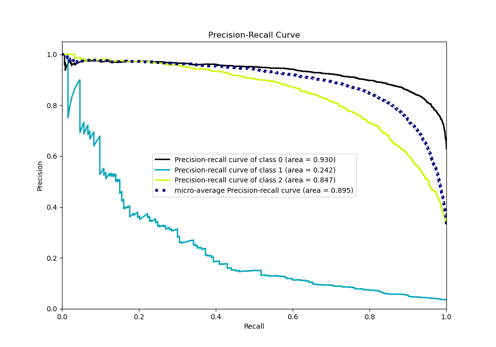

# Summary of 31_CatBoost

[<< Go back](../README.md)

## CatBoost
- **n_jobs**: -1
- **learning_rate**: 0.2
- **depth**: 5
- **rsm**: 0.7
- **loss_function**: MultiClass
- **eval_metric**: MultiClass
- **num_class**: 3
- **explain_level**: 0

## Validation
 - **validation_type**: kfold
 - **shuffle**: True
 - **stratify**: True
 - **k_folds**: 10

## Optimized metric
logloss

## Training time

9.8 seconds

### Metric details
|           |           0 |           1 |           2 |   accuracy |   macro avg |   weighted avg |   logloss |
|:----------|------------:|------------:|------------:|-----------:|------------:|---------------:|----------:|
| precision |    0.842925 |   0.8       |    0.784393 |   0.824508 |    0.809106 |       0.821815 |  0.460249 |
| recall    |    0.91595  |   0.0621762 |    0.731931 |   0.824508 |    0.570019 |       0.824508 |  0.460249 |
| f1-score  |    0.877921 |   0.115385  |    0.757254 |   0.824508 |    0.58352  |       0.81089  |  0.460249 |
| support   | 3486        | 193         | 1854        |   0.824508 | 5533        |    5533        |  0.460249 |

## Confusion matrix
|              |   Predicted as 0 |   Predicted as 1 |   Predicted as 2 |
|:-------------|-----------------:|-----------------:|-----------------:|
| Labeled as 0 |             3193 |                1 |              292 |
| Labeled as 1 |              100 |               12 |               81 |
| Labeled as 2 |              495 |                2 |             1357 |

## Learning curves

## Confusion Matrix

## Normalized Confusion Matrix

## ROC Curve

## Precision Recall Curve

[<< Go back](../README.md)
