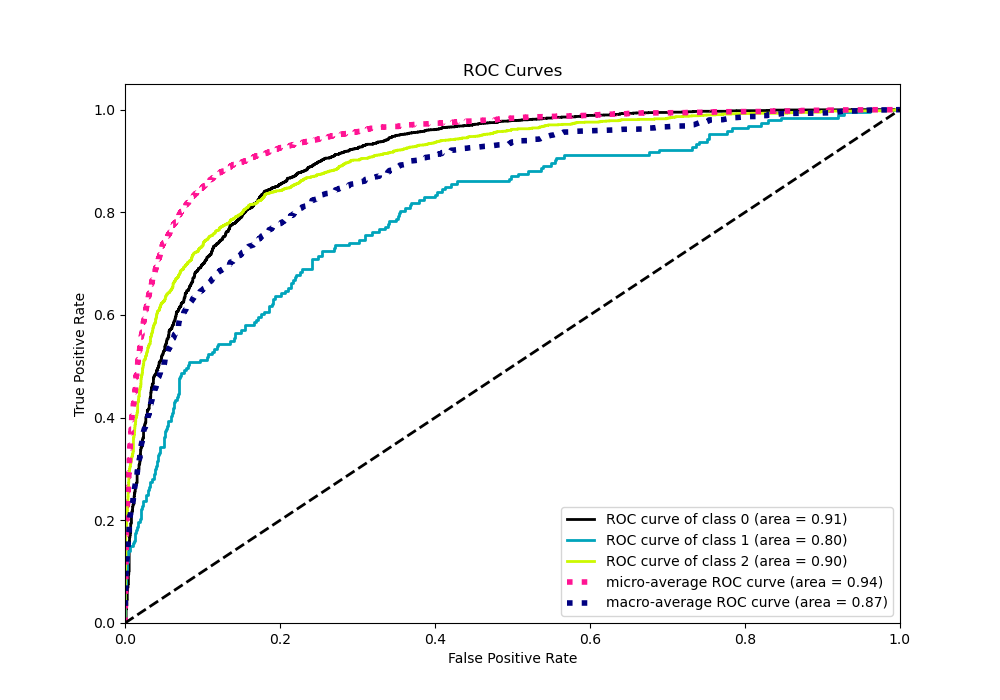

# Summary of 34_CatBoost_SelectedFeatures

[<< Go back](../README.md)

## CatBoost
- **n_jobs**: -1
- **learning_rate**: 0.2
- **depth**: 5
- **rsm**: 0.7
- **loss_function**: MultiClass
- **eval_metric**: MultiClass
- **num_class**: 3
- **explain_level**: 0

## Validation
 - **validation_type**: kfold
 - **shuffle**: True
 - **stratify**: True
 - **k_folds**: 10

## Optimized metric
logloss

## Training time

13.1 seconds

### Metric details
|           |           0 |           1 |           2 |   accuracy |   macro avg |   weighted avg |   logloss |
|:----------|------------:|------------:|------------:|-----------:|------------:|---------------:|----------:|
| precision |    0.844351 |   0.875     |    0.789535 |   0.827399 |    0.836295 |       0.827052 |  0.457602 |
| recall    |    0.919679 |   0.0725389 |    0.73247  |   0.827399 |    0.574896 |       0.827399 |  0.457602 |
| f1-score  |    0.880406 |   0.133971  |    0.759933 |   0.827399 |    0.591437 |       0.814001 |  0.457602 |
| support   | 3486        | 193         | 1854        |   0.827399 | 5533        |    5533        |  0.457602 |

## Confusion matrix
|              |   Predicted as 0 |   Predicted as 1 |   Predicted as 2 |
|:-------------|-----------------:|-----------------:|-----------------:|
| Labeled as 0 |             3206 |                0 |              280 |
| Labeled as 1 |               97 |               14 |               82 |
| Labeled as 2 |              494 |                2 |             1358 |

## Learning curves

## Confusion Matrix

## Normalized Confusion Matrix

## ROC Curve

## Precision Recall Curve

[<< Go back](../README.md)
