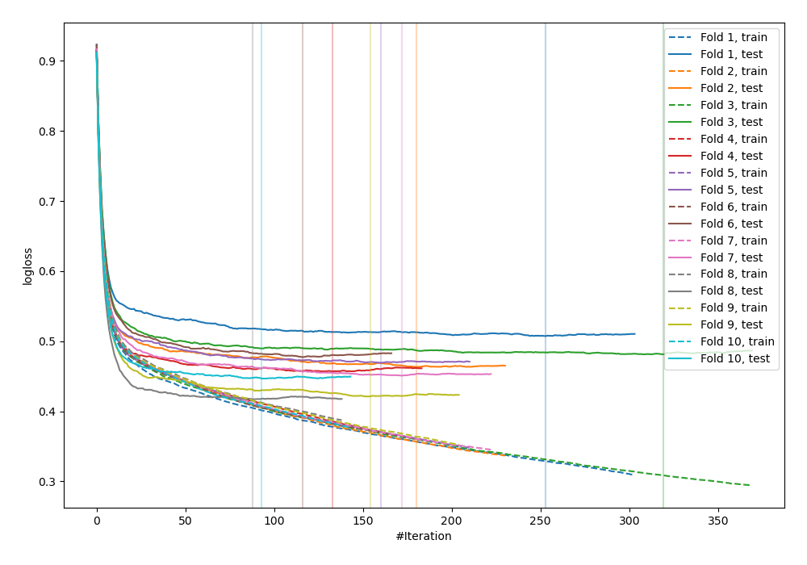
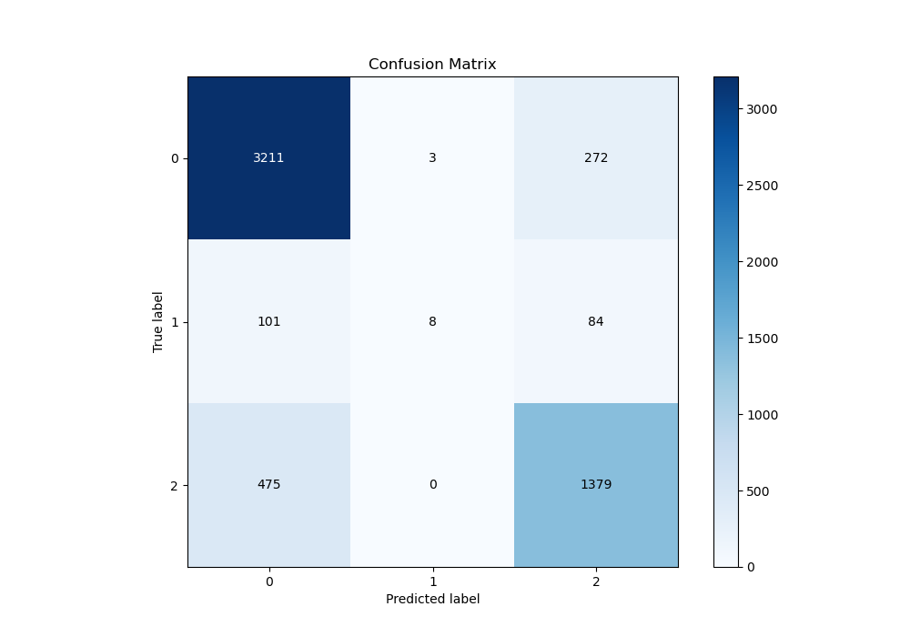
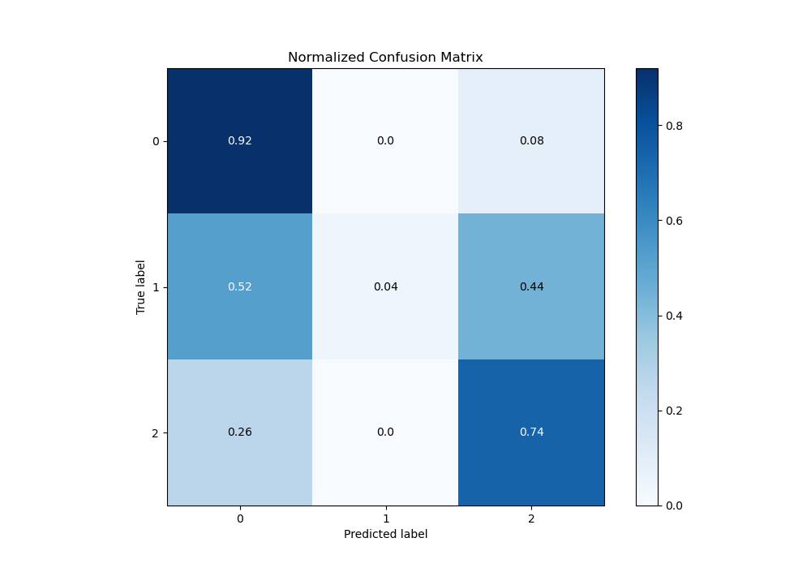
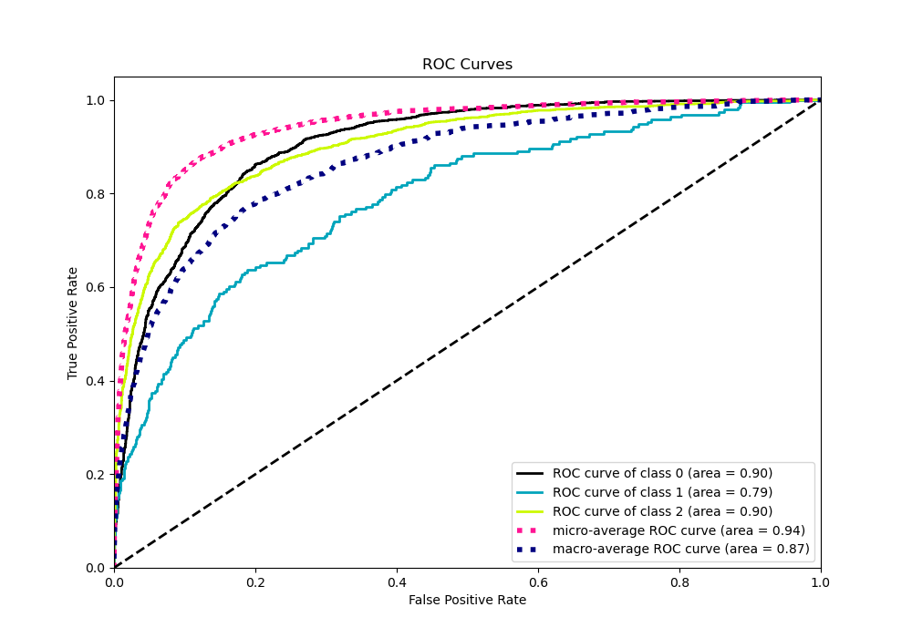
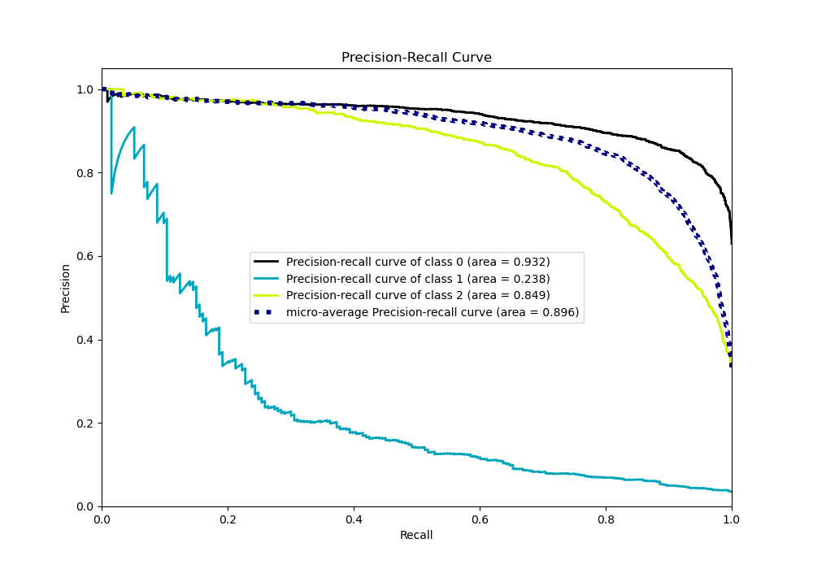

# Summary of 37_CatBoost

[<< Go back](../README.md)

## CatBoost
- **n_jobs**: -1
- **learning_rate**: 0.2
- **depth**: 4
- **rsm**: 1.0
- **loss_function**: MultiClass
- **eval_metric**: MultiClass
- **num_class**: 3
- **explain_level**: 0

## Validation
 - **validation_type**: kfold
 - **shuffle**: True
 - **stratify**: True
 - **k_folds**: 10

## Optimized metric
logloss

## Training time

9.4 seconds

### Metric details
|           |           0 |           1 |           2 |   accuracy |   macro avg |   weighted avg |   logloss |
|:----------|------------:|------------:|------------:|-----------:|------------:|---------------:|----------:|
| precision |    0.847901 |   0.727273  |    0.794813 |   0.831014 |    0.789995 |       0.825904 |  0.459038 |
| recall    |    0.921113 |   0.0414508 |    0.743797 |   0.831014 |    0.568787 |       0.831014 |  0.459038 |
| f1-score  |    0.882992 |   0.0784314 |    0.768459 |   0.831014 |    0.576627 |       0.81655  |  0.459038 |
| support   | 3486        | 193         | 1854        |   0.831014 | 5533        |    5533        |  0.459038 |

## Confusion matrix
|              |   Predicted as 0 |   Predicted as 1 |   Predicted as 2 |
|:-------------|-----------------:|-----------------:|-----------------:|
| Labeled as 0 |             3211 |                3 |              272 |
| Labeled as 1 |              101 |                8 |               84 |
| Labeled as 2 |              475 |                0 |             1379 |

## Learning curves

## Confusion Matrix

## Normalized Confusion Matrix

## ROC Curve

## Precision Recall Curve

[<< Go back](../README.md)
