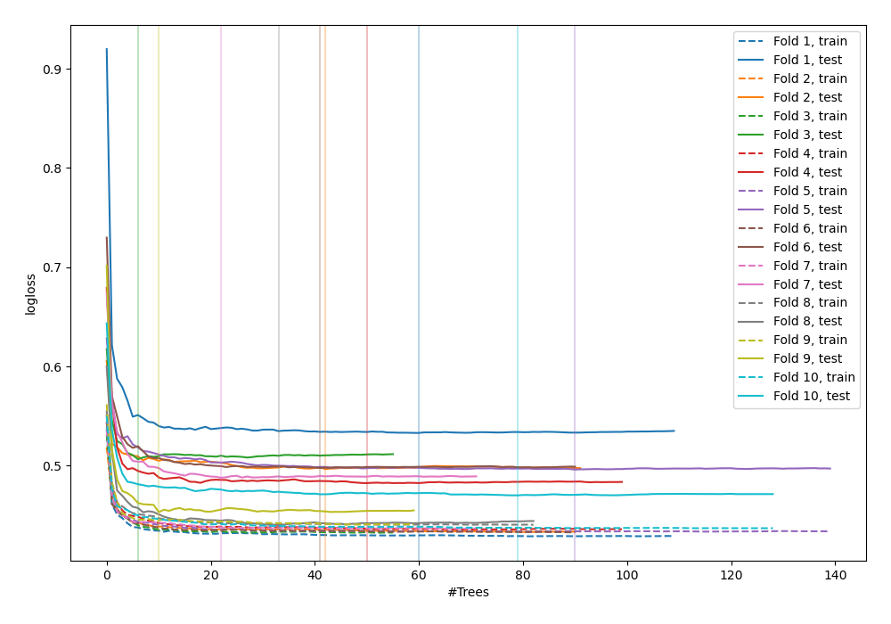
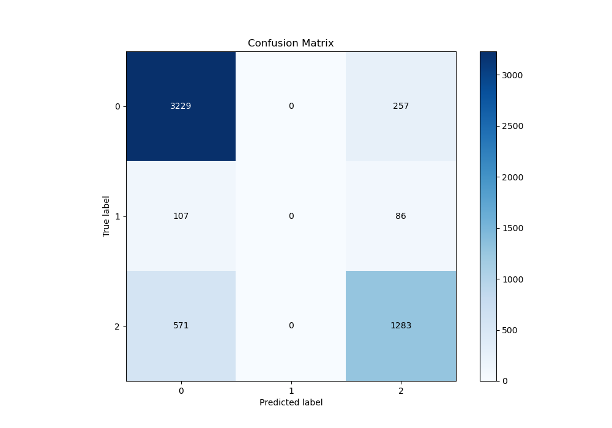
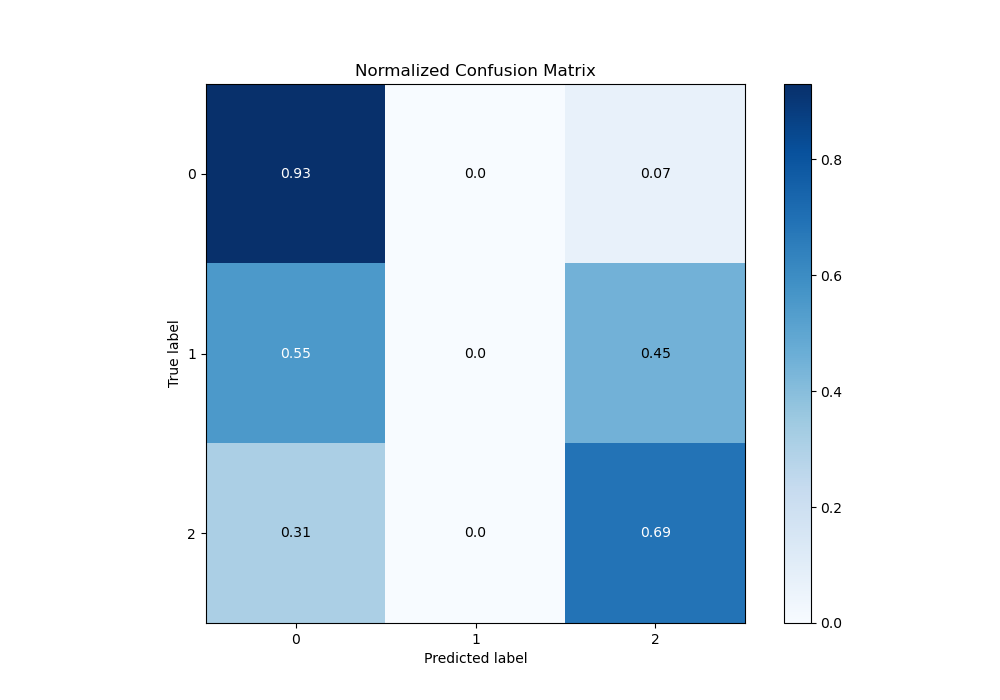
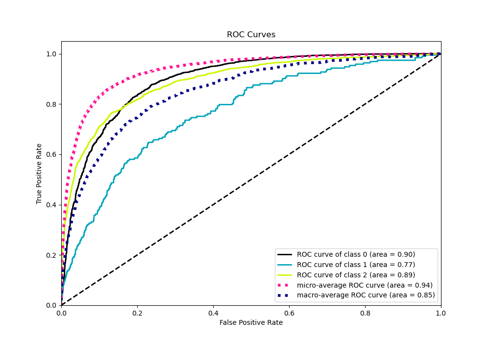
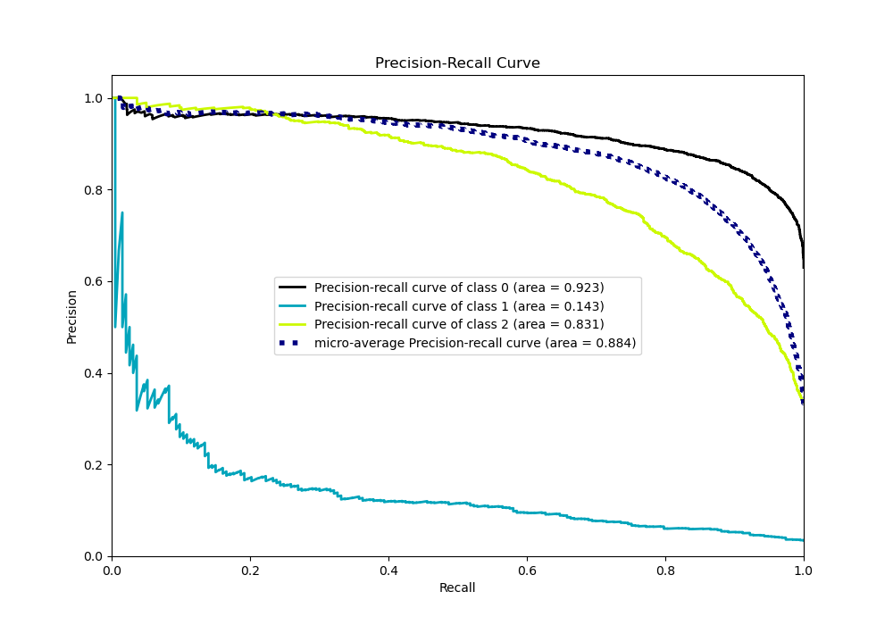

# Summary of 42_RandomForest

[<< Go back](../README.md)

## Random Forest
- **n_jobs**: -1
- **criterion**: entropy
- **max_features**: 0.6
- **min_samples_split**: 50
- **max_depth**: 6
- **eval_metric_name**: logloss
- **num_class**: 3
- **explain_level**: 0

## Validation
 - **validation_type**: kfold
 - **shuffle**: True
 - **stratify**: True
 - **k_folds**: 10

## Optimized metric
logloss

## Training time

13.1 seconds

### Metric details
|           |           0 |   1 |           2 |   accuracy |   macro avg |   weighted avg |   logloss |
|:----------|------------:|----:|------------:|-----------:|------------:|---------------:|----------:|
| precision |    0.826465 |   0 |    0.789053 |   0.815471 |    0.538506 |       0.785101 |  0.486462 |
| recall    |    0.926277 |   0 |    0.692017 |   0.815471 |    0.539431 |       0.815471 |  0.486462 |
| f1-score  |    0.873529 |   0 |    0.737356 |   0.815471 |    0.536962 |       0.79743  |  0.486462 |
| support   | 3486        | 193 | 1854        |   0.815471 | 5533        |    5533        |  0.486462 |

## Confusion matrix
|              |   Predicted as 0 |   Predicted as 1 |   Predicted as 2 |
|:-------------|-----------------:|-----------------:|-----------------:|
| Labeled as 0 |             3229 |                0 |              257 |
| Labeled as 1 |              107 |                0 |               86 |
| Labeled as 2 |              571 |                0 |             1283 |

## Learning curves

## Confusion Matrix

## Normalized Confusion Matrix

## ROC Curve

## Precision Recall Curve

[<< Go back](../README.md)
