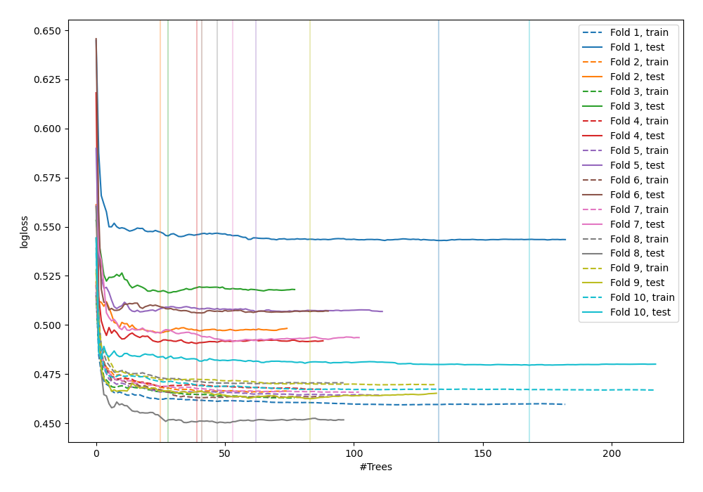
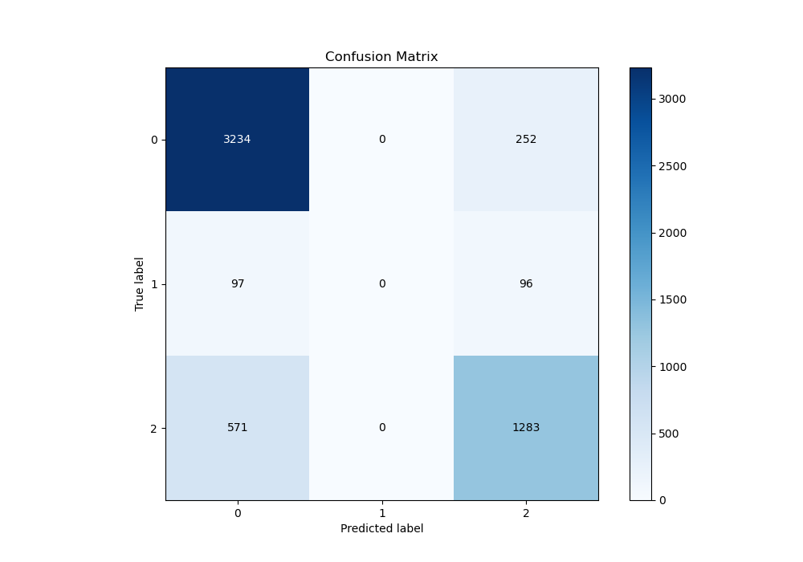
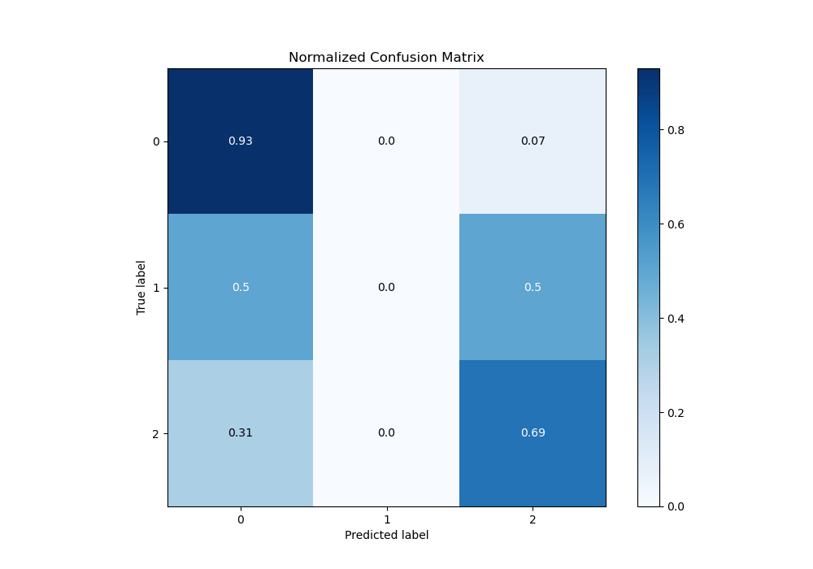
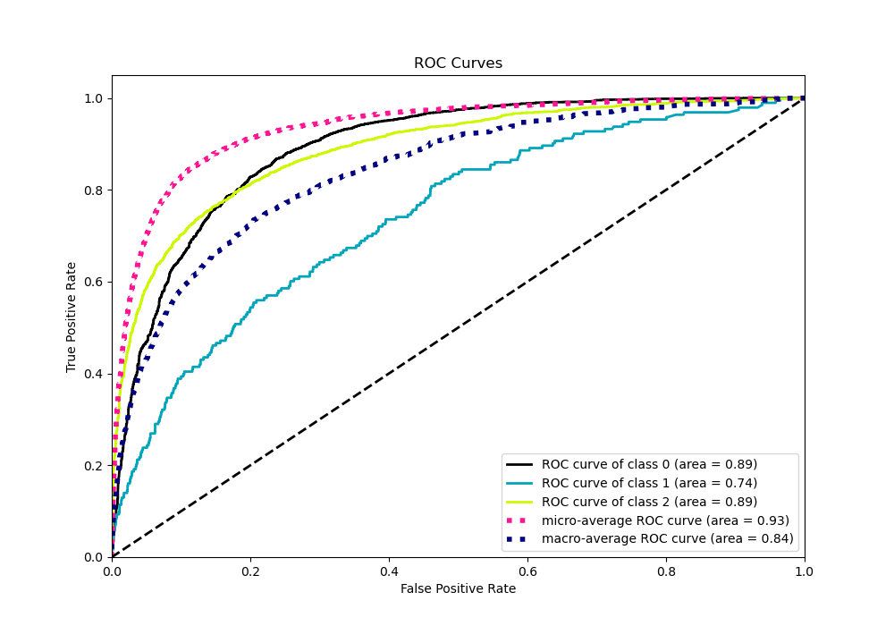
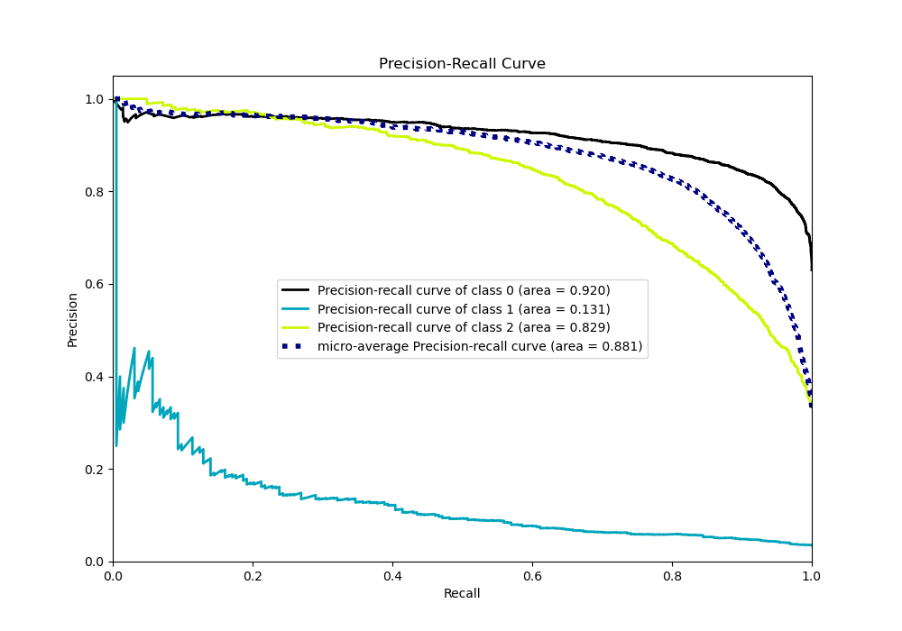

# Summary of 47_RandomForest

[<< Go back](../README.md)

## Random Forest
- **n_jobs**: -1
- **criterion**: gini
- **max_features**: 0.5
- **min_samples_split**: 50
- **max_depth**: 5
- **eval_metric_name**: logloss
- **num_class**: 3
- **explain_level**: 0

## Validation
 - **validation_type**: kfold
 - **shuffle**: True
 - **stratify**: True
 - **k_folds**: 10

## Optimized metric
logloss

## Training time

16.6 seconds

### Metric details
|           |           0 |   1 |           2 |   accuracy |   macro avg |   weighted avg |   logloss |
|:----------|------------:|----:|------------:|-----------:|------------:|---------------:|----------:|
| precision |    0.828806 |   0 |    0.786634 |   0.816374 |    0.53848  |       0.785765 |  0.494268 |
| recall    |    0.927711 |   0 |    0.692017 |   0.816374 |    0.539909 |       0.816374 |  0.494268 |
| f1-score  |    0.875474 |   0 |    0.736298 |   0.816374 |    0.537257 |       0.798301 |  0.494268 |
| support   | 3486        | 193 | 1854        |   0.816374 | 5533        |    5533        |  0.494268 |

## Confusion matrix
|              |   Predicted as 0 |   Predicted as 1 |   Predicted as 2 |
|:-------------|-----------------:|-----------------:|-----------------:|
| Labeled as 0 |             3234 |                0 |              252 |
| Labeled as 1 |               97 |                0 |               96 |
| Labeled as 2 |              571 |                0 |             1283 |

## Learning curves

## Confusion Matrix

## Normalized Confusion Matrix

## ROC Curve

## Precision Recall Curve

[<< Go back](../README.md)
