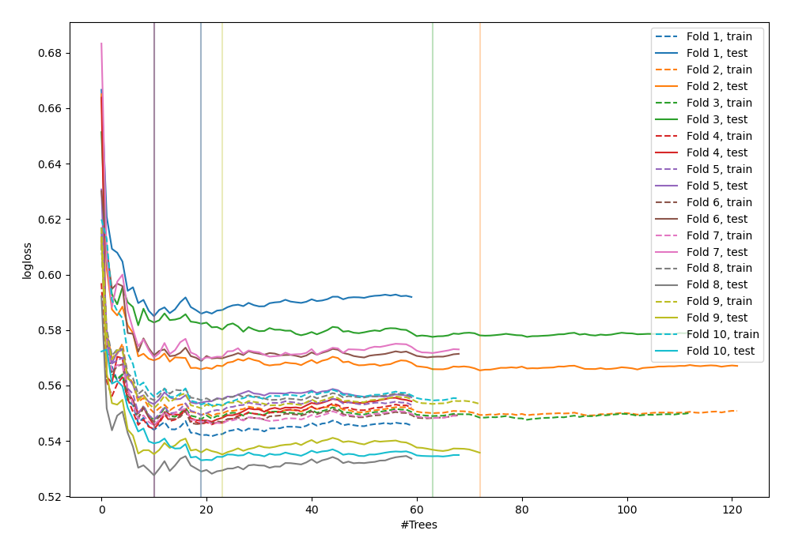
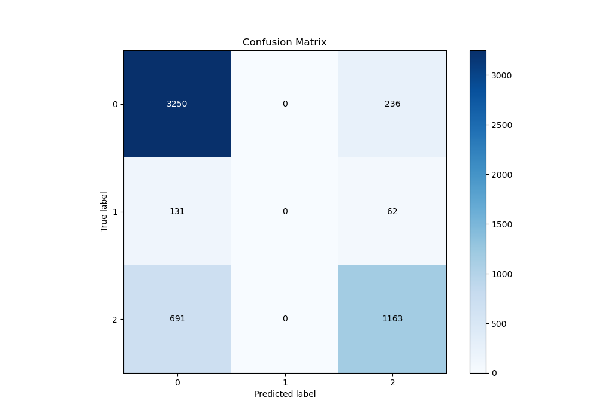
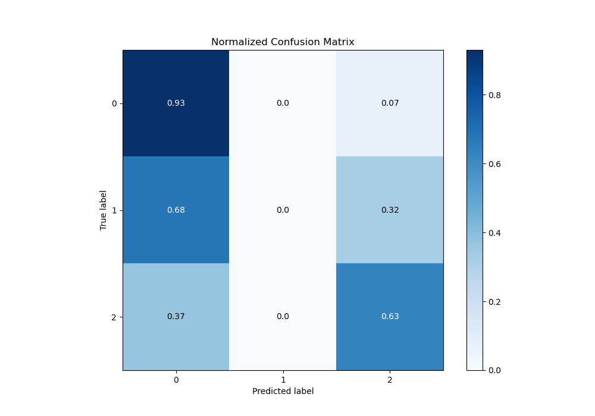
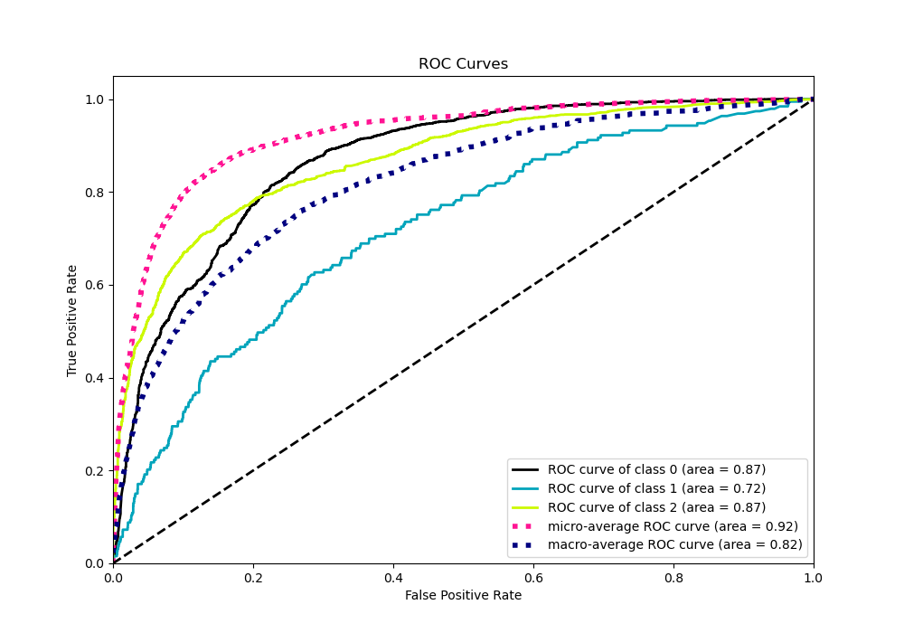
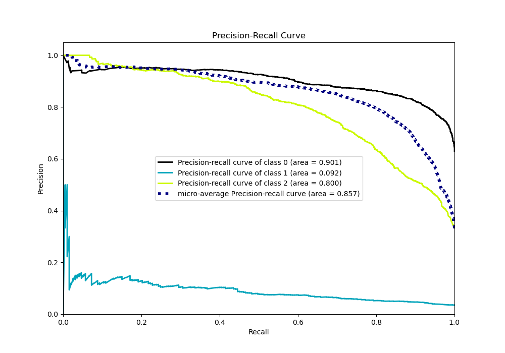

# Summary of 48_ExtraTrees

[<< Go back](../README.md)

## Extra Trees Classifier (Extra Trees)
- **n_jobs**: -1
- **criterion**: gini
- **max_features**: 0.5
- **min_samples_split**: 20
- **max_depth**: 4
- **eval_metric_name**: logloss
- **num_class**: 3
- **explain_level**: 0

## Validation
 - **validation_type**: kfold
 - **shuffle**: True
 - **stratify**: True
 - **k_folds**: 10

## Optimized metric
logloss

## Training time

8.9 seconds

### Metric details
|           |           0 |   1 |           2 |   accuracy |   macro avg |   weighted avg |   logloss |
|:----------|------------:|----:|------------:|-----------:|------------:|---------------:|----------:|
| precision |    0.798134 |   0 |    0.79603  |   0.797578 |    0.531388 |       0.769589 |   0.55609 |
| recall    |    0.932301 |   0 |    0.627292 |   0.797578 |    0.519864 |       0.797578 |   0.55609 |
| f1-score  |    0.860016 |   0 |    0.701659 |   0.797578 |    0.520558 |       0.776955 |   0.55609 |
| support   | 3486        | 193 | 1854        |   0.797578 | 5533        |    5533        |   0.55609 |

## Confusion matrix
|              |   Predicted as 0 |   Predicted as 1 |   Predicted as 2 |
|:-------------|-----------------:|-----------------:|-----------------:|
| Labeled as 0 |             3250 |                0 |              236 |
| Labeled as 1 |              131 |                0 |               62 |
| Labeled as 2 |              691 |                0 |             1163 |

## Learning curves

## Confusion Matrix

## Normalized Confusion Matrix

## ROC Curve

## Precision Recall Curve

[<< Go back](../README.md)
