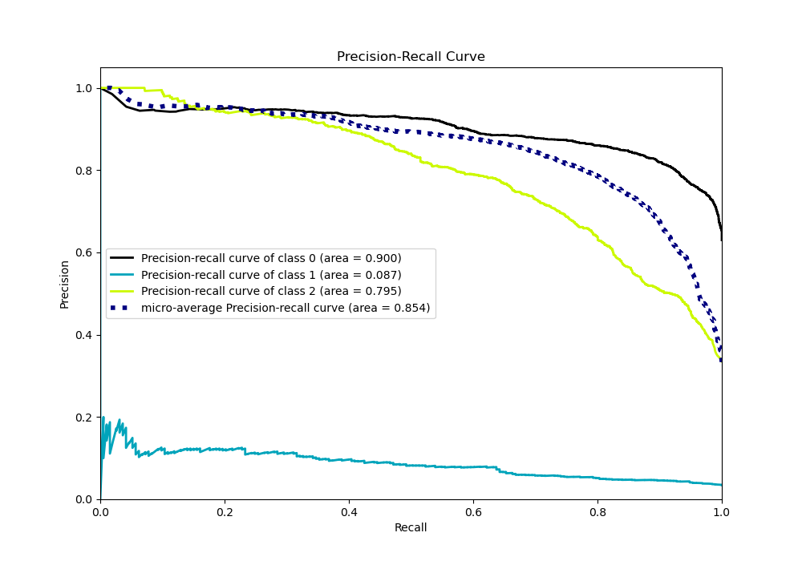

# Summary of 52_ExtraTrees

[<< Go back](../README.md)

## Extra Trees Classifier (Extra Trees)
- **n_jobs**: -1
- **criterion**: gini
- **max_features**: 0.7
- **min_samples_split**: 50
- **max_depth**: 3
- **eval_metric_name**: logloss
- **num_class**: 3
- **explain_level**: 0

## Validation
 - **validation_type**: kfold
 - **shuffle**: True
 - **stratify**: True
 - **k_folds**: 10

## Optimized metric
logloss

## Training time

11.2 seconds

### Metric details
|           |           0 |   1 |           2 |   accuracy |   macro avg |   weighted avg |   logloss |
|:----------|------------:|----:|------------:|-----------:|------------:|---------------:|----------:|
| precision |    0.793686 |   0 |    0.785073 |   0.791433 |    0.526253 |       0.763115 |  0.568478 |
| recall    |    0.930293 |   0 |    0.612729 |   0.791433 |    0.514341 |       0.791433 |  0.568478 |
| f1-score  |    0.856577 |   0 |    0.688276 |   0.791433 |    0.514951 |       0.770304 |  0.568478 |
| support   | 3486        | 193 | 1854        |   0.791433 | 5533        |    5533        |  0.568478 |

## Confusion matrix
|              |   Predicted as 0 |   Predicted as 1 |   Predicted as 2 |
|:-------------|-----------------:|-----------------:|-----------------:|
| Labeled as 0 |             3243 |                0 |              243 |
| Labeled as 1 |              125 |                0 |               68 |
| Labeled as 2 |              718 |                0 |             1136 |

## Learning curves

## Confusion Matrix

## Normalized Confusion Matrix

## ROC Curve

## Precision Recall Curve

[<< Go back](../README.md)
