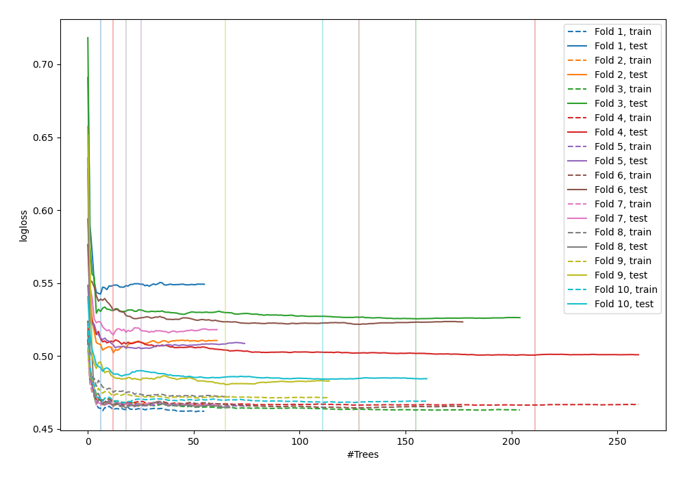
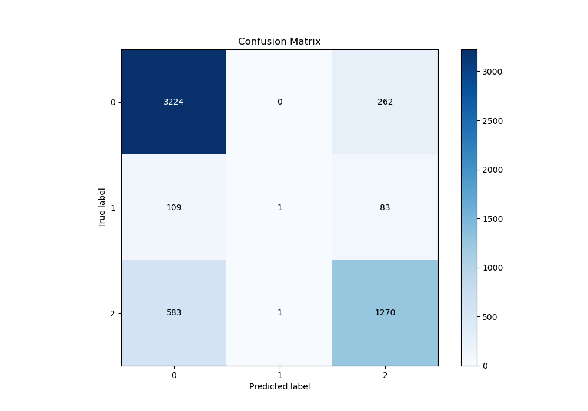
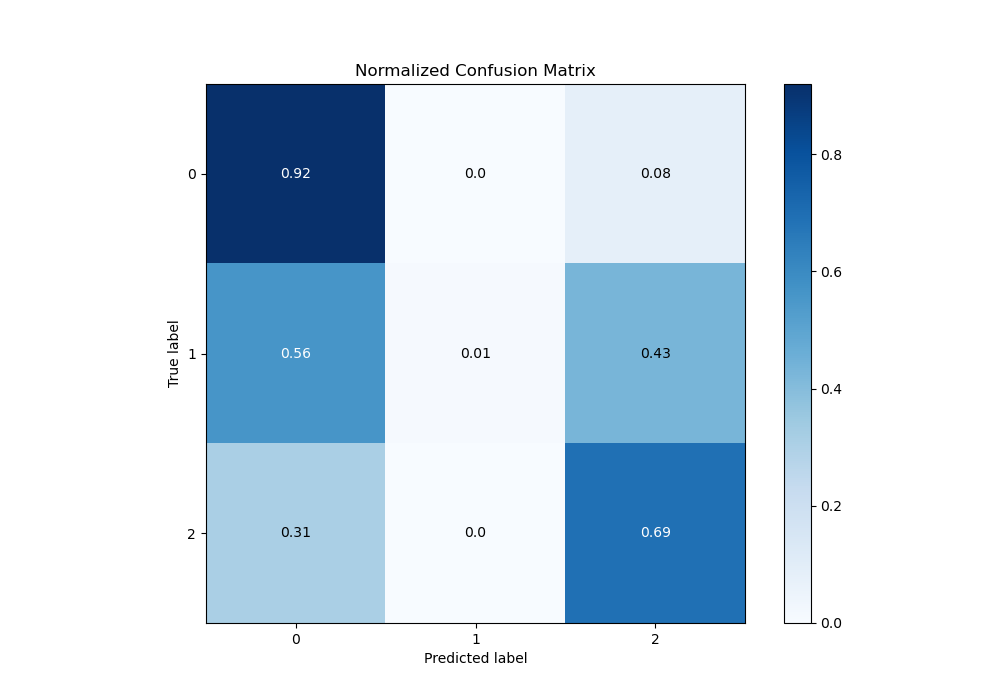
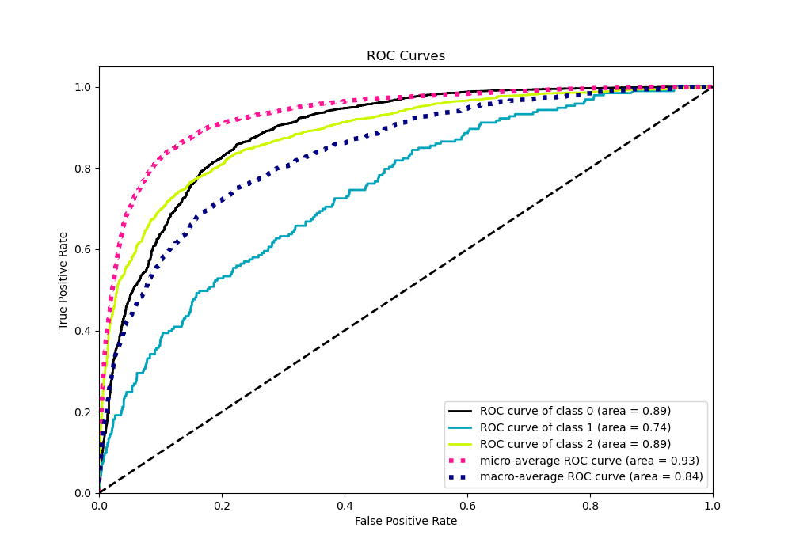
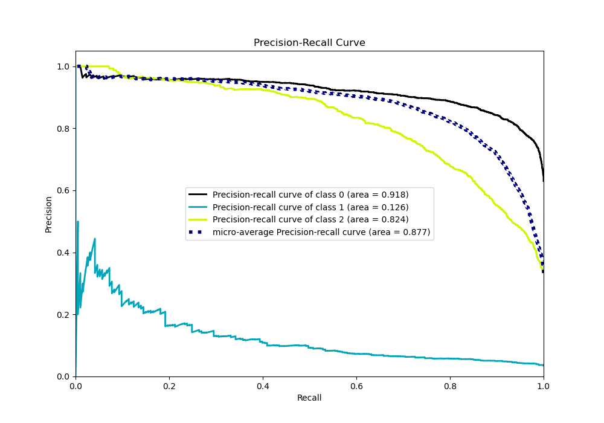

# Summary of 53_ExtraTrees_SelectedFeatures

[<< Go back](../README.md)

## Extra Trees Classifier (Extra Trees)
- **n_jobs**: -1
- **criterion**: gini
- **max_features**: 1.0
- **min_samples_split**: 40
- **max_depth**: 7
- **eval_metric_name**: logloss
- **num_class**: 3
- **explain_level**: 0

## Validation
 - **validation_type**: kfold
 - **shuffle**: True
 - **stratify**: True
 - **k_folds**: 10

## Optimized metric
logloss

## Training time

16.5 seconds

### Metric details
|           |           0 |            1 |           2 |   accuracy |   macro avg |   weighted avg |   logloss |
|:----------|------------:|-------------:|------------:|-----------:|------------:|---------------:|----------:|
| precision |    0.823289 |   0.5        |    0.786378 |   0.812398 |    0.703222 |       0.799644 |  0.504092 |
| recall    |    0.924842 |   0.00518135 |    0.685005 |   0.812398 |    0.538343 |       0.812398 |  0.504092 |
| f1-score  |    0.871116 |   0.0102564  |    0.732199 |   0.812398 |    0.537857 |       0.79454  |  0.504092 |
| support   | 3486        | 193          | 1854        |   0.812398 | 5533        |    5533        |  0.504092 |

## Confusion matrix
|              |   Predicted as 0 |   Predicted as 1 |   Predicted as 2 |
|:-------------|-----------------:|-----------------:|-----------------:|
| Labeled as 0 |             3224 |                0 |              262 |
| Labeled as 1 |              109 |                1 |               83 |
| Labeled as 2 |              583 |                1 |             1270 |

## Learning curves

## Confusion Matrix

## Normalized Confusion Matrix

## ROC Curve

## Precision Recall Curve

[<< Go back](../README.md)
