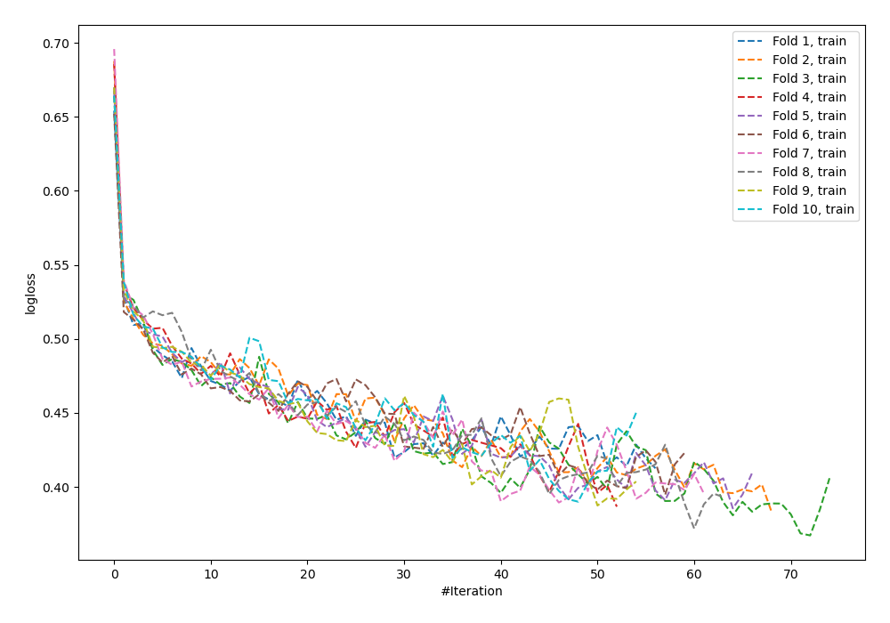
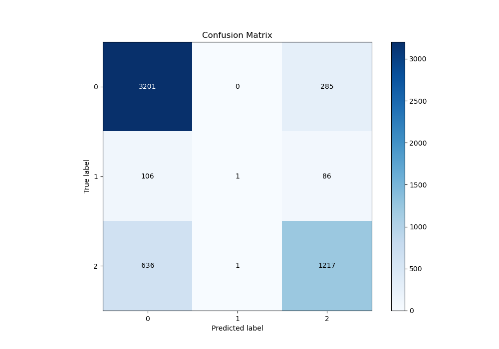
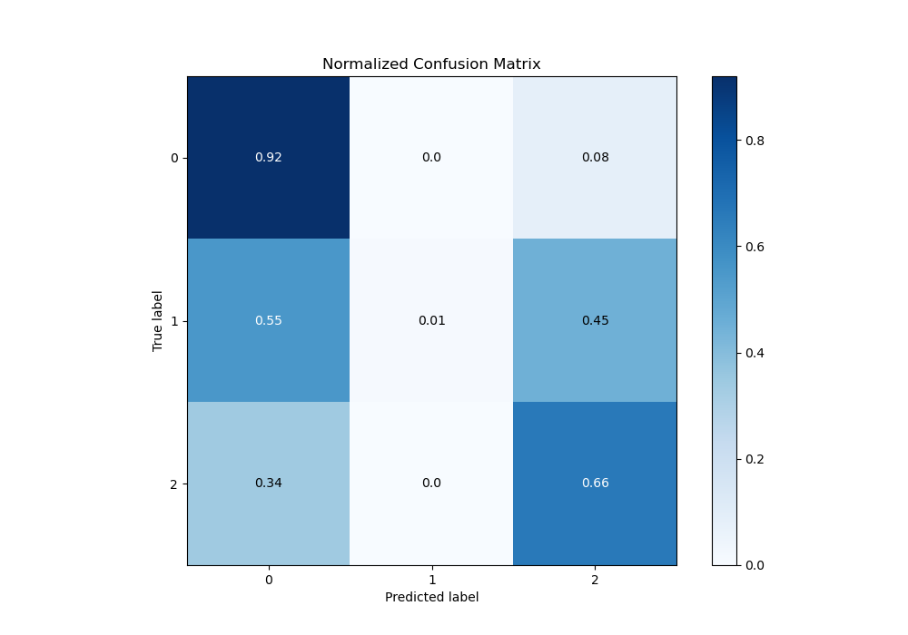
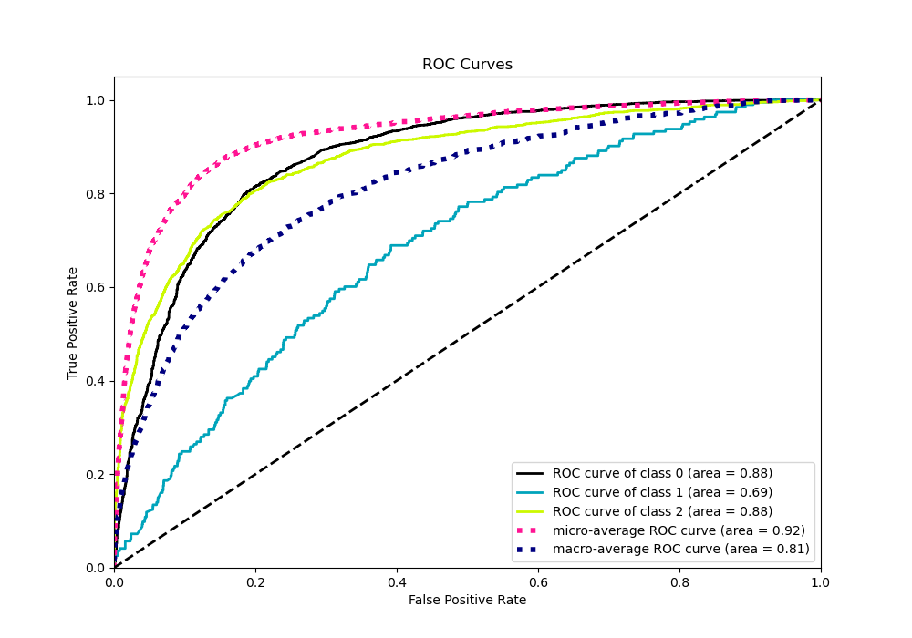
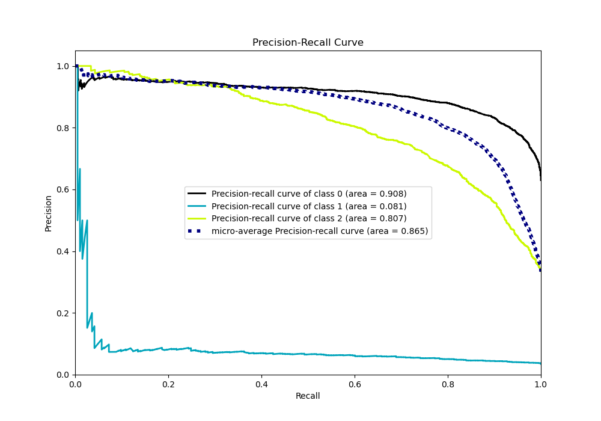

# Summary of 59_NeuralNetwork

[<< Go back](../README.md)

## Neural Network
- **n_jobs**: -1
- **dense_1_size**: 64
- **dense_2_size**: 32
- **learning_rate**: 0.08
- **num_class**: 3
- **explain_level**: 0

## Validation
 - **validation_type**: kfold
 - **shuffle**: True
 - **stratify**: True
 - **k_folds**: 10

## Optimized metric
logloss

## Training time

13.4 seconds

### Metric details
|           |           0 |            1 |           2 |   accuracy |   macro avg |   weighted avg |   logloss |
|:----------|------------:|-------------:|------------:|-----------:|------------:|---------------:|----------:|
| precision |    0.811818 |   0.5        |    0.766373 |   0.798663 |    0.69273  |       0.785714 |  0.536725 |
| recall    |    0.918244 |   0.00518135 |    0.656419 |   0.798663 |    0.526615 |       0.798663 |  0.536725 |
| f1-score  |    0.861758 |   0.0102564  |    0.707147 |   0.798663 |    0.526387 |       0.780249 |  0.536725 |
| support   | 3486        | 193          | 1854        |   0.798663 | 5533        |    5533        |  0.536725 |

## Confusion matrix
|              |   Predicted as 0 |   Predicted as 1 |   Predicted as 2 |
|:-------------|-----------------:|-----------------:|-----------------:|
| Labeled as 0 |             3201 |                0 |              285 |
| Labeled as 1 |              106 |                1 |               86 |
| Labeled as 2 |              636 |                1 |             1217 |

## Learning curves

## Confusion Matrix

## Normalized Confusion Matrix

## ROC Curve

## Precision Recall Curve

[<< Go back](../README.md)
