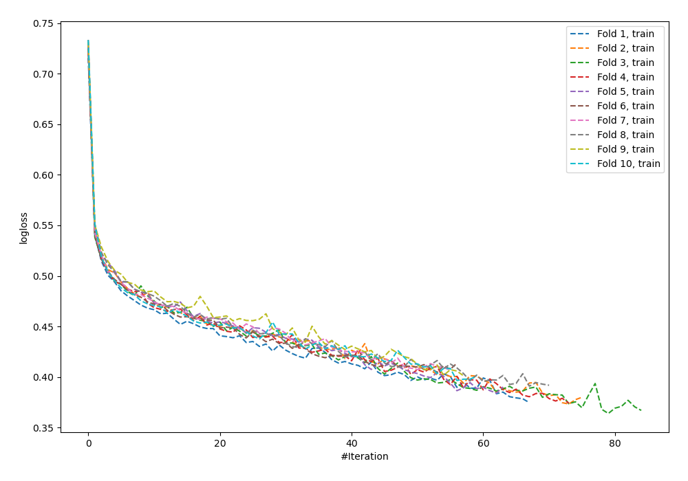
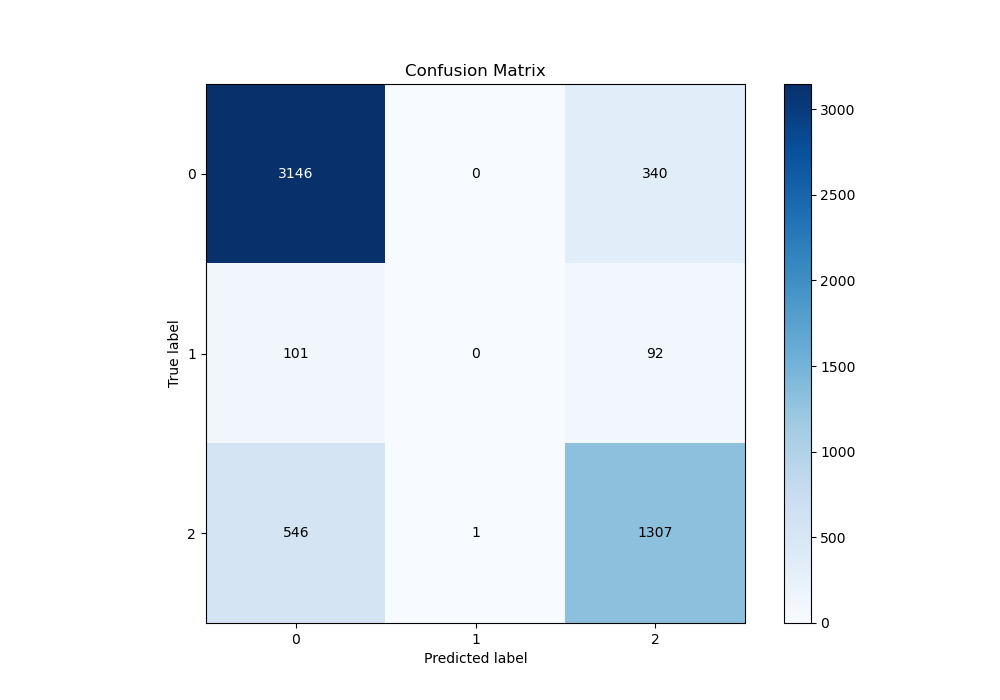
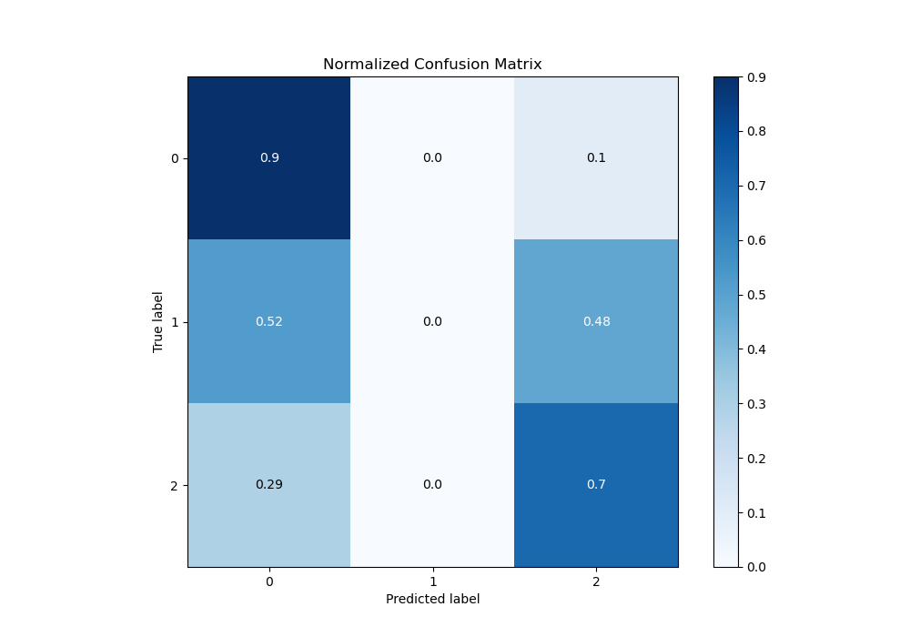
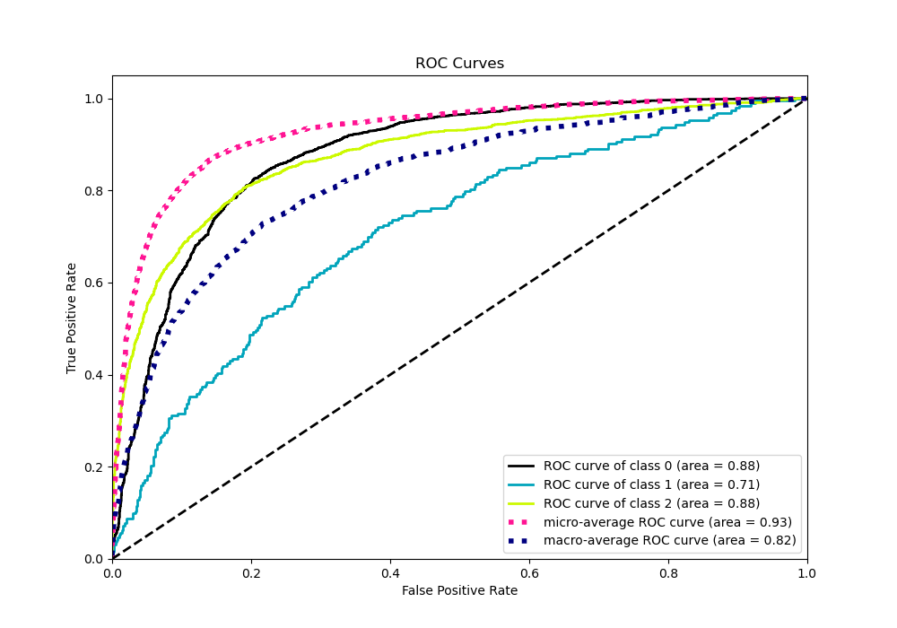
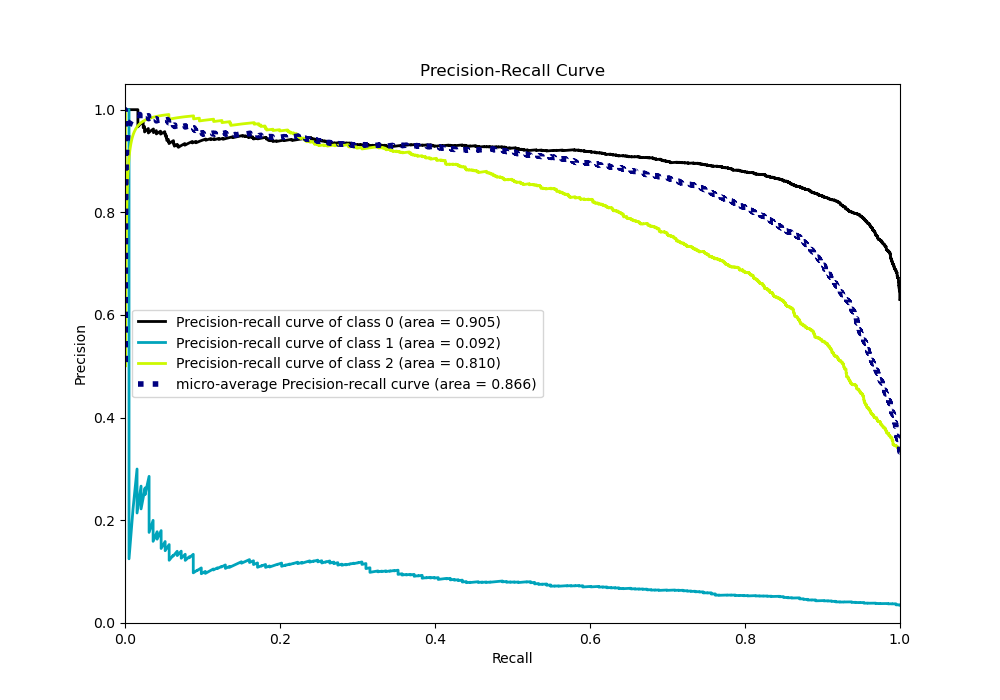

# Summary of 62_NeuralNetwork_SelectedFeatures

[<< Go back](../README.md)

## Neural Network
- **n_jobs**: -1
- **dense_1_size**: 64
- **dense_2_size**: 4
- **learning_rate**: 0.01
- **num_class**: 3
- **explain_level**: 0

## Validation
 - **validation_type**: kfold
 - **shuffle**: True
 - **stratify**: True
 - **k_folds**: 10

## Optimized metric
logloss

## Training time

17.4 seconds

### Metric details
|           |           0 |   1 |           2 |   accuracy |   macro avg |   weighted avg |   logloss |
|:----------|------------:|----:|------------:|-----------:|------------:|---------------:|----------:|
| precision |    0.829423 |   0 |    0.751581 |   0.804808 |    0.527001 |       0.774408 |  0.522612 |
| recall    |    0.902467 |   0 |    0.704962 |   0.804808 |    0.53581  |       0.804808 |  0.522612 |
| f1-score  |    0.864404 |   0 |    0.727526 |   0.804808 |    0.530643 |       0.788387 |  0.522612 |
| support   | 3486        | 193 | 1854        |   0.804808 | 5533        |    5533        |  0.522612 |

## Confusion matrix
|              |   Predicted as 0 |   Predicted as 1 |   Predicted as 2 |
|:-------------|-----------------:|-----------------:|-----------------:|
| Labeled as 0 |             3146 |                0 |              340 |
| Labeled as 1 |              101 |                0 |               92 |
| Labeled as 2 |              546 |                1 |             1307 |

## Learning curves

## Confusion Matrix

## Normalized Confusion Matrix

## ROC Curve

## Precision Recall Curve

[<< Go back](../README.md)
