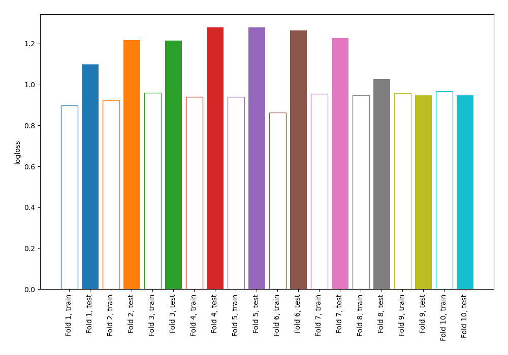
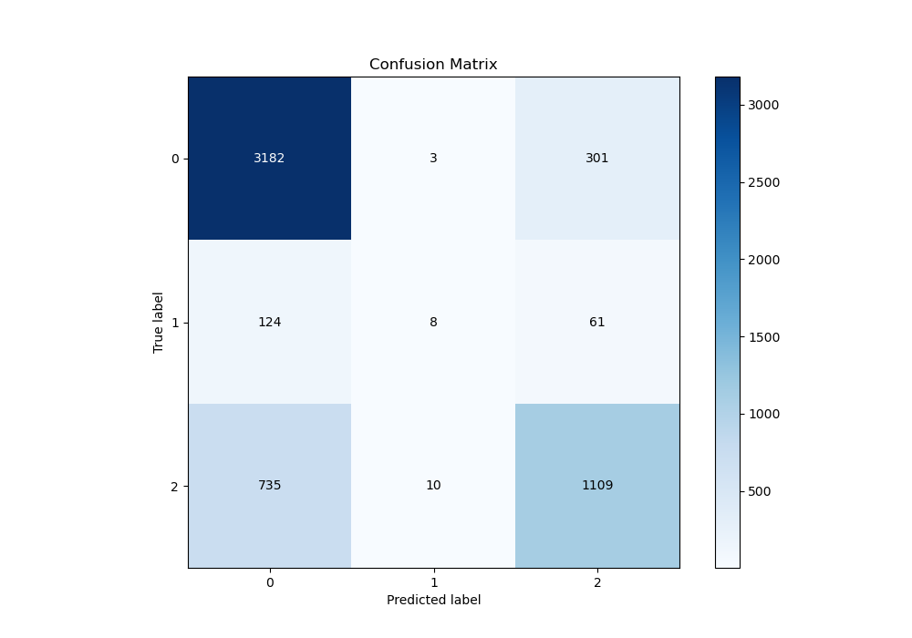
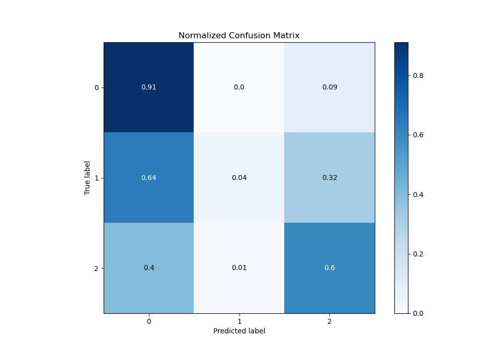
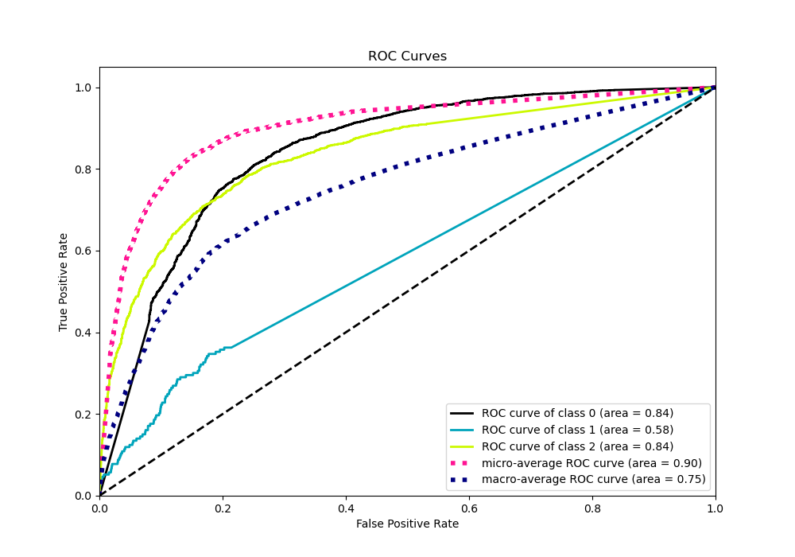
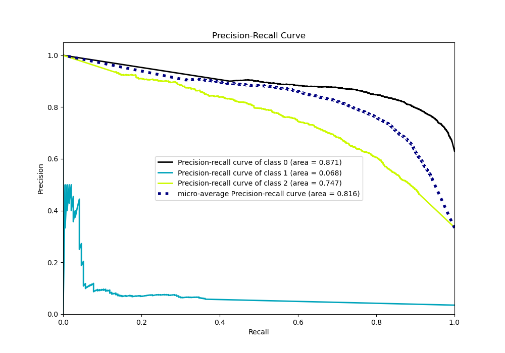

# Summary of 67_NearestNeighbors

[<< Go back](../README.md)

## k-Nearest Neighbors (Nearest Neighbors)
- **n_jobs**: -1
- **n_neighbors**: 7
- **weights**: distance
- **num_class**: 3
- **explain_level**: 0

## Validation
 - **validation_type**: kfold
 - **shuffle**: True
 - **stratify**: True
 - **k_folds**: 10

## Optimized metric
logloss

## Training time

3.9 seconds

### Metric details
|           |           0 |           1 |           2 |   accuracy |   macro avg |   weighted avg |   logloss |
|:----------|------------:|------------:|------------:|-----------:|------------:|---------------:|----------:|
| precision |    0.787429 |   0.380952  |    0.753909 |   0.776975 |    0.640763 |       0.762018 |   1.14968 |
| recall    |    0.912794 |   0.0414508 |    0.598166 |   0.776975 |    0.51747  |       0.776975 |   1.14968 |
| f1-score  |    0.84549  |   0.0747664 |    0.667068 |   0.776975 |    0.529108 |       0.75882  |   1.14968 |
| support   | 3486        | 193         | 1854        |   0.776975 | 5533        |    5533        |   1.14968 |

## Confusion matrix
|              |   Predicted as 0 |   Predicted as 1 |   Predicted as 2 |
|:-------------|-----------------:|-----------------:|-----------------:|
| Labeled as 0 |             3182 |                3 |              301 |
| Labeled as 1 |              124 |                8 |               61 |
| Labeled as 2 |              735 |               10 |             1109 |

## Learning curves

## Confusion Matrix

## Normalized Confusion Matrix

## ROC Curve

## Precision Recall Curve

[<< Go back](../README.md)
