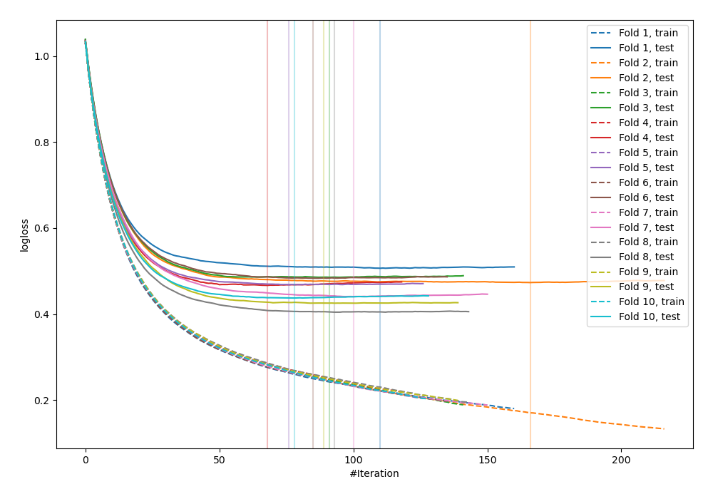
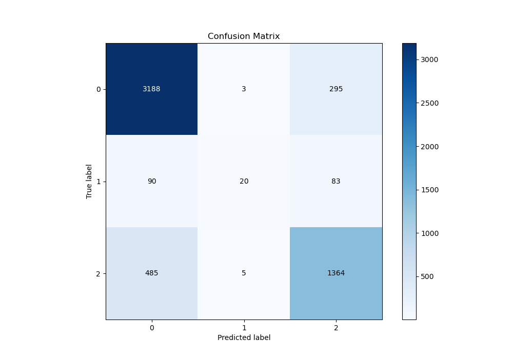
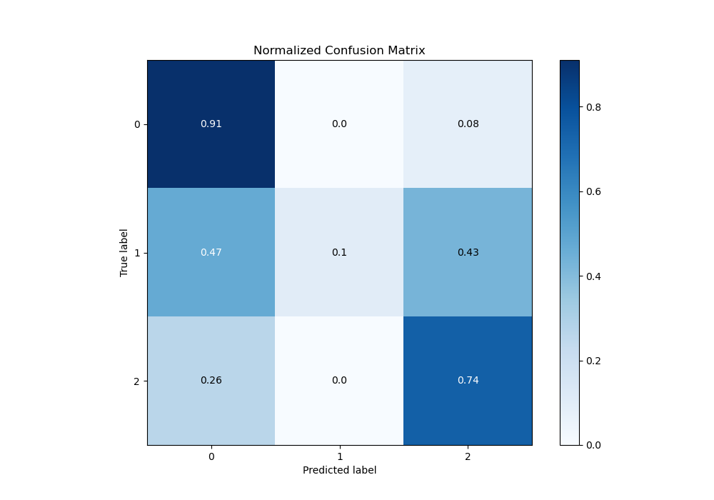
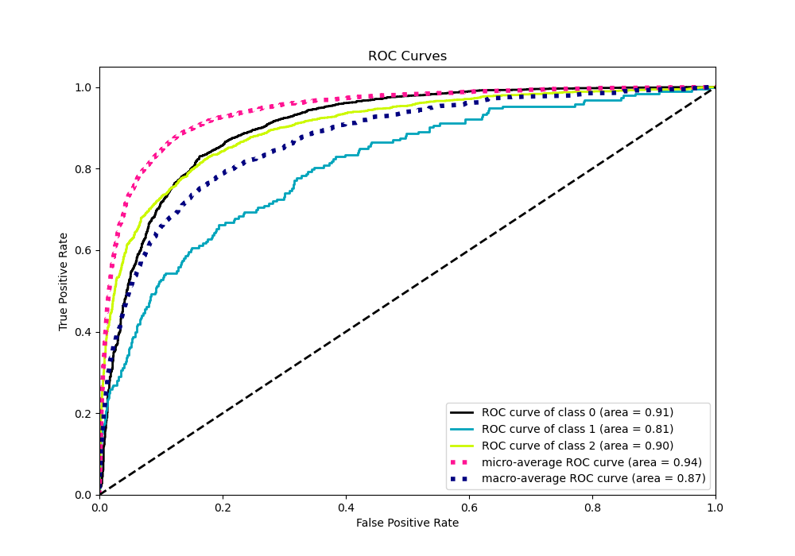
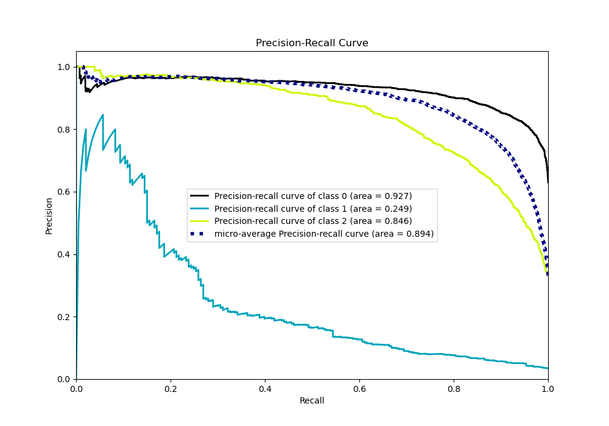

# Summary of 6_Default_Xgboost

[<< Go back](../README.md)

## Extreme Gradient Boosting (Xgboost)
- **n_jobs**: -1
- **objective**: multi:softprob
- **eta**: 0.075
- **max_depth**: 6
- **min_child_weight**: 1
- **subsample**: 1.0
- **colsample_bytree**: 1.0
- **eval_metric**: mlogloss
- **num_class**: 3
- **explain_level**: 0

## Validation
 - **validation_type**: kfold
 - **shuffle**: True
 - **stratify**: True
 - **k_folds**: 10

## Optimized metric
logloss

## Training time

7.6 seconds

### Metric details
|           |           0 |          1 |           2 |   accuracy |   macro avg |   weighted avg |   logloss |
|:----------|------------:|-----------:|------------:|-----------:|------------:|---------------:|----------:|
| precision |    0.847196 |   0.714286 |    0.783008 |   0.826315 |    0.781497 |       0.821052 |  0.459219 |
| recall    |    0.914515 |   0.103627 |    0.735707 |   0.826315 |    0.584616 |       0.826315 |  0.459219 |
| f1-score  |    0.87957  |   0.180995 |    0.758621 |   0.826315 |    0.606395 |       0.814675 |  0.459219 |
| support   | 3486        | 193        | 1854        |   0.826315 | 5533        |    5533        |  0.459219 |

## Confusion matrix
|              |   Predicted as 0 |   Predicted as 1 |   Predicted as 2 |
|:-------------|-----------------:|-----------------:|-----------------:|
| Labeled as 0 |             3188 |                3 |              295 |
| Labeled as 1 |               90 |               20 |               83 |
| Labeled as 2 |              485 |                5 |             1364 |

## Learning curves

## Confusion Matrix

## Normalized Confusion Matrix

## ROC Curve

## Precision Recall Curve

[<< Go back](../README.md)
