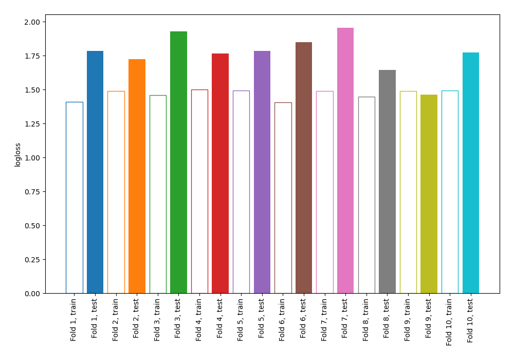
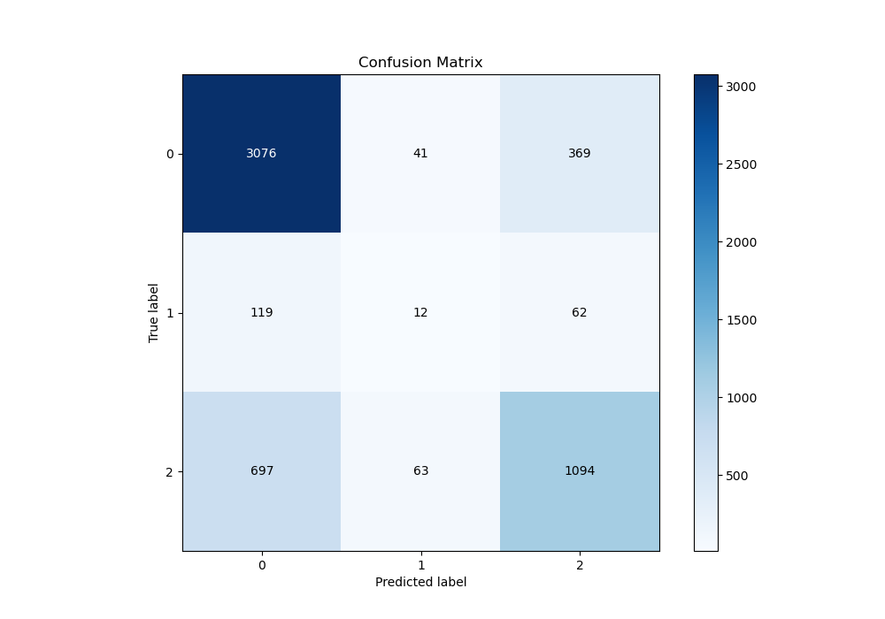
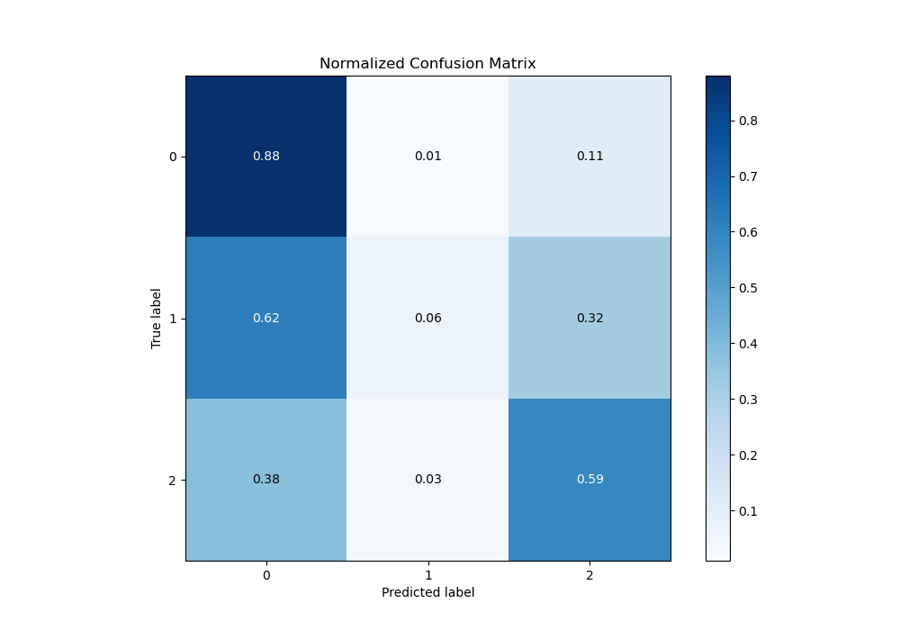
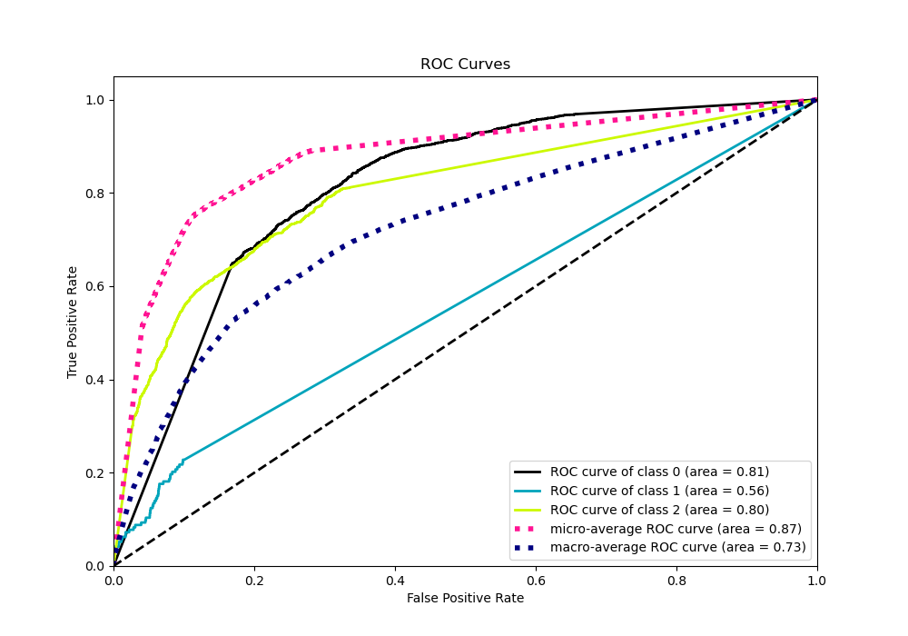
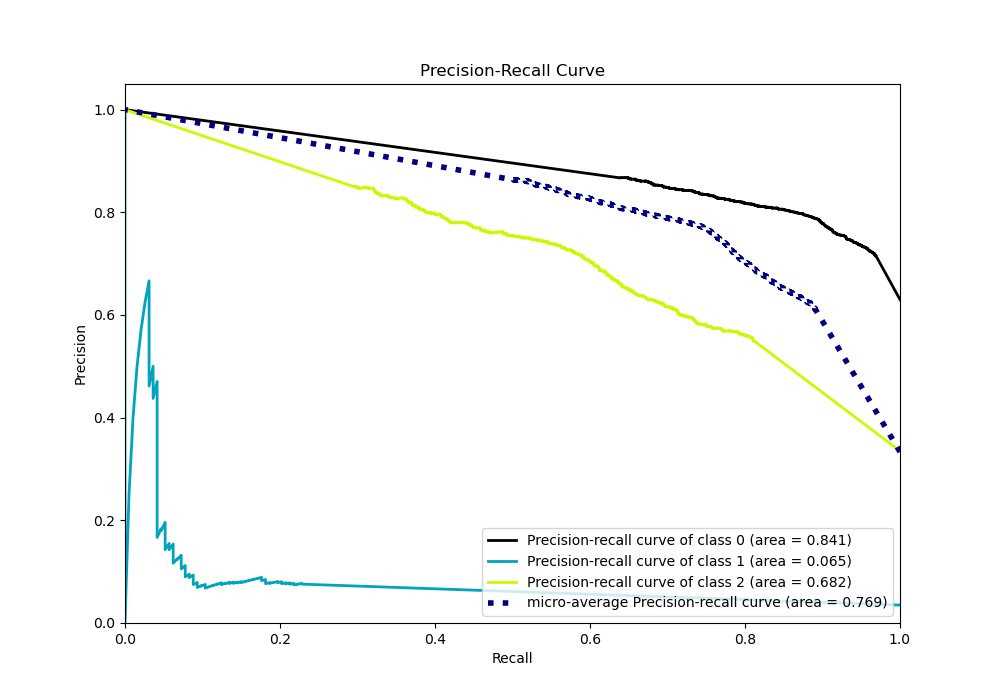

# Summary of 72_NearestNeighbors

[<< Go back](../README.md)

## k-Nearest Neighbors (Nearest Neighbors)
- **n_jobs**: -1
- **n_neighbors**: 3
- **weights**: distance
- **num_class**: 3
- **explain_level**: 0

## Validation
 - **validation_type**: kfold
 - **shuffle**: True
 - **stratify**: True
 - **k_folds**: 10

## Optimized metric
logloss

## Training time

5.3 seconds

### Metric details
|           |           0 |           1 |           2 |   accuracy |   macro avg |   weighted avg |   logloss |
|:----------|------------:|------------:|------------:|-----------:|------------:|---------------:|----------:|
| precision |    0.790339 |   0.103448  |    0.717377 |   0.755829 |    0.537055 |       0.741931 |   1.76832 |
| recall    |    0.882387 |   0.0621762 |    0.590076 |   0.755829 |    0.511546 |       0.755829 |   1.76832 |
| f1-score  |    0.83383  |   0.0776699 |    0.647529 |   0.755829 |    0.519676 |       0.745028 |   1.76832 |
| support   | 3486        | 193         | 1854        |   0.755829 | 5533        |    5533        |   1.76832 |

## Confusion matrix
|              |   Predicted as 0 |   Predicted as 1 |   Predicted as 2 |
|:-------------|-----------------:|-----------------:|-----------------:|
| Labeled as 0 |             3076 |               41 |              369 |
| Labeled as 1 |              119 |               12 |               62 |
| Labeled as 2 |              697 |               63 |             1094 |

## Learning curves

## Confusion Matrix

## Normalized Confusion Matrix

## ROC Curve

## Precision Recall Curve

[<< Go back](../README.md)
