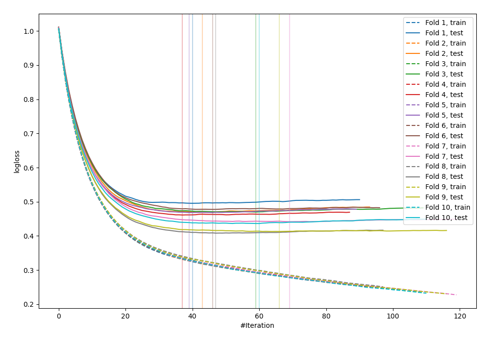
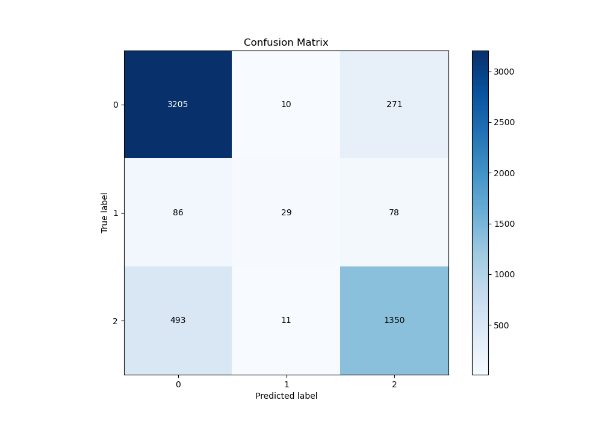
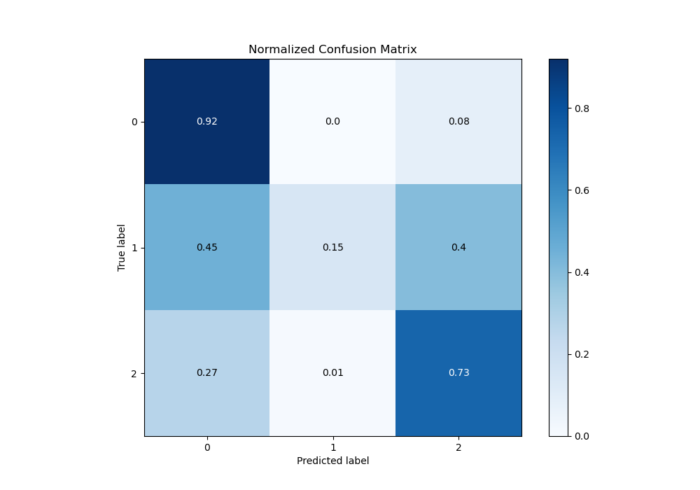
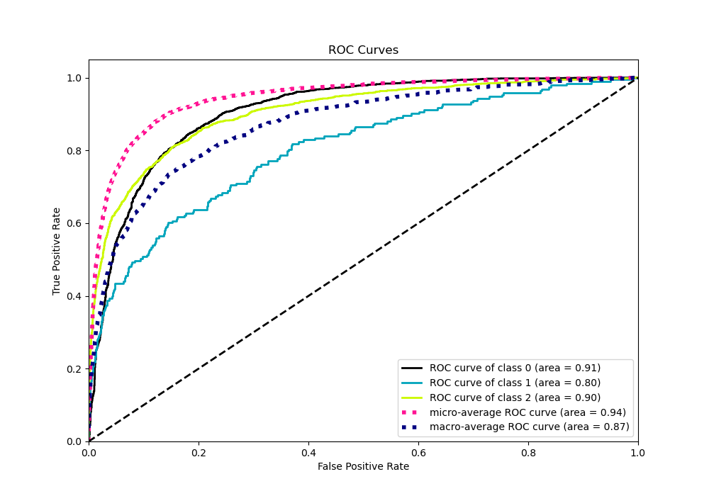
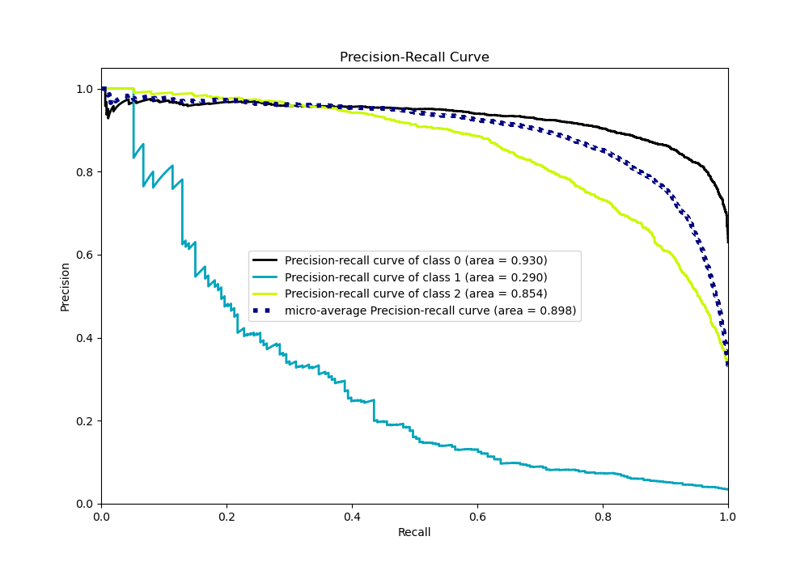

# Summary of 73_Xgboost_Stacked

[<< Go back](../README.md)

## Extreme Gradient Boosting (Xgboost)
- **n_jobs**: -1
- **objective**: multi:softprob
- **eta**: 0.1
- **max_depth**: 7
- **min_child_weight**: 25
- **subsample**: 0.9
- **colsample_bytree**: 0.5
- **eval_metric**: mlogloss
- **num_class**: 3
- **explain_level**: 0

## Validation
 - **validation_type**: kfold
 - **shuffle**: True
 - **stratify**: True
 - **k_folds**: 10

## Optimized metric
logloss

## Training time

53.2 seconds

### Metric details
|           |           0 |          1 |           2 |   accuracy |   macro avg |   weighted avg |   logloss |
|:----------|------------:|-----------:|------------:|-----------:|------------:|---------------:|----------:|
| precision |    0.846987 |   0.58     |    0.794585 |   0.828484 |    0.740524 |       0.820115 |  0.454138 |
| recall    |    0.919392 |   0.150259 |    0.728155 |   0.828484 |    0.599269 |       0.828484 |  0.454138 |
| f1-score  |    0.881706 |   0.238683 |    0.759921 |   0.828484 |    0.62677  |       0.818468 |  0.454138 |
| support   | 3486        | 193        | 1854        |   0.828484 | 5533        |    5533        |  0.454138 |

## Confusion matrix
|              |   Predicted as 0 |   Predicted as 1 |   Predicted as 2 |
|:-------------|-----------------:|-----------------:|-----------------:|
| Labeled as 0 |             3205 |               10 |              271 |
| Labeled as 1 |               86 |               29 |               78 |
| Labeled as 2 |              493 |               11 |             1350 |

## Learning curves

## Confusion Matrix

## Normalized Confusion Matrix

## ROC Curve

## Precision Recall Curve

[<< Go back](../README.md)
