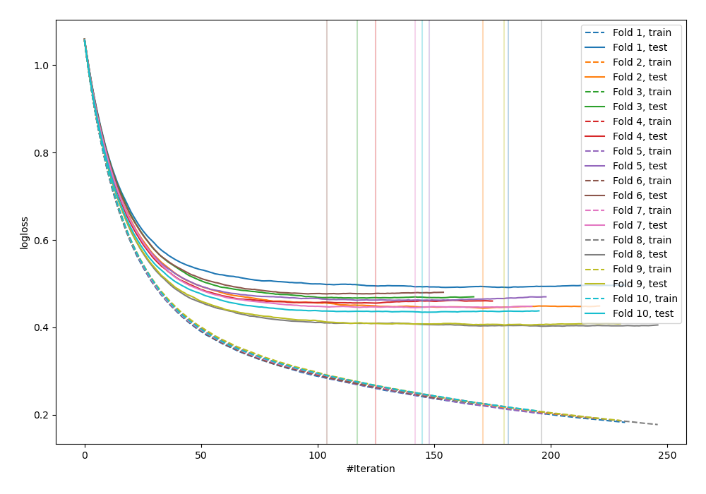
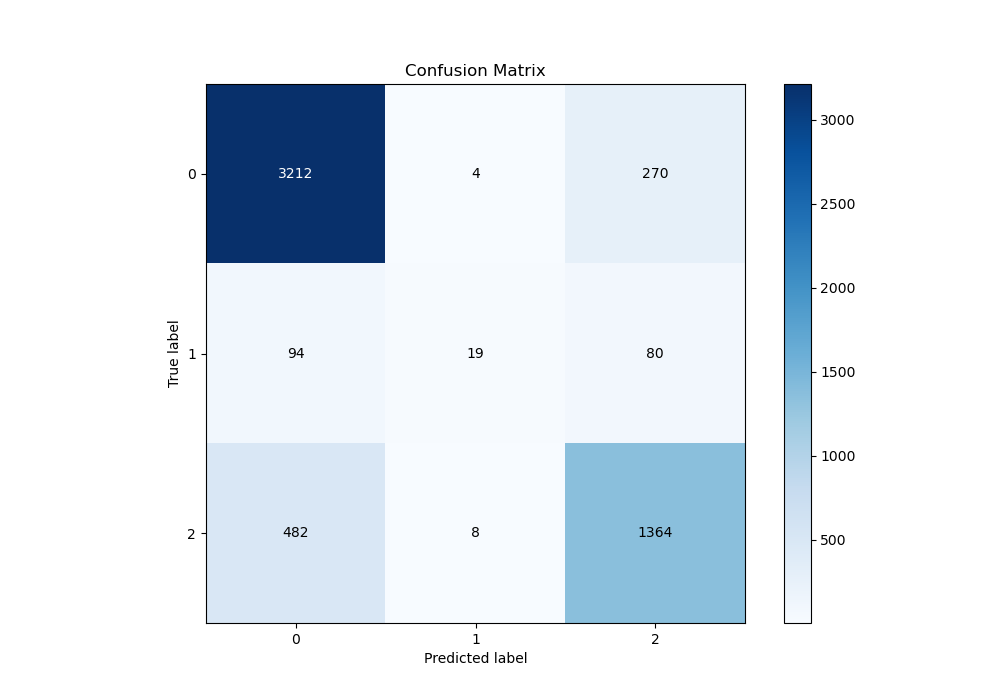
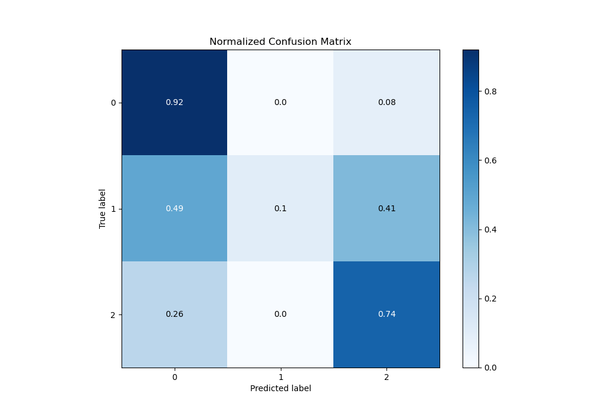
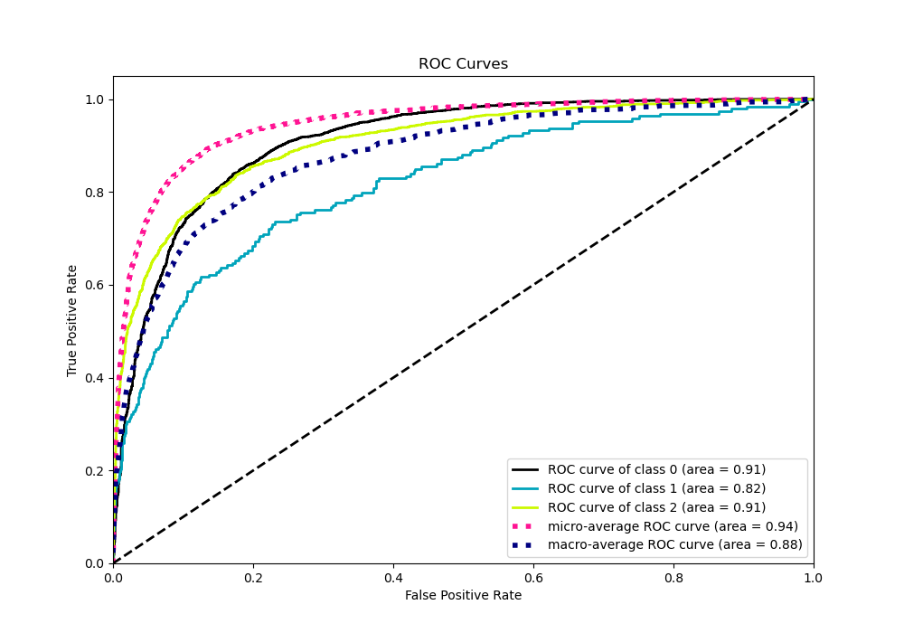
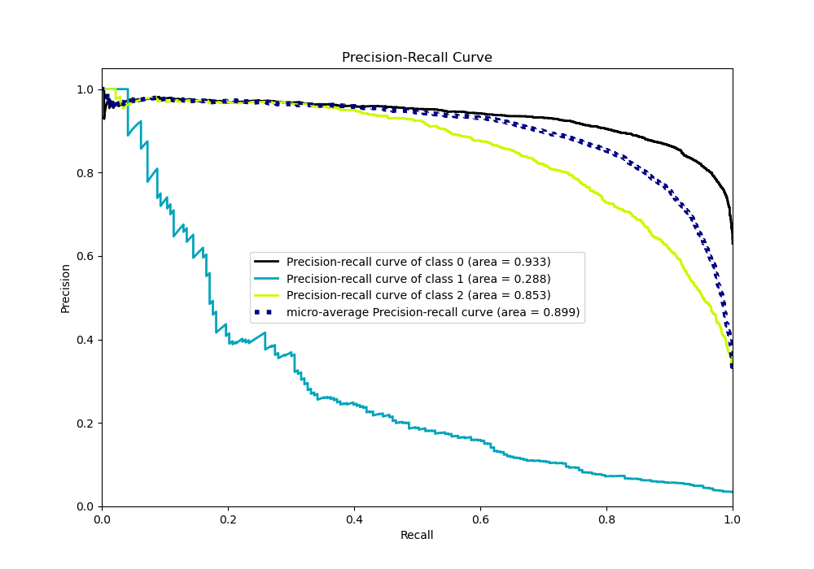

# Summary of 75_Xgboost

[<< Go back](../README.md)

## Extreme Gradient Boosting (Xgboost)
- **n_jobs**: -1
- **objective**: multi:softprob
- **eta**: 0.05
- **max_depth**: 8
- **min_child_weight**: 5
- **subsample**: 0.5
- **colsample_bytree**: 0.7
- **eval_metric**: mlogloss
- **num_class**: 3
- **explain_level**: 0

## Validation
 - **validation_type**: kfold
 - **shuffle**: True
 - **stratify**: True
 - **k_folds**: 10

## Optimized metric
logloss

## Training time

17.0 seconds

### Metric details
|           |           0 |           1 |           2 |   accuracy |   macro avg |   weighted avg |   logloss |
|:----------|------------:|------------:|------------:|-----------:|------------:|---------------:|----------:|
| precision |    0.847941 |   0.612903  |    0.795799 |   0.830472 |    0.752214 |       0.822271 |  0.448622 |
| recall    |    0.9214   |   0.0984456 |    0.735707 |   0.830472 |    0.585184 |       0.830472 |  0.448622 |
| f1-score  |    0.883145 |   0.169643  |    0.764574 |   0.830472 |    0.605787 |       0.818526 |  0.448622 |
| support   | 3486        | 193         | 1854        |   0.830472 | 5533        |    5533        |  0.448622 |

## Confusion matrix
|              |   Predicted as 0 |   Predicted as 1 |   Predicted as 2 |
|:-------------|-----------------:|-----------------:|-----------------:|
| Labeled as 0 |             3212 |                4 |              270 |
| Labeled as 1 |               94 |               19 |               80 |
| Labeled as 2 |              482 |                8 |             1364 |

## Learning curves

## Confusion Matrix

## Normalized Confusion Matrix

## ROC Curve

## Precision Recall Curve

[<< Go back](../README.md)
