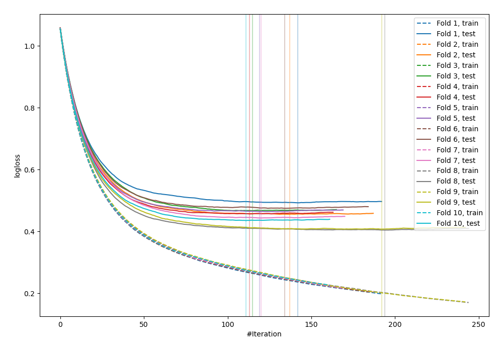
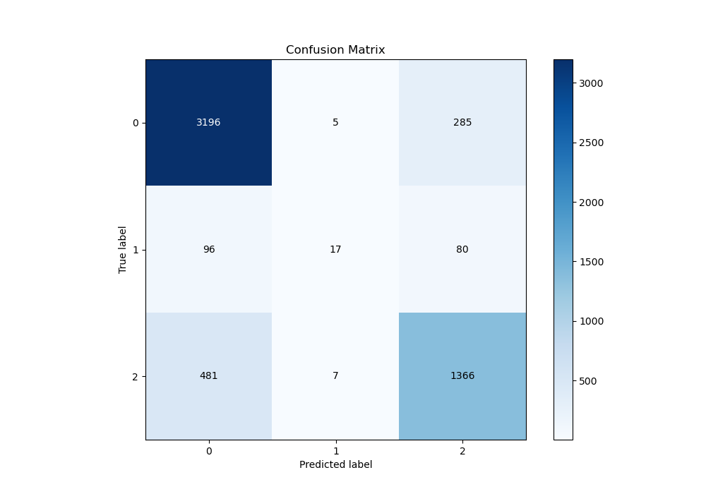
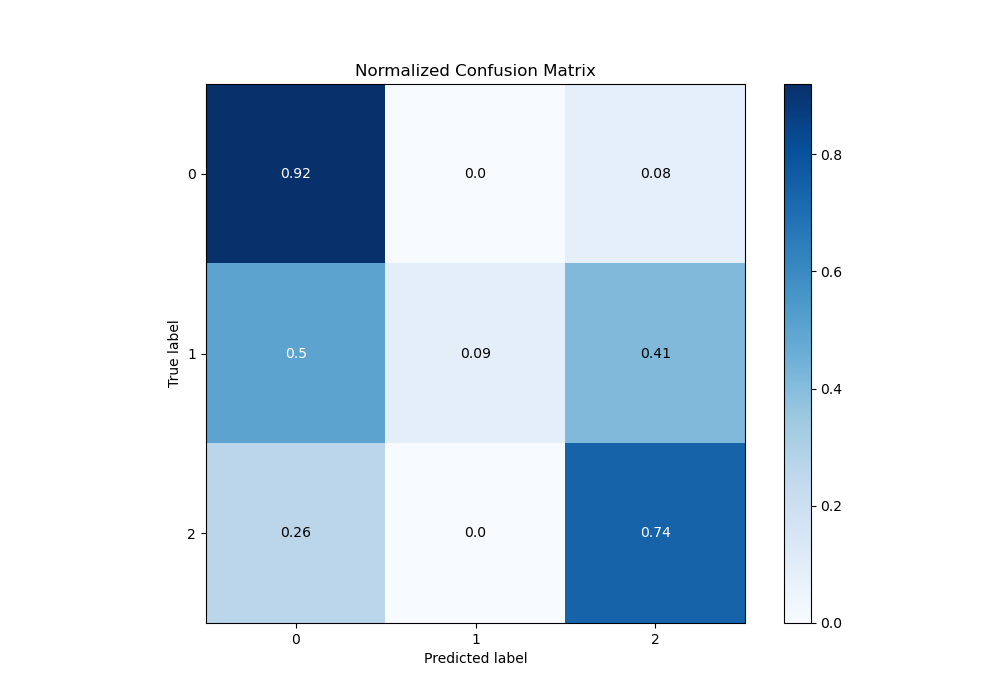
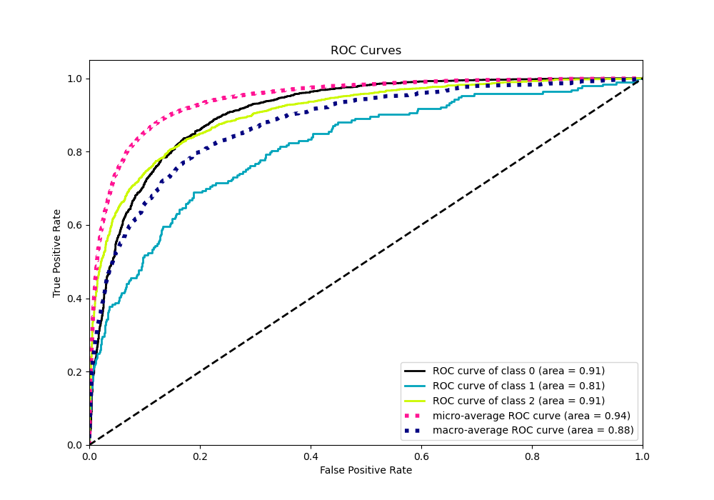
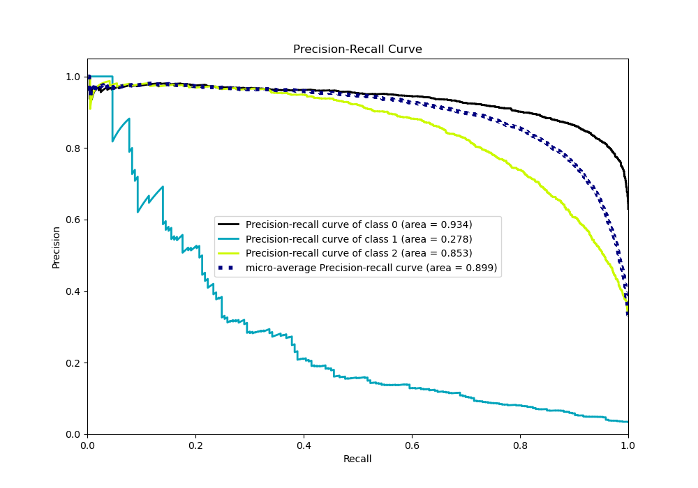

# Summary of 76_Xgboost

[<< Go back](../README.md)

## Extreme Gradient Boosting (Xgboost)
- **n_jobs**: -1
- **objective**: multi:softprob
- **eta**: 0.05
- **max_depth**: 8
- **min_child_weight**: 5
- **subsample**: 0.5
- **colsample_bytree**: 0.9
- **eval_metric**: mlogloss
- **num_class**: 3
- **explain_level**: 0

## Validation
 - **validation_type**: kfold
 - **shuffle**: True
 - **stratify**: True
 - **k_folds**: 10

## Optimized metric
logloss

## Training time

16.6 seconds

### Metric details
|           |           0 |           1 |           2 |   accuracy |   macro avg |   weighted avg |   logloss |
|:----------|------------:|------------:|------------:|-----------:|------------:|---------------:|----------:|
| precision |    0.847071 |   0.586207  |    0.789139 |    0.82758 |    0.740806 |       0.81856  |  0.450228 |
| recall    |    0.91681  |   0.0880829 |    0.736785 |    0.82758 |    0.580559 |       0.82758  |  0.450228 |
| f1-score  |    0.880562 |   0.153153  |    0.762064 |    0.82758 |    0.598593 |       0.815483 |  0.450228 |
| support   | 3486        | 193         | 1854        |    0.82758 | 5533        |    5533        |  0.450228 |

## Confusion matrix
|              |   Predicted as 0 |   Predicted as 1 |   Predicted as 2 |
|:-------------|-----------------:|-----------------:|-----------------:|
| Labeled as 0 |             3196 |                5 |              285 |
| Labeled as 1 |               96 |               17 |               80 |
| Labeled as 2 |              481 |                7 |             1366 |

## Learning curves

## Confusion Matrix

## Normalized Confusion Matrix

## ROC Curve

## Precision Recall Curve

[<< Go back](../README.md)
