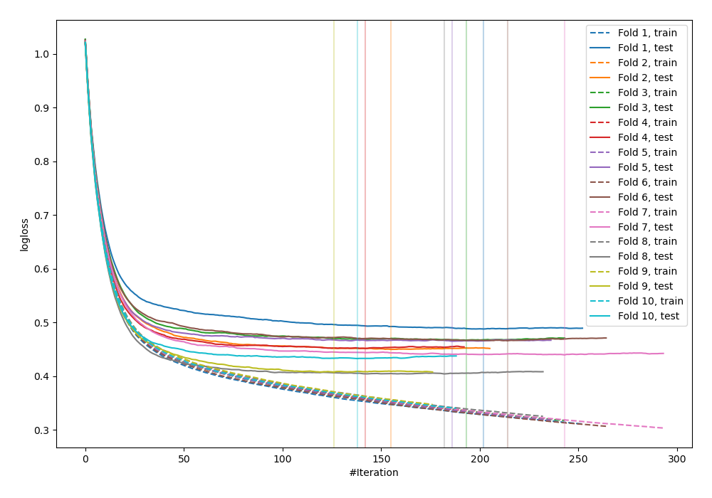
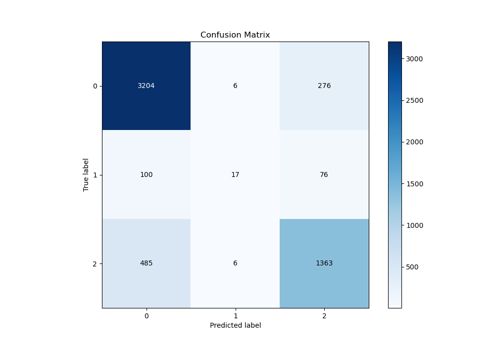
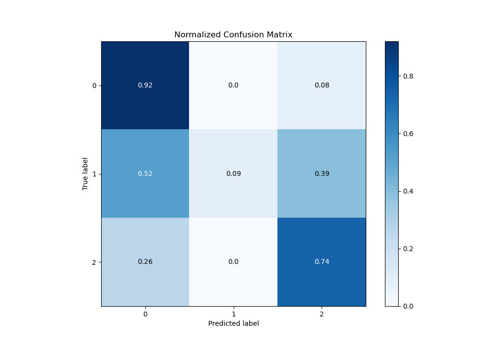
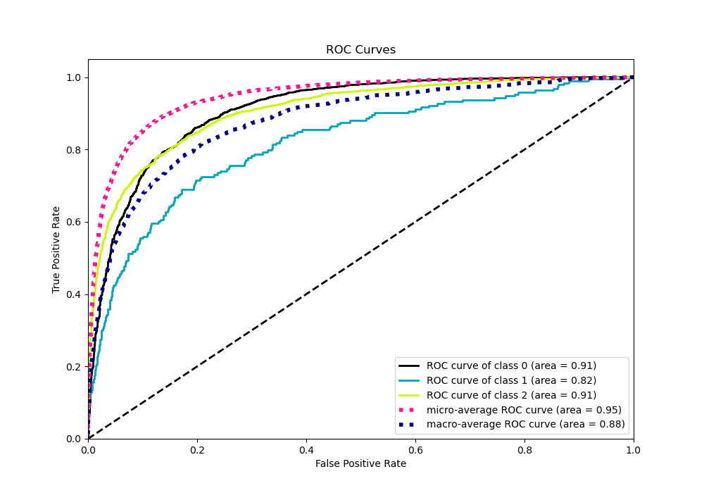
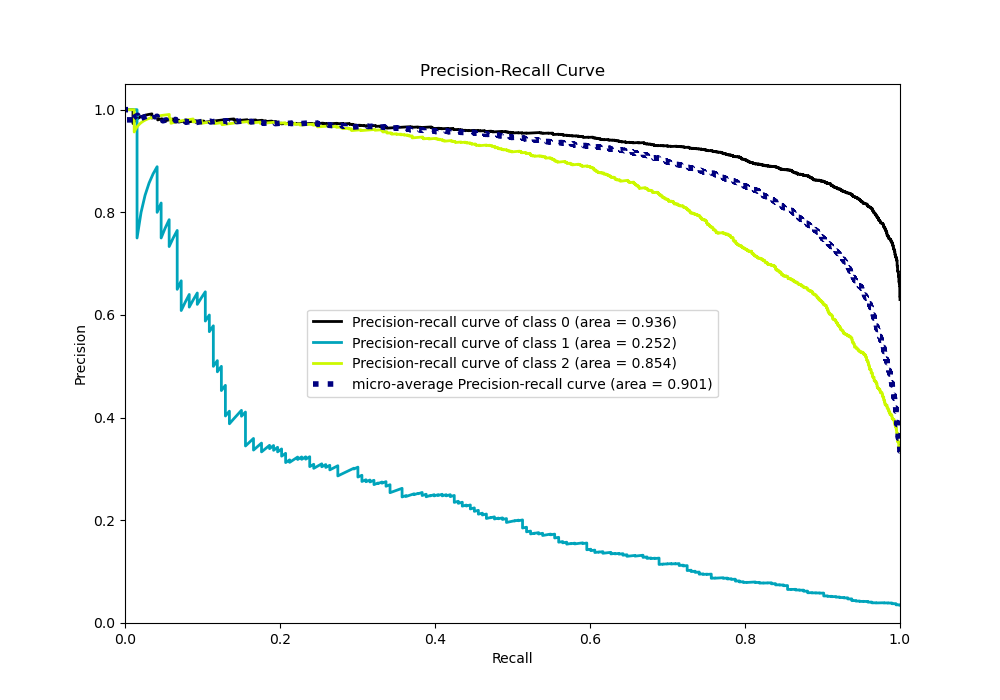

# Summary of 77_Xgboost

[<< Go back](../README.md)

## Extreme Gradient Boosting (Xgboost)
- **n_jobs**: -1
- **objective**: multi:softprob
- **eta**: 0.1
- **max_depth**: 4
- **min_child_weight**: 25
- **subsample**: 0.7
- **colsample_bytree**: 0.6
- **eval_metric**: mlogloss
- **num_class**: 3
- **explain_level**: 0

## Validation
 - **validation_type**: kfold
 - **shuffle**: True
 - **stratify**: True
 - **k_folds**: 10

## Optimized metric
logloss

## Training time

12.4 seconds

### Metric details
|           |           0 |           1 |           2 |   accuracy |   macro avg |   weighted avg |   logloss |
|:----------|------------:|------------:|------------:|-----------:|------------:|---------------:|----------:|
| precision |    0.845606 |   0.586207  |    0.794752 |   0.828484 |    0.742188 |       0.819517 |  0.447025 |
| recall    |    0.919105 |   0.0880829 |    0.735167 |   0.828484 |    0.580785 |       0.828484 |  0.447025 |
| f1-score  |    0.880825 |   0.153153  |    0.763799 |   0.828484 |    0.599259 |       0.816229 |  0.447025 |
| support   | 3486        | 193         | 1854        |   0.828484 | 5533        |    5533        |  0.447025 |

## Confusion matrix
|              |   Predicted as 0 |   Predicted as 1 |   Predicted as 2 |
|:-------------|-----------------:|-----------------:|-----------------:|
| Labeled as 0 |             3204 |                6 |              276 |
| Labeled as 1 |              100 |               17 |               76 |
| Labeled as 2 |              485 |                6 |             1363 |

## Learning curves

## Confusion Matrix

## Normalized Confusion Matrix

## ROC Curve

## Precision Recall Curve

[<< Go back](../README.md)
