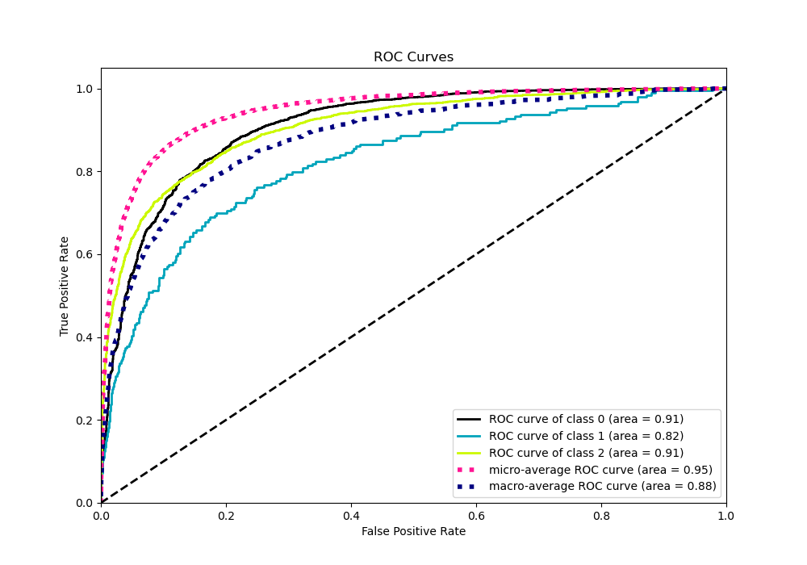

# Summary of 78_Xgboost

[<< Go back](../README.md)

## Extreme Gradient Boosting (Xgboost)
- **n_jobs**: -1
- **objective**: multi:softprob
- **eta**: 0.1
- **max_depth**: 4
- **min_child_weight**: 25
- **subsample**: 0.7
- **colsample_bytree**: 0.8
- **eval_metric**: mlogloss
- **num_class**: 3
- **explain_level**: 0

## Validation
 - **validation_type**: kfold
 - **shuffle**: True
 - **stratify**: True
 - **k_folds**: 10

## Optimized metric
logloss

## Training time

12.5 seconds

### Metric details
|           |           0 |           1 |           2 |   accuracy |   macro avg |   weighted avg |   logloss |
|:----------|------------:|------------:|------------:|-----------:|------------:|---------------:|----------:|
| precision |    0.844573 |   0.451613  |    0.7966   |    0.82758 |    0.697595 |       0.814791 |   0.44819 |
| recall    |    0.919679 |   0.0725389 |    0.73301  |    0.82758 |    0.575076 |       0.82758  |   0.44819 |
| f1-score  |    0.880527 |   0.125     |    0.763483 |    0.82758 |    0.58967  |       0.814954 |   0.44819 |
| support   | 3486        | 193         | 1854        |    0.82758 | 5533        |    5533        |   0.44819 |

## Confusion matrix
|              |   Predicted as 0 |   Predicted as 1 |   Predicted as 2 |
|:-------------|-----------------:|-----------------:|-----------------:|
| Labeled as 0 |             3206 |                9 |              271 |
| Labeled as 1 |              103 |               14 |               76 |
| Labeled as 2 |              487 |                8 |             1359 |

## Learning curves

## Confusion Matrix

## Normalized Confusion Matrix

## ROC Curve

## Precision Recall Curve

[<< Go back](../README.md)
