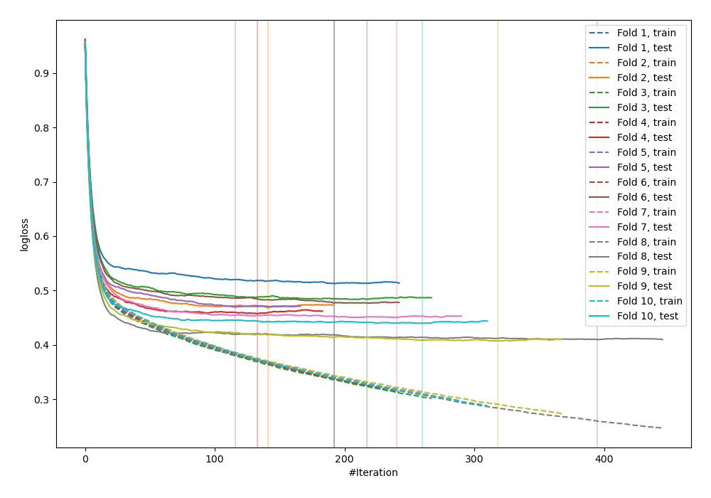
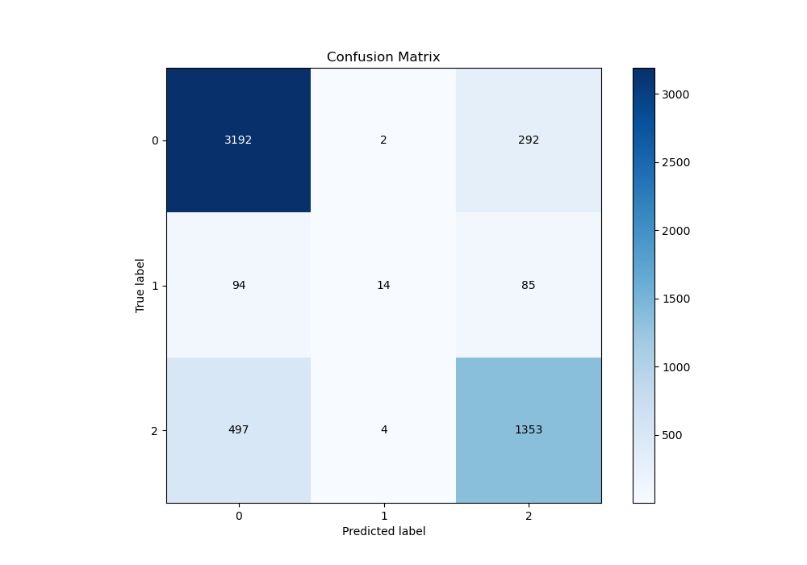
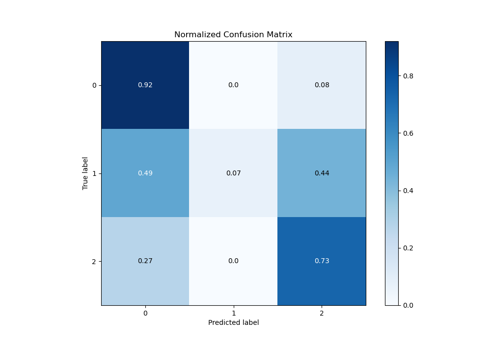
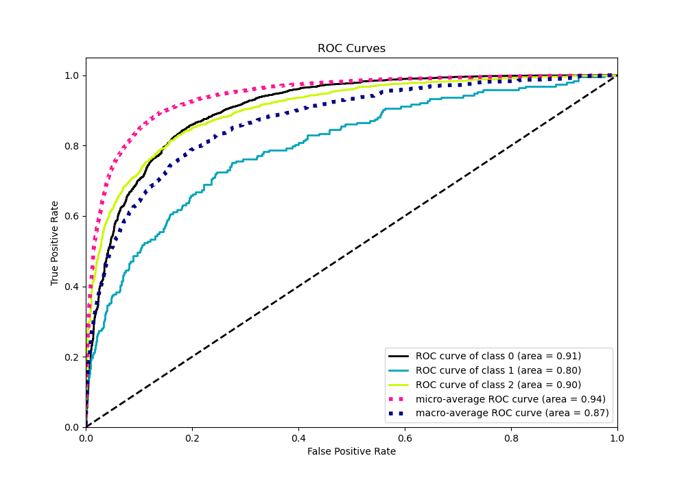
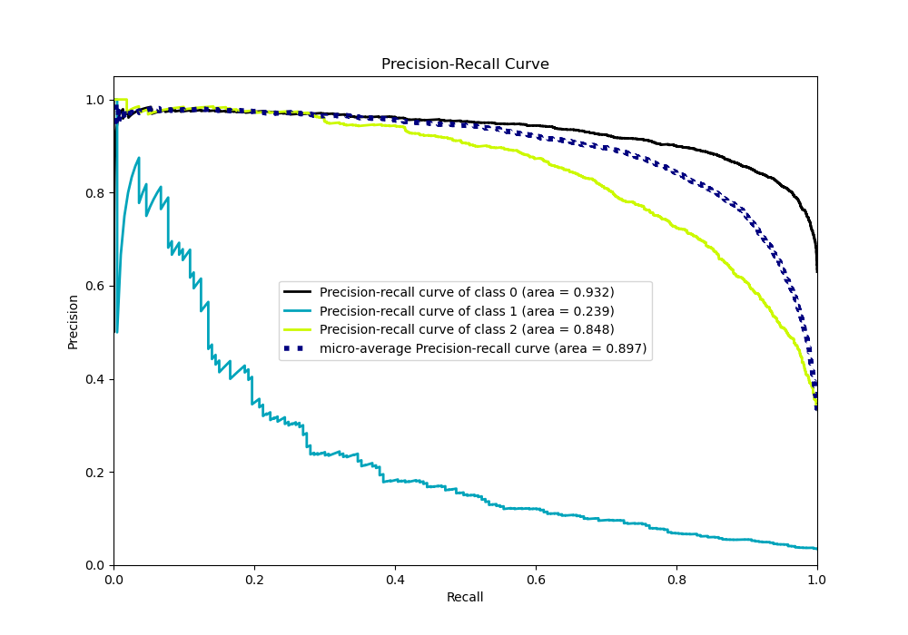

# Summary of 7_Default_CatBoost

[<< Go back](../README.md)

## CatBoost
- **n_jobs**: -1
- **learning_rate**: 0.15
- **depth**: 5
- **rsm**: 1
- **loss_function**: MultiClass
- **eval_metric**: MultiClass
- **num_class**: 3
- **explain_level**: 0

## Validation
 - **validation_type**: kfold
 - **shuffle**: True
 - **stratify**: True
 - **k_folds**: 10

## Optimized metric
logloss

## Training time

9.9 seconds

### Metric details
|           |           0 |           1 |           2 |   accuracy |   macro avg |   weighted avg |   logloss |
|:----------|------------:|------------:|------------:|-----------:|------------:|---------------:|----------:|
| precision |    0.843775 |   0.7       |    0.782081 |   0.823965 |    0.775285 |       0.818087 |  0.457631 |
| recall    |    0.915663 |   0.0725389 |    0.729773 |   0.823965 |    0.572658 |       0.823965 |  0.457631 |
| f1-score  |    0.87825  |   0.131455  |    0.755022 |   0.823965 |    0.588243 |       0.810909 |  0.457631 |
| support   | 3486        | 193         | 1854        |   0.823965 | 5533        |    5533        |  0.457631 |

## Confusion matrix
|              |   Predicted as 0 |   Predicted as 1 |   Predicted as 2 |
|:-------------|-----------------:|-----------------:|-----------------:|
| Labeled as 0 |             3192 |                2 |              292 |
| Labeled as 1 |               94 |               14 |               85 |
| Labeled as 2 |              497 |                4 |             1353 |

## Learning curves

## Confusion Matrix

## Normalized Confusion Matrix

## ROC Curve

## Precision Recall Curve

[<< Go back](../README.md)
