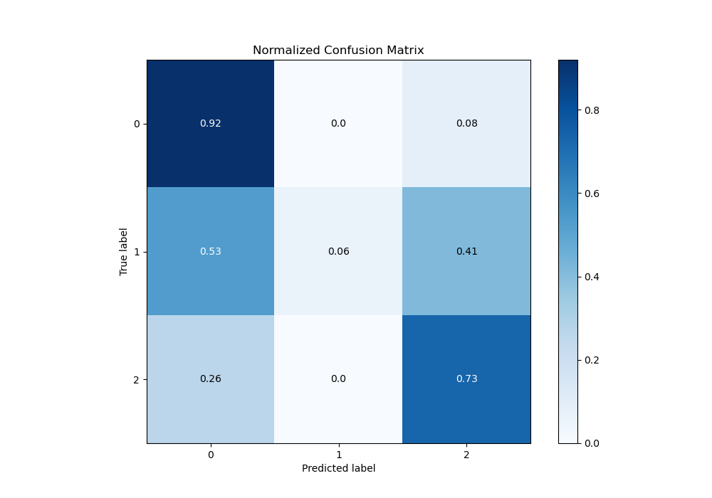

# Summary of 83_CatBoost

[<< Go back](../README.md)

## CatBoost
- **n_jobs**: -1
- **learning_rate**: 0.2
- **depth**: 4
- **rsm**: 0.7
- **loss_function**: MultiClass
- **eval_metric**: MultiClass
- **num_class**: 3
- **explain_level**: 0

## Validation
 - **validation_type**: kfold
 - **shuffle**: True
 - **stratify**: True
 - **k_folds**: 10

## Optimized metric
logloss

## Training time

12.8 seconds

### Metric details
|           |           0 |           1 |           2 |   accuracy |   macro avg |   weighted avg |   logloss |
|:----------|------------:|------------:|------------:|-----------:|------------:|---------------:|----------:|
| precision |    0.843923 |   0.785714  |    0.789108 |   0.826676 |    0.806248 |       0.823525 |  0.456098 |
| recall    |    0.918244 |   0.0569948 |    0.734628 |   0.826676 |    0.569956 |       0.826676 |  0.456098 |
| f1-score  |    0.879516 |   0.10628   |    0.760894 |   0.826676 |    0.58223  |       0.812797 |  0.456098 |
| support   | 3486        | 193         | 1854        |   0.826676 | 5533        |    5533        |  0.456098 |

## Confusion matrix
|              |   Predicted as 0 |   Predicted as 1 |   Predicted as 2 |
|:-------------|-----------------:|-----------------:|-----------------:|
| Labeled as 0 |             3201 |                1 |              284 |
| Labeled as 1 |              102 |               11 |               80 |
| Labeled as 2 |              490 |                2 |             1362 |

## Learning curves

## Confusion Matrix

## Normalized Confusion Matrix

## ROC Curve

## Precision Recall Curve

[<< Go back](../README.md)
