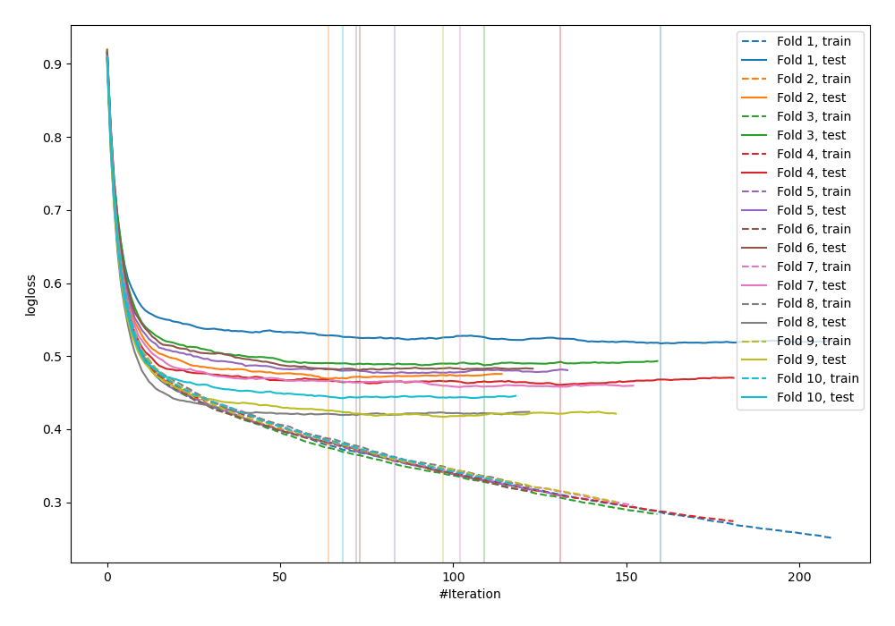
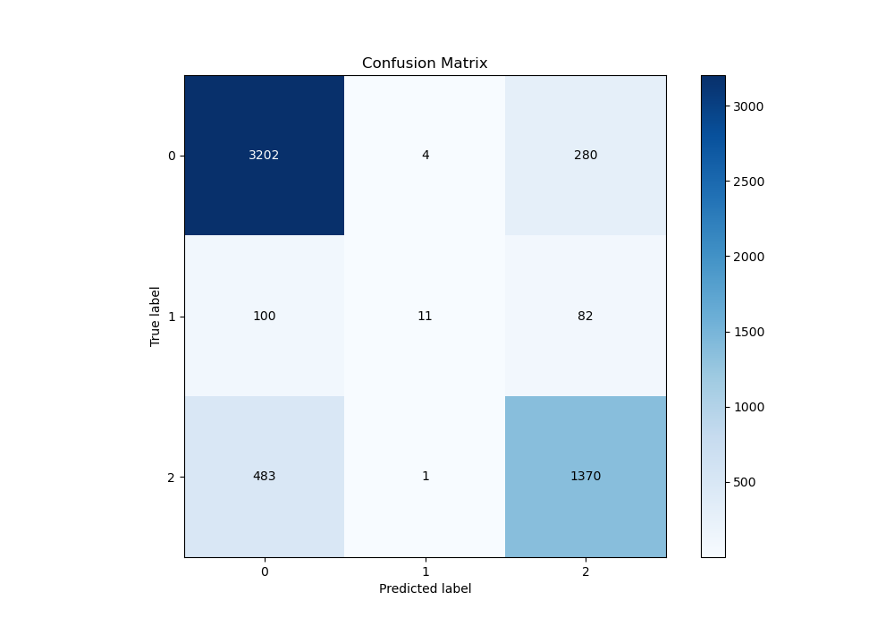
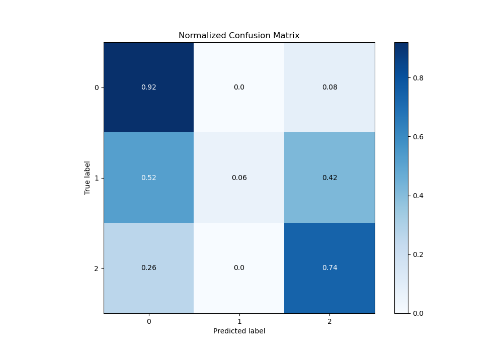
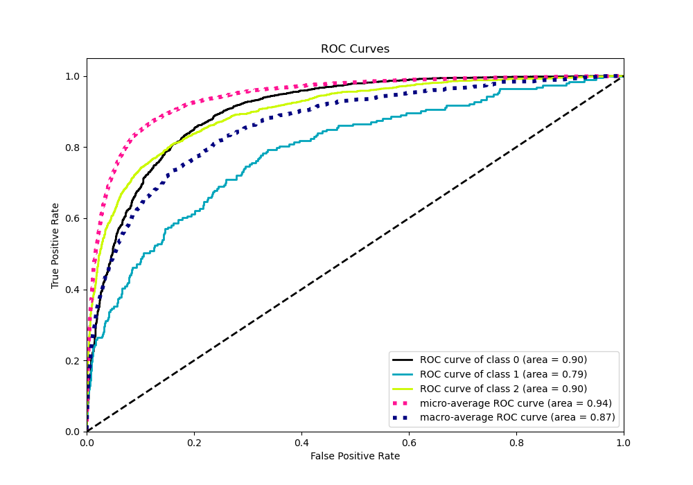
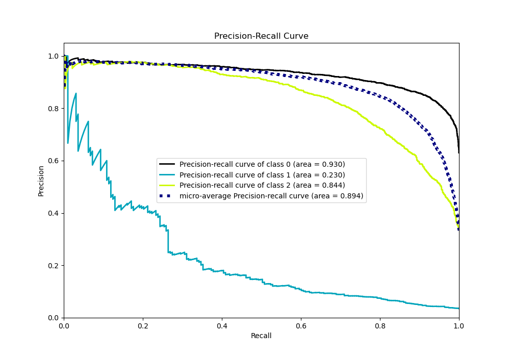

# Summary of 84_CatBoost

[<< Go back](../README.md)

## CatBoost
- **n_jobs**: -1
- **learning_rate**: 0.2
- **depth**: 6
- **rsm**: 0.7
- **loss_function**: MultiClass
- **eval_metric**: MultiClass
- **num_class**: 3
- **explain_level**: 0

## Validation
 - **validation_type**: kfold
 - **shuffle**: True
 - **stratify**: True
 - **k_folds**: 10

## Optimized metric
logloss

## Training time

13.6 seconds

### Metric details
|           |           0 |           1 |           2 |   accuracy |   macro avg |   weighted avg |   logloss |
|:----------|------------:|------------:|------------:|-----------:|------------:|---------------:|----------:|
| precision |    0.845971 |   0.6875    |    0.790993 |   0.828303 |    0.774821 |       0.822021 |  0.462884 |
| recall    |    0.918531 |   0.0569948 |    0.738943 |   0.828303 |    0.57149  |       0.828303 |  0.462884 |
| f1-score  |    0.880759 |   0.105263  |    0.764083 |   0.828303 |    0.583368 |       0.814613 |  0.462884 |
| support   | 3486        | 193         | 1854        |   0.828303 | 5533        |    5533        |  0.462884 |

## Confusion matrix
|              |   Predicted as 0 |   Predicted as 1 |   Predicted as 2 |
|:-------------|-----------------:|-----------------:|-----------------:|
| Labeled as 0 |             3202 |                4 |              280 |
| Labeled as 1 |              100 |               11 |               82 |
| Labeled as 2 |              483 |                1 |             1370 |

## Learning curves

## Confusion Matrix

## Normalized Confusion Matrix

## ROC Curve

## Precision Recall Curve

[<< Go back](../README.md)
