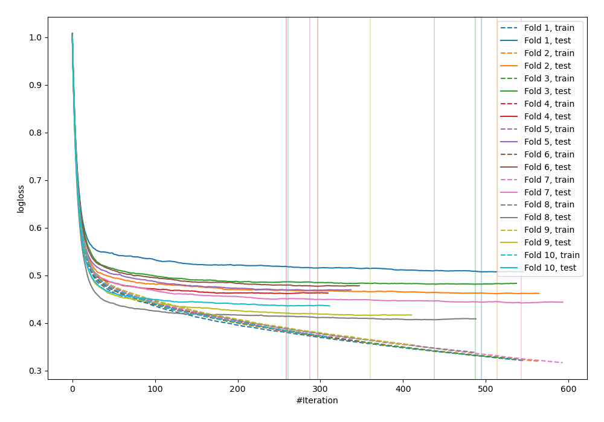
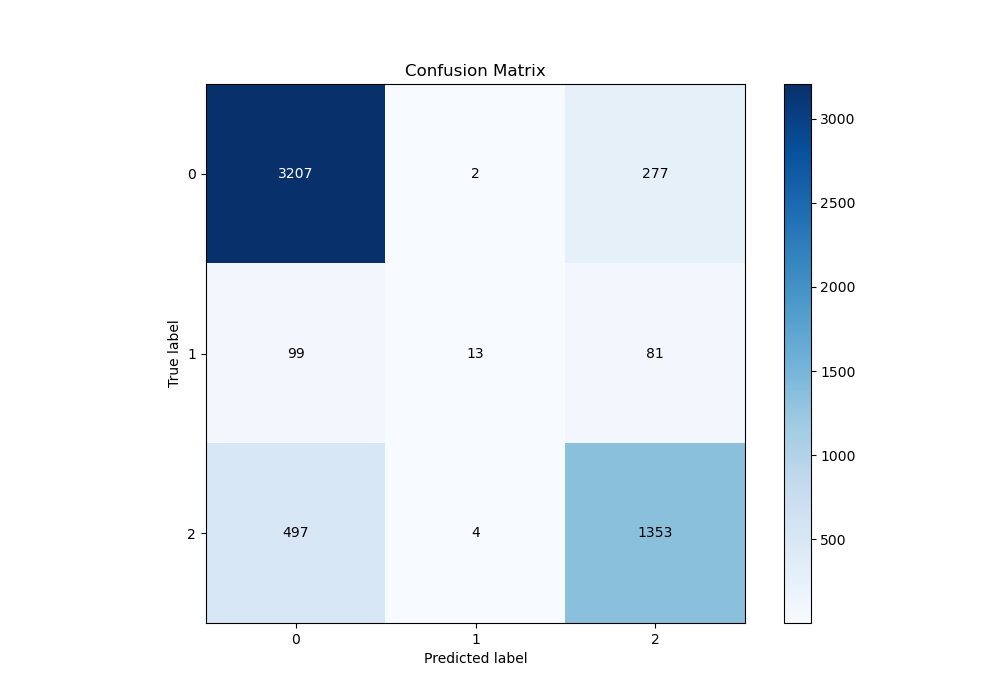
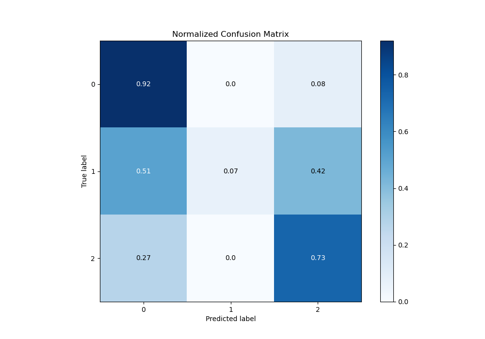
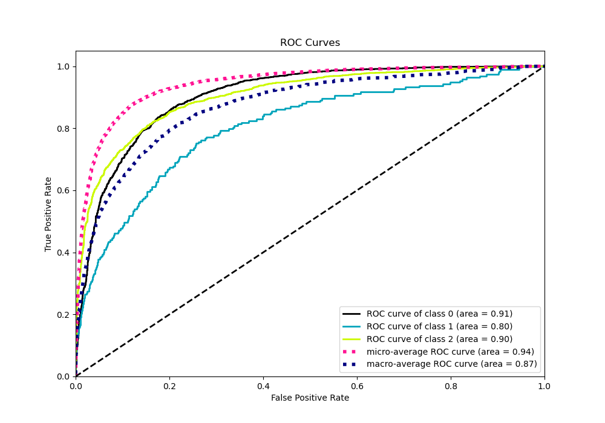
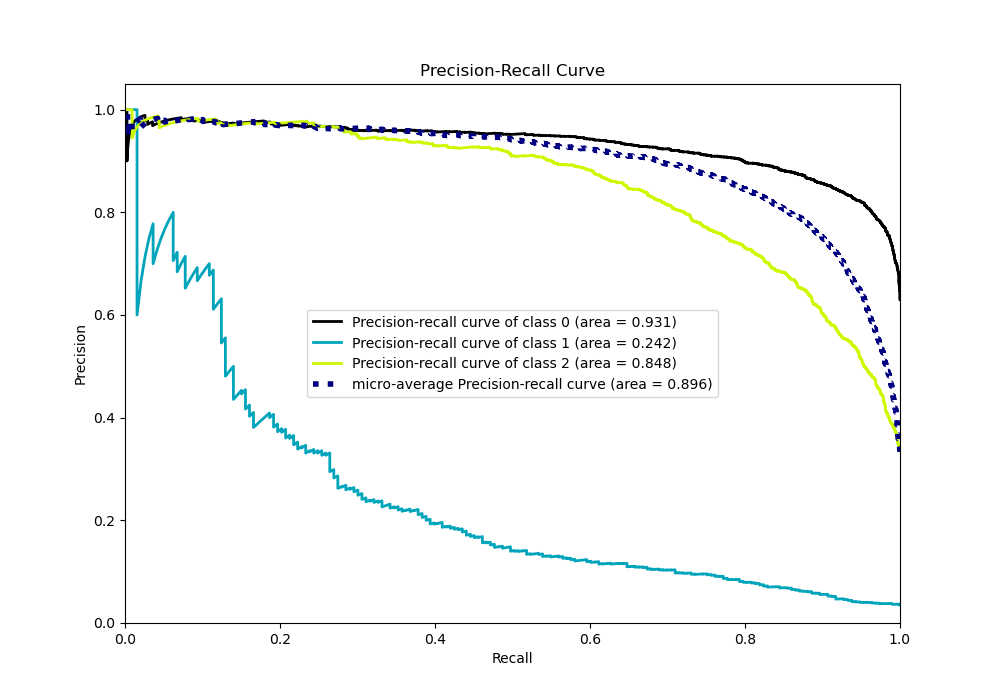

# Summary of 85_CatBoost

[<< Go back](../README.md)

## CatBoost
- **n_jobs**: -1
- **learning_rate**: 0.1
- **depth**: 4
- **rsm**: 0.7
- **loss_function**: MultiClass
- **eval_metric**: MultiClass
- **num_class**: 3
- **explain_level**: 0

## Validation
 - **validation_type**: kfold
 - **shuffle**: True
 - **stratify**: True
 - **k_folds**: 10

## Optimized metric
logloss

## Training time

17.6 seconds

### Metric details
|           |           0 |           1 |           2 |   accuracy |   macro avg |   weighted avg |   logloss |
|:----------|------------:|------------:|------------:|-----------:|------------:|---------------:|----------:|
| precision |    0.843282 |   0.684211  |    0.790766 |   0.826496 |    0.772753 |       0.820136 |  0.455972 |
| recall    |    0.919966 |   0.0673575 |    0.729773 |   0.826496 |    0.572366 |       0.826496 |  0.455972 |
| f1-score  |    0.879956 |   0.122642  |    0.759046 |   0.826496 |    0.587215 |       0.813025 |  0.455972 |
| support   | 3486        | 193         | 1854        |   0.826496 | 5533        |    5533        |  0.455972 |

## Confusion matrix
|              |   Predicted as 0 |   Predicted as 1 |   Predicted as 2 |
|:-------------|-----------------:|-----------------:|-----------------:|
| Labeled as 0 |             3207 |                2 |              277 |
| Labeled as 1 |               99 |               13 |               81 |
| Labeled as 2 |              497 |                4 |             1353 |

## Learning curves

## Confusion Matrix

## Normalized Confusion Matrix

## ROC Curve

## Precision Recall Curve

[<< Go back](../README.md)
