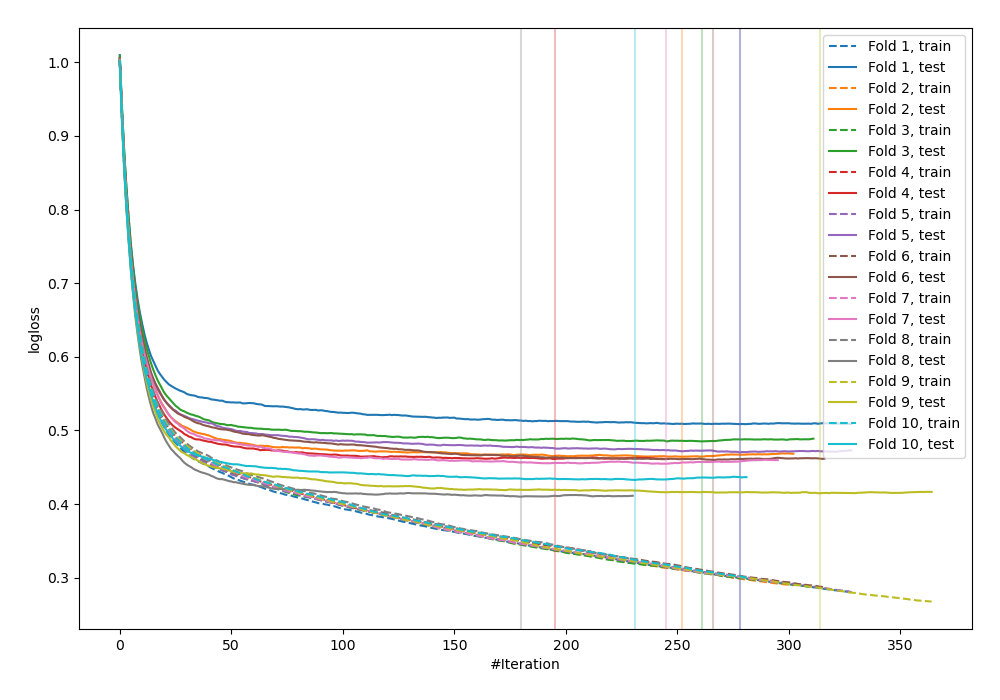

# Summary of 86_CatBoost

[<< Go back](../README.md)

## CatBoost
- **n_jobs**: -1
- **learning_rate**: 0.1
- **depth**: 6
- **rsm**: 0.7
- **loss_function**: MultiClass
- **eval_metric**: MultiClass
- **num_class**: 3
- **explain_level**: 0

## Validation
 - **validation_type**: kfold
 - **shuffle**: True
 - **stratify**: True
 - **k_folds**: 10

## Optimized metric
logloss

## Training time

22.5 seconds

### Metric details
|           |           0 |           1 |           2 |   accuracy |   macro avg |   weighted avg |   logloss |
|:----------|------------:|------------:|------------:|-----------:|------------:|---------------:|----------:|
| precision |    0.847476 |   0.736842  |    0.793183 |    0.83011 |    0.7925   |       0.825424 |  0.456173 |
| recall    |    0.919679 |   0.0725389 |    0.740561 |    0.83011 |    0.577593 |       0.83011  |  0.456173 |
| f1-score  |    0.882102 |   0.132075  |    0.765969 |    0.83011 |    0.593382 |       0.817026 |  0.456173 |
| support   | 3486        | 193         | 1854        |    0.83011 | 5533        |    5533        |  0.456173 |

## Confusion matrix
|              |   Predicted as 0 |   Predicted as 1 |   Predicted as 2 |
|:-------------|-----------------:|-----------------:|-----------------:|
| Labeled as 0 |             3206 |                3 |              277 |
| Labeled as 1 |               98 |               14 |               81 |
| Labeled as 2 |              479 |                2 |             1373 |

## Learning curves

## Confusion Matrix

## Normalized Confusion Matrix

## ROC Curve

## Precision Recall Curve

[<< Go back](../README.md)
