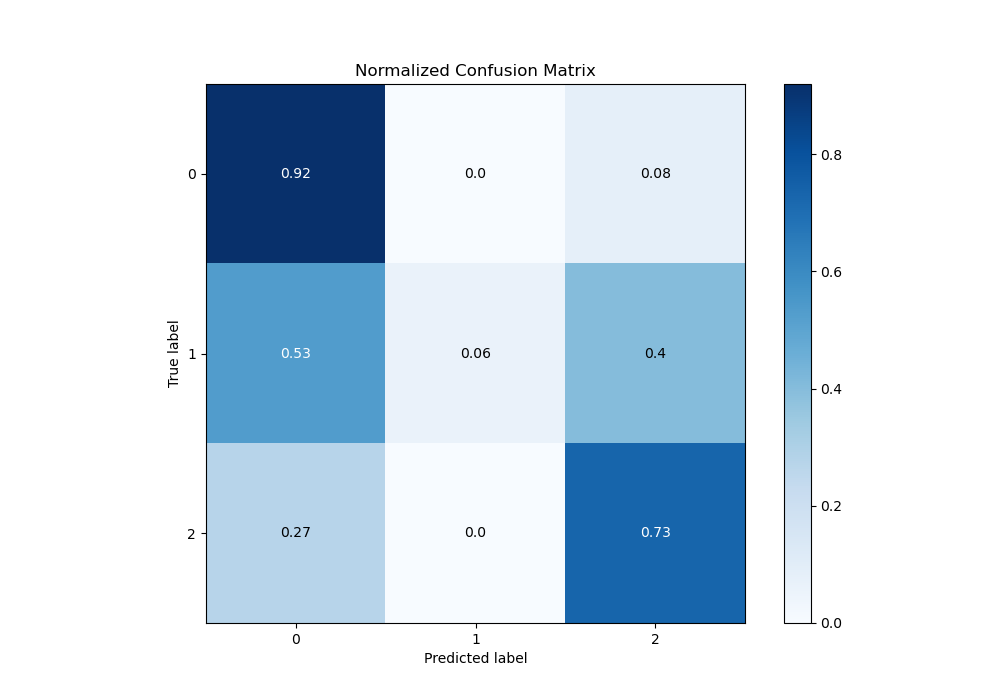

# Summary of 87_CatBoost

[<< Go back](../README.md)

## CatBoost
- **n_jobs**: -1
- **learning_rate**: 0.15
- **depth**: 4
- **rsm**: 0.8
- **loss_function**: MultiClass
- **eval_metric**: MultiClass
- **num_class**: 3
- **explain_level**: 0

## Validation
 - **validation_type**: kfold
 - **shuffle**: True
 - **stratify**: True
 - **k_folds**: 10

## Optimized metric
logloss

## Training time

14.5 seconds

### Metric details
|           |           0 |           1 |           2 |   accuracy |   macro avg |   weighted avg |   logloss |
|:----------|------------:|------------:|------------:|-----------:|------------:|---------------:|----------:|
| precision |    0.841058 |   0.8       |    0.793996 |   0.826496 |    0.811685 |       0.823856 |  0.457141 |
| recall    |    0.9214   |   0.0621762 |    0.727616 |   0.826496 |    0.570397 |       0.826496 |  0.457141 |
| f1-score  |    0.879398 |   0.115385  |    0.759358 |   0.826496 |    0.584714 |       0.812525 |  0.457141 |
| support   | 3486        | 193         | 1854        |   0.826496 | 5533        |    5533        |  0.457141 |

## Confusion matrix
|              |   Predicted as 0 |   Predicted as 1 |   Predicted as 2 |
|:-------------|-----------------:|-----------------:|-----------------:|
| Labeled as 0 |             3212 |                2 |              272 |
| Labeled as 1 |              103 |               12 |               78 |
| Labeled as 2 |              504 |                1 |             1349 |

## Learning curves

## Confusion Matrix

## Normalized Confusion Matrix

## ROC Curve

## Precision Recall Curve

[<< Go back](../README.md)
