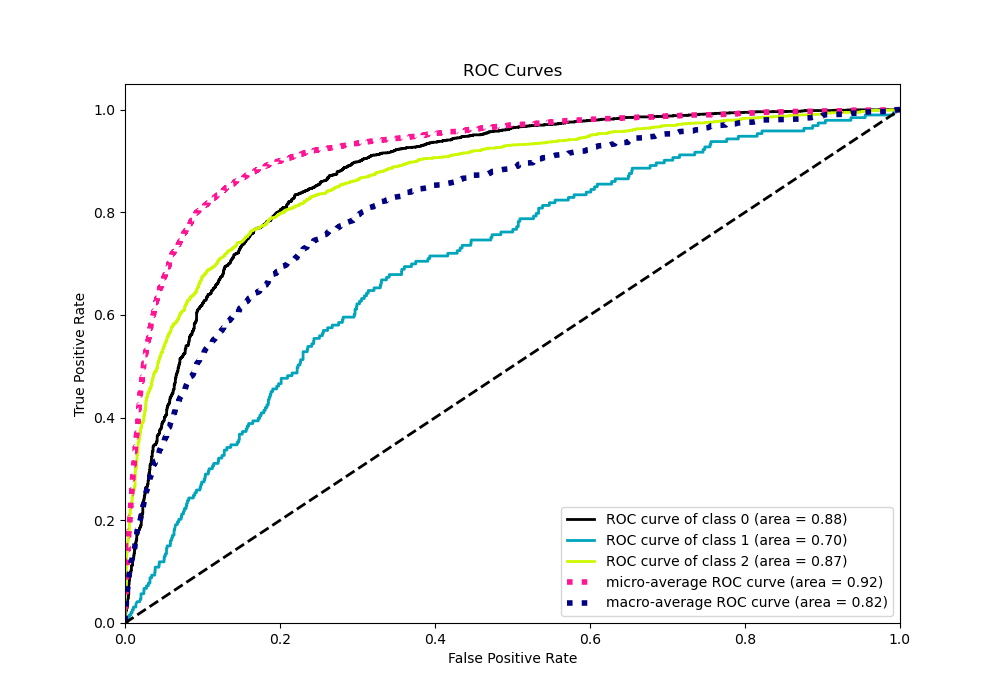

# Summary of 8_Default_NeuralNetwork

[<< Go back](../README.md)

## Neural Network
- **n_jobs**: -1
- **dense_1_size**: 32
- **dense_2_size**: 16
- **learning_rate**: 0.05
- **num_class**: 3
- **explain_level**: 0

## Validation
 - **validation_type**: kfold
 - **shuffle**: True
 - **stratify**: True
 - **k_folds**: 10

## Optimized metric
logloss

## Training time

11.0 seconds

### Metric details
|           |           0 |   1 |           2 |   accuracy |   macro avg |   weighted avg |   logloss |
|:----------|------------:|----:|------------:|-----------:|------------:|---------------:|----------:|
| precision |    0.822154 |   0 |    0.771341 |   0.806796 |    0.531165 |       0.776449 |  0.535415 |
| recall    |    0.917671 |   0 |    0.682309 |   0.806796 |    0.533326 |       0.806796 |  0.535415 |
| f1-score  |    0.86729  |   0 |    0.724098 |   0.806796 |    0.530463 |       0.789057 |  0.535415 |
| support   | 3486        | 193 | 1854        |   0.806796 | 5533        |    5533        |  0.535415 |

## Confusion matrix
|              |   Predicted as 0 |   Predicted as 1 |   Predicted as 2 |
|:-------------|-----------------:|-----------------:|-----------------:|
| Labeled as 0 |             3199 |                0 |              287 |
| Labeled as 1 |              105 |                0 |               88 |
| Labeled as 2 |              587 |                2 |             1265 |

## Learning curves

## Confusion Matrix

## Normalized Confusion Matrix

## ROC Curve

## Precision Recall Curve

[<< Go back](../README.md)
