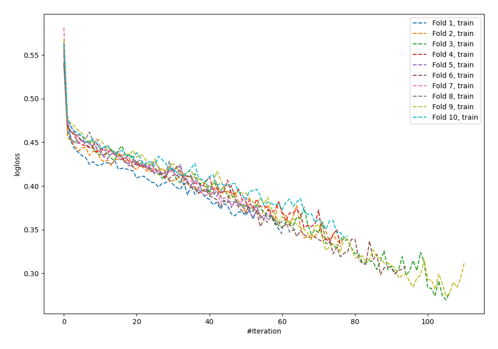
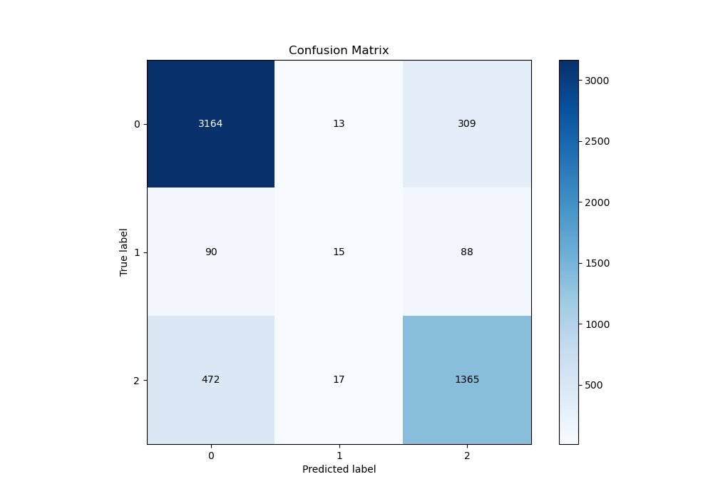
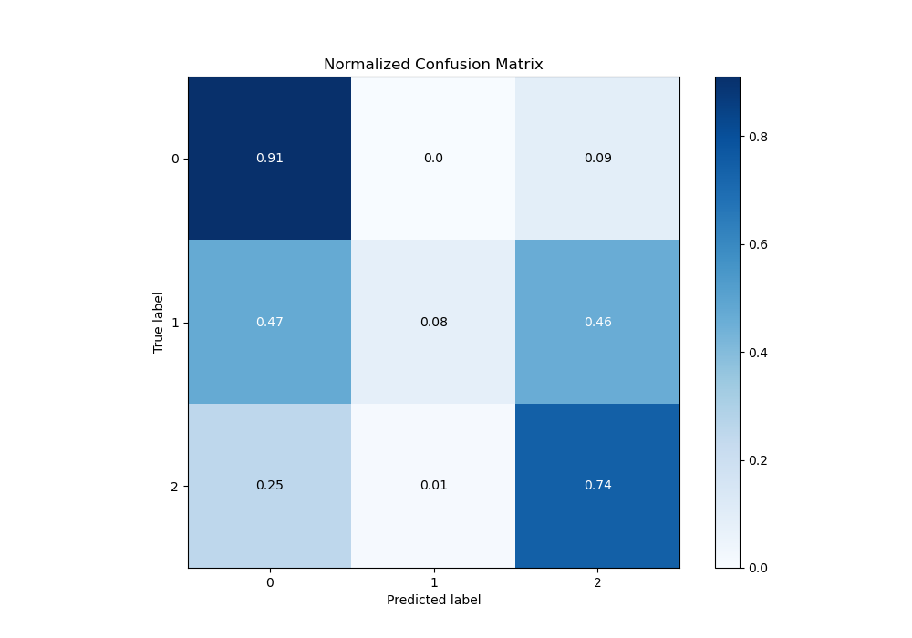
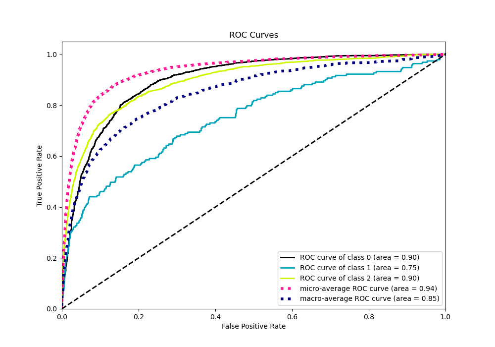
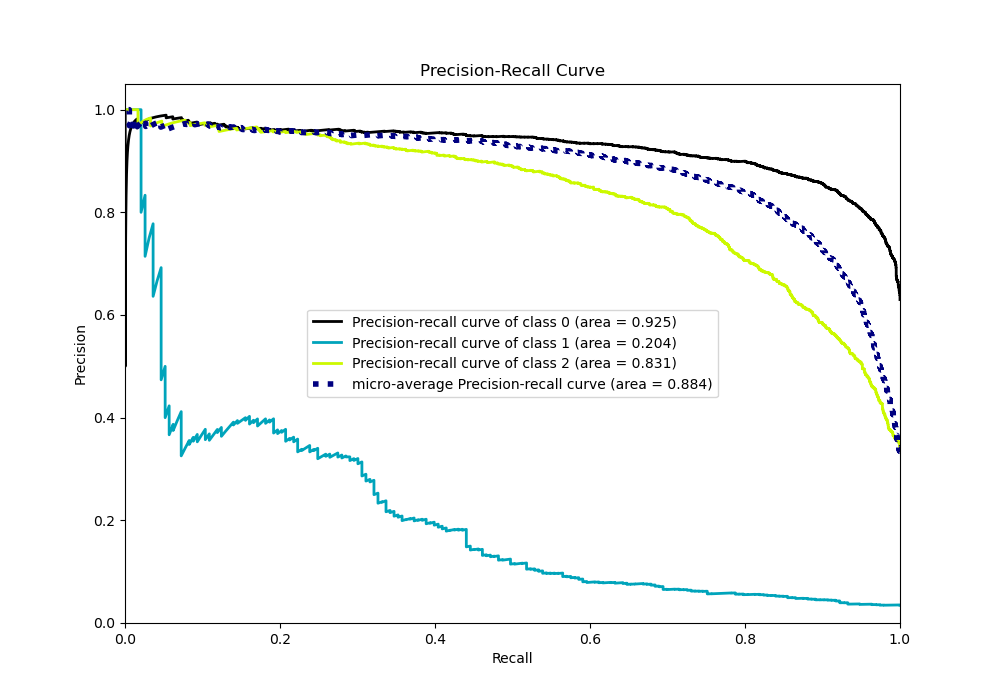

# Summary of 98_NeuralNetwork_Stacked

[<< Go back](../README.md)

## Neural Network
- **n_jobs**: -1
- **dense_1_size**: 64
- **dense_2_size**: 8
- **learning_rate**: 0.01
- **num_class**: 3
- **explain_level**: 0

## Validation
 - **validation_type**: kfold
 - **shuffle**: True
 - **stratify**: True
 - **k_folds**: 10

## Optimized metric
logloss

## Training time

33.1 seconds

### Metric details
|           |           0 |           1 |           2 |   accuracy |   macro avg |   weighted avg |   logloss |
|:----------|------------:|------------:|------------:|-----------:|------------:|---------------:|----------:|
| precision |    0.849168 |   0.333333  |    0.774688 |   0.821254 |    0.652396 |       0.806218 |  0.491154 |
| recall    |    0.907631 |   0.0777202 |    0.736246 |   0.821254 |    0.573866 |       0.821254 |  0.491154 |
| f1-score  |    0.877427 |   0.12605   |    0.754978 |   0.821254 |    0.586152 |       0.810187 |  0.491154 |
| support   | 3486        | 193         | 1854        |   0.821254 | 5533        |    5533        |  0.491154 |

## Confusion matrix
|              |   Predicted as 0 |   Predicted as 1 |   Predicted as 2 |
|:-------------|-----------------:|-----------------:|-----------------:|
| Labeled as 0 |             3164 |               13 |              309 |
| Labeled as 1 |               90 |               15 |               88 |
| Labeled as 2 |              472 |               17 |             1365 |

## Learning curves

## Confusion Matrix

## Normalized Confusion Matrix

## ROC Curve

## Precision Recall Curve

[<< Go back](../README.md)
