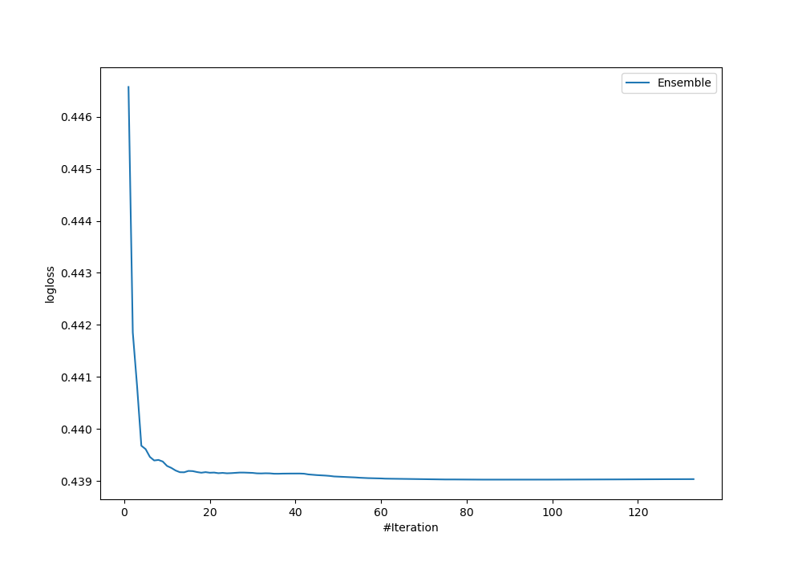
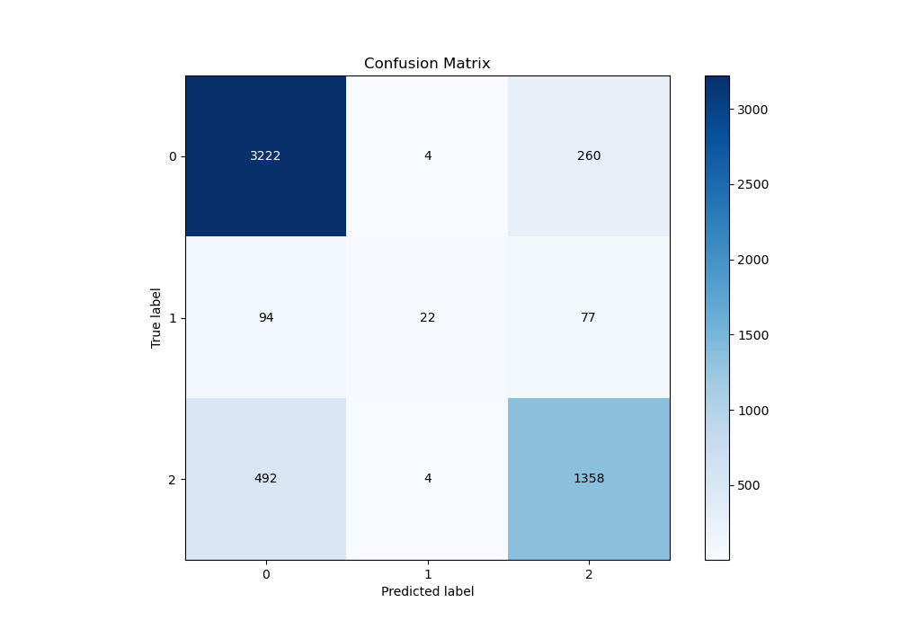
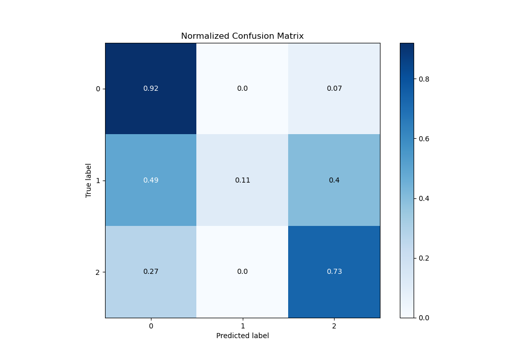
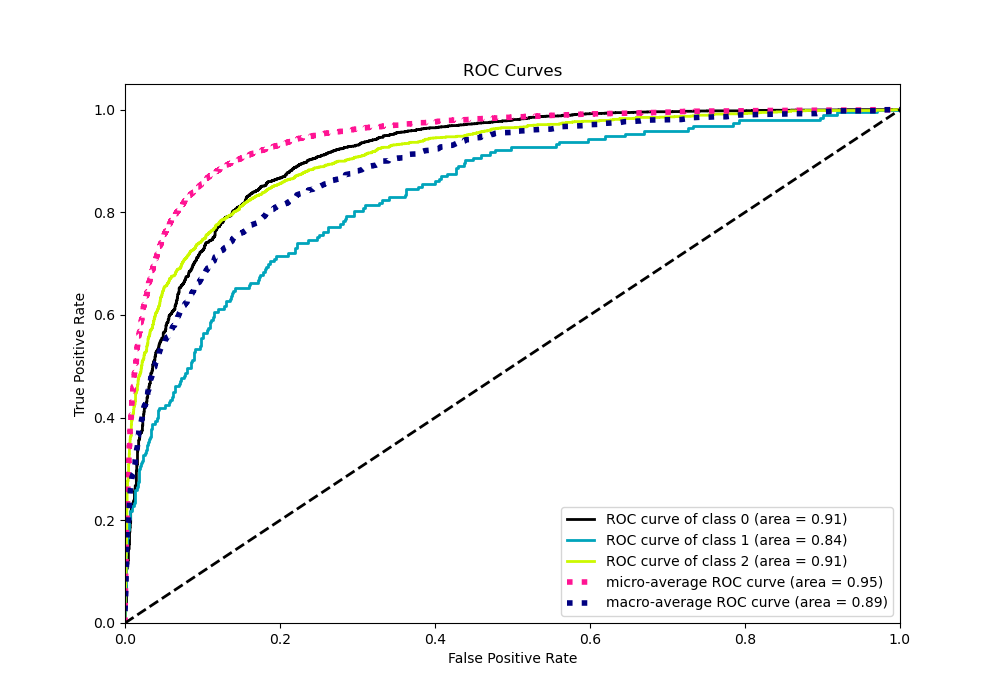
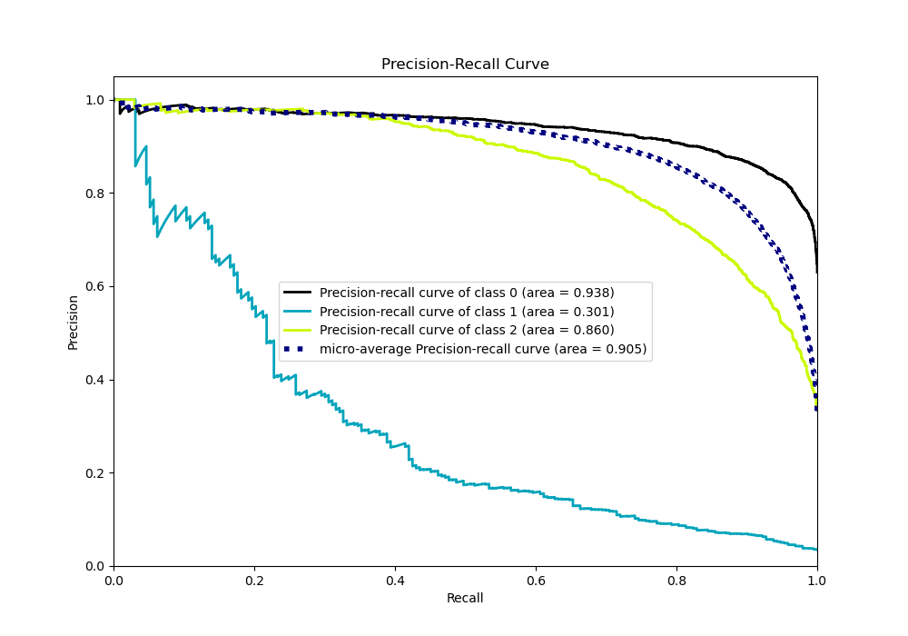

# Summary of Ensemble

[<< Go back](../README.md)

## Ensemble structure
| Model                     |   Weight |
|:--------------------------|---------:|
| 109_LightGBM              |        5 |
| 14_Xgboost                |        1 |
| 15_Xgboost                |        7 |
| 17_Xgboost                |        2 |
| 17_Xgboost_KMeansFeatures |        7 |
| 18_Xgboost                |        5 |
| 22_LightGBM               |       15 |
| 25_LightGBM               |       21 |
| 70_NearestNeighbors       |        1 |
| 73_Xgboost                |        7 |
| 77_Xgboost                |       16 |
| 81_LightGBM               |        5 |
| 82_LightGBM               |        1 |

### Metric details
|           |           0 |          1 |           2 |   accuracy |   macro avg |   weighted avg |   logloss |
|:----------|------------:|-----------:|------------:|-----------:|------------:|---------------:|----------:|
| precision |    0.846113 |   0.733333 |    0.80118  |   0.831737 |    0.793542 |       0.827123 |  0.439024 |
| recall    |    0.924269 |   0.11399  |    0.73247  |   0.831737 |    0.590243 |       0.831737 |  0.439024 |
| f1-score  |    0.883466 |   0.197309 |    0.765286 |   0.831737 |    0.615354 |       0.819932 |  0.439024 |
| support   | 3486        | 193        | 1854        |   0.831737 | 5533        |    5533        |  0.439024 |

## Confusion matrix
|              |   Predicted as 0 |   Predicted as 1 |   Predicted as 2 |
|:-------------|-----------------:|-----------------:|-----------------:|
| Labeled as 0 |             3222 |                4 |              260 |
| Labeled as 1 |               94 |               22 |               77 |
| Labeled as 2 |              492 |                4 |             1358 |

## Learning curves

## Confusion Matrix

## Normalized Confusion Matrix

## ROC Curve

## Precision Recall Curve

[<< Go back](../README.md)
