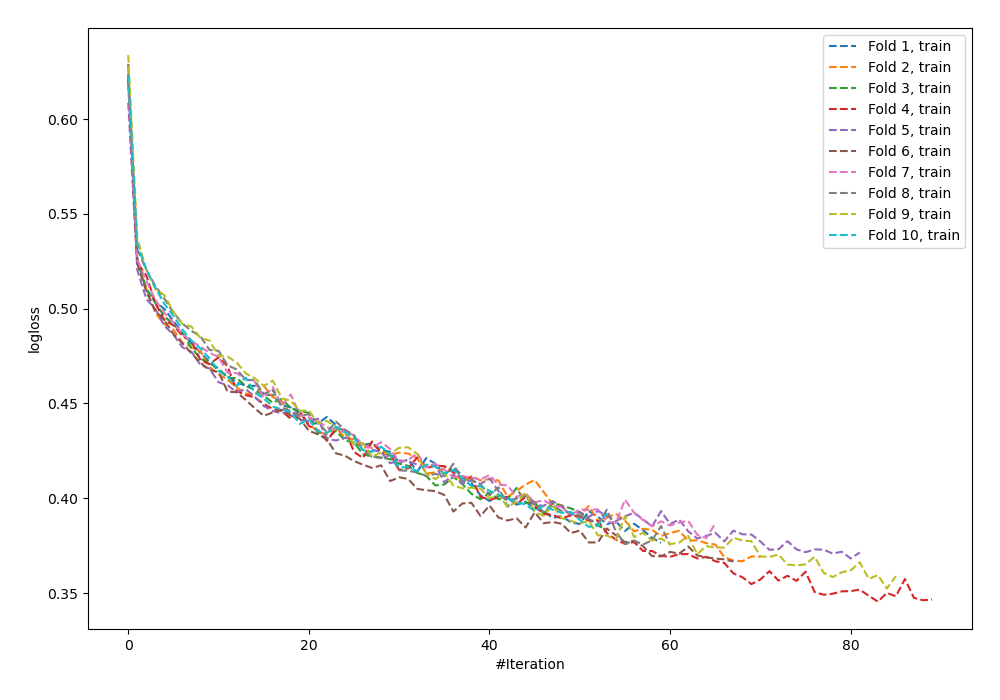
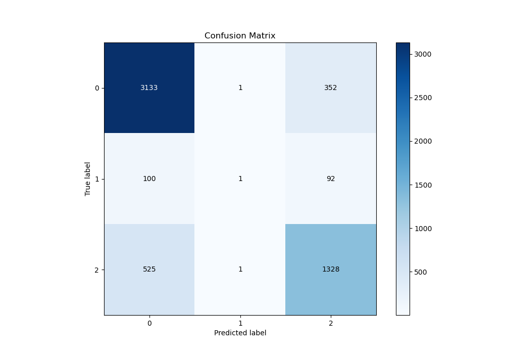
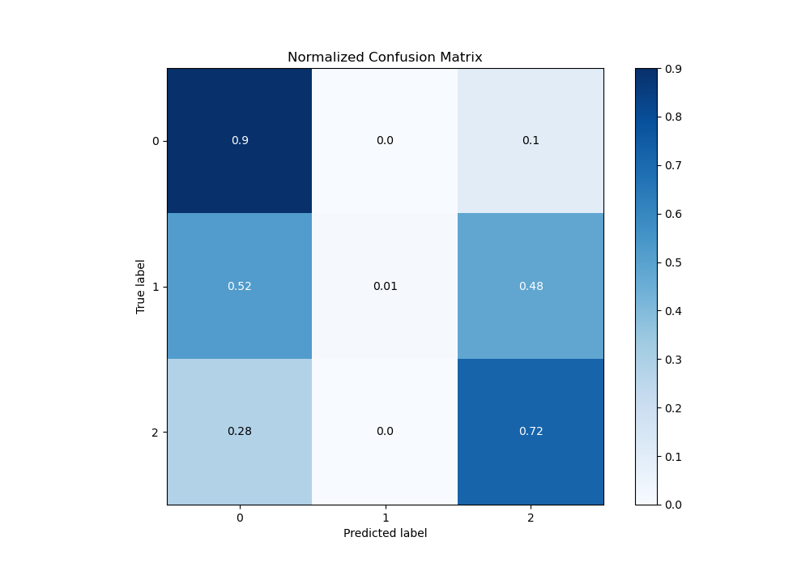
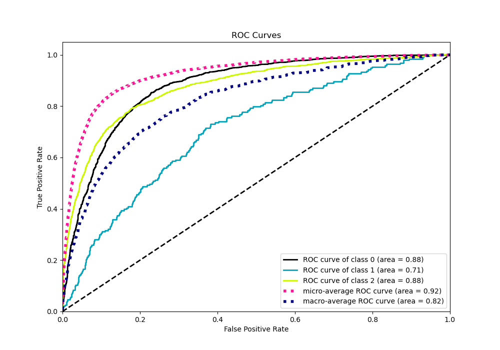
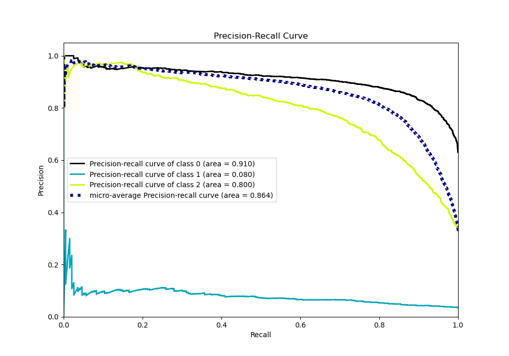

# Summary of 101_NeuralNetwork

[<< Go back](../README.md)

## Neural Network
- **n_jobs**: -1
- **dense_1_size**: 16
- **dense_2_size**: 32
- **learning_rate**: 0.01
- **num_class**: 3
- **explain_level**: 0

## Validation
 - **validation_type**: kfold
 - **shuffle**: True
 - **stratify**: True
 - **k_folds**: 10

## Optimized metric
logloss

## Training time

18.6 seconds

### Metric details
|           |           0 |            1 |           2 |   accuracy |   macro avg |   weighted avg |   logloss |
|:----------|------------:|-------------:|------------:|-----------:|------------:|---------------:|----------:|
| precision |    0.833688 |   0.333333   |    0.749436 |   0.806434 |    0.638819 |       0.788004 |  0.532826 |
| recall    |    0.898738 |   0.00518135 |    0.716289 |   0.806434 |    0.540069 |       0.806434 |  0.532826 |
| f1-score  |    0.864992 |   0.0102041  |    0.732488 |   0.806434 |    0.535894 |       0.790776 |  0.532826 |
| support   | 3486        | 193          | 1854        |   0.806434 | 5533        |    5533        |  0.532826 |

## Confusion matrix
|              |   Predicted as 0 |   Predicted as 1 |   Predicted as 2 |
|:-------------|-----------------:|-----------------:|-----------------:|
| Labeled as 0 |             3133 |                1 |              352 |
| Labeled as 1 |              100 |                1 |               92 |
| Labeled as 2 |              525 |                1 |             1328 |

## Learning curves

## Confusion Matrix

## Normalized Confusion Matrix

## ROC Curve

## Precision Recall Curve

[<< Go back](../README.md)
